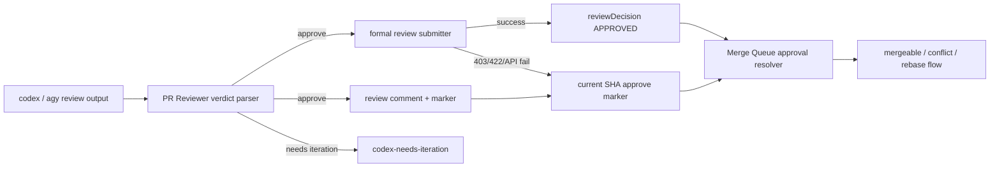

# Design Document

## Overview

本件は、PR Reviewer Processor の approve 判定を GitHub formal review または idd-codex marker approval として Merge Queue Processor へ接続する修正である。現状の PR Reviewer は `VERDICT: approve` を含む通常 PR コメントを投稿するだけで、GitHub の `reviewDecision` は `APPROVED` にならない。一方、Merge Queue は `review:approved` 検索と `reviewDecision == "APPROVED"` に依存しているため、PR Reviewer が approve 済みでも候補数 0 のまま停滞する。

設計方針は二段構えにする。第一経路は GitHub CLI の `gh pr review --approve` による formal review 投稿で、GitHub CLI 公式 manual は `gh pr review --approve` が PR approval を作る操作であることを示している。第二経路は、GitHub の権限・self-review・validation により formal review が使えない場合の marker fallback である。GitHub REST API の pull request review docs でも review event は `APPROVE` / `REQUEST_CHANGES` / `COMMENT` を取り、失敗時には 403 / 422 があり得るため、fallback を仕様化する。

**Purpose**: PR Reviewer approve 済み PR を Merge Queue の候補に進める承認 signal を watcher operator に提供する。
**Users**: idd-codex watcher を cron / launchd で運用する maintainer が、PR Reviewer / Merge Queue / PR Iteration の連携 workflow で利用する。
**Impact**: 現在の「approve コメントはあるが `reviewDecision` が空で止まる」状態を、formal review または current-SHA approve marker によって自動 merge 前段へ進む状態へ変える。

### Goals

- `VERDICT: approve` を current head SHA に紐づく承認 signal として保存する。
- formal review 投稿が可能なら GitHub `APPROVE` review を作成する。
- formal review が失敗しても current-SHA approve marker を Merge Queue が承認 signal として扱う。
- old-SHA marker、reject / iteration marker、API failure では merge しない安全側を維持する。
- README と shell-level regression tests で挙動を固定する。

### Non-Goals

- PR Reviewer のレビュー品質や prompt の観点を広げない。
- PR Iteration の修正反映ロジックを変更しない。
- Gitflow / closing keyword / `codex-staged-for-release` の判定を変更しない。
- GitHub branch protection や repository settings を変更しない。

## Architecture

### Existing Architecture Analysis

- PR Reviewer Processor は `local-watcher/bin/modules/pr-reviewer.sh` に集約され、`PR_REVIEWER_ENABLED=true` の opt-in gate の内側で open / non-draft / managed branch / non-fork PR をレビューする。
- 既存 marker は `<!-- idd-codex:pr-reviewer sha=<sha> kind=<kind> tool=<tool> -->` で、同一 `(sha, kind)` の二重処理抑止に使われている。
- 現在の `kind=review` は approve / iteration の意味を区別しない。判定は本文中の `VERDICT: codex-needs-iteration` 検出だけであり、approve は「iteration label を付けない」ことにしか反映されない。
- Merge Queue Processor は `local-watcher/bin/modules/merge-queue.sh` で `gh pr list --search "review:approved ..."` と `reviewDecision == "APPROVED"` の両方に依存する。これにより GitHub formal review が存在しない PR は候補に入らない。
- Re-check Processor も同じ `review:approved` / `reviewDecision == "APPROVED"` 条件を使うため、`codex-needs-rebase` 解除側も同じ承認 signal 拡張が必要である。

### Architecture Pattern & Boundary Map

既存 bash module 境界を維持し、PR Reviewer 側で approve signal を作り、Merge Queue 側で signal を読み取る。marker parser は PR Reviewer と Merge Queue の共通契約になるため、`pr-reviewer.sh` 側の既存 marker builder と byte 互換を保ちつつ、Merge Queue 側に read-only parser helper を置く。



**Architecture Integration**:

- 採用パターン: producer / consumer signal contract。PR Reviewer が SHA 付き signal を生産し、Merge Queue が current head SHA に限定して消費する。
- ドメイン／機能境界: PR Reviewer は review execution と approval signal production、Merge Queue は candidate selection と mergeability handling、README は operator-facing contract を担当する。
- 既存パターンの維持: opt-in gate、head branch pattern、fork 除外、label 名、timeout env、stdout discipline、WARN + skip の安全側。
- 新規コンポーネントの根拠: formal review 投稿 helper と marker approval parser は、既存 `kind=review` だけでは approve / reject / stale を識別できないため必要。

### Technology Stack

| Layer | Choice / Version | Role in Feature | Notes |
|-------|------------------|-----------------|-------|
| CLI / Runtime | bash 4+ | watcher module 実装 | 既存規約どおり `set -euo pipefail` は本体側 |
| GitHub CLI | `gh pr review`, `gh pr list`, `gh pr view`, `gh api` | formal review 投稿、PR / comments / reviews 取得 | `gh pr review --approve` を第一候補 |
| Data / Storage | GitHub PR comments / reviews | approval signal の永続化 | marker は current head SHA に紐づける |
| Infrastructure / Runtime | cron / launchd / local watcher | 定期実行 | 新しい外部サービスは追加しない |
| Verification | shellcheck + shell-level tests | regression 固定 | GitHub API は mock で検証 |

## File Structure Plan

### Directory Structure

```text
local-watcher/bin/modules/
├── pr-reviewer.sh        # approve verdict parser、formal review submitter、approve marker emission
└── merge-queue.sh        # approval resolver、marker parser、main/recheck candidate selection

local-watcher/test/
├── pr_reviewer_approval_signal_test.sh      # PR Reviewer verdict / formal fallback regression
└── merge_queue_approval_signal_test.sh      # Merge Queue marker / stale SHA / reject regression

README.md                 # PR Reviewer / Merge Queue integration documentation
```

### Modified Files

- `local-watcher/bin/modules/pr-reviewer.sh` — `VERDICT: approve` を検出する helper、formal review 投稿 helper、approve marker fallback、reject / iteration marker semantics を追加する。
- `local-watcher/bin/modules/merge-queue.sh` — GitHub formal review または current-SHA idd-codex approve marker を承認 signal として解決する helper を追加し、main / recheck の候補取得を同一 helper に寄せる。
- `local-watcher/bin/idd-codex-issue-watcher.sh` — 必要最小限で新規 env default を置く場合のみ更新する。既存 env var 名は変更しない。env 追加を避けられるなら変更不要。
- `README.md` — PR Reviewer approve が formal review と marker fallback のどちらで Merge Queue に接続されるか、stale SHA が無効であること、運用上の診断点を追記する。
- `local-watcher/test/pr_reviewer_approval_signal_test.sh` — `pr-reviewer.sh` から関数を抽出し、approve / iteration verdict、formal review success / failure fallback を mock で検証する。
- `local-watcher/test/merge_queue_approval_signal_test.sh` — `merge-queue.sh` helper を mock comments / PR JSON で検証し、current approve / stale approve / current reject / formal review を固定する。

## Requirements Traceability

| Requirement | Summary | Components | Interfaces | Flows |
|-------------|---------|------------|------------|-------|
| 1.1 | approve 判定を後段へ公開 | PR Reviewer Verdict Parser, PR Reviewer Marker Writer | `pr_detect_approval_verdict`, `pr_post_review_comment` | Review output -> signal |
| 1.2 | iteration 判定では approve しない | PR Reviewer Verdict Parser | `pr_detect_iteration_keyword`, `pr_detect_approval_verdict` | Review output -> iteration label |
| 1.3 | 混在 signal は安全側 | PR Reviewer Verdict Parser | verdict conflict return code | Review output -> no approve |
| 1.4 | skip 時も既存 marker を再利用 | Merge Queue Approval Resolver | marker parser | Existing comment -> approval |
| 2.1 | formal review approve を作成 | Formal Review Submitter | `gh pr review --approve --body-file` | Approve verdict -> GitHub review |
| 2.2 | marker contract を監査用に維持 | PR Reviewer Marker Writer | existing marker format + optional verdict field | Review comment |
| 2.3 | formal review 失敗を可視化 | Formal Review Submitter | WARN / status comment | API failure |
| 2.4 | fallback で cycle 継続 | Formal Review Submitter, Marker Writer | failure rc handling | Formal fail -> marker |
| 3.1 | formal review approval を含める | Merge Queue Approval Resolver | `reviewDecision == APPROVED` | Candidate selection |
| 3.2 | marker approval を含める | Merge Queue Approval Resolver | comments parser | Candidate selection |
| 3.3 | reject / iteration marker は除外 | Merge Queue Approval Resolver | marker verdict parser | Candidate filtering |
| 3.4 | 既存除外を維持 | Merge Queue Processor | label / draft / fork / head filters | Candidate filtering |
| 3.5 | recheck も同一 semantics | Merge Queue Re-check Processor | shared approval resolver | Re-check candidate selection |
| 4.1 | head 更新時は再レビュー | PR Reviewer Processor, Merge Queue Approval Resolver | `headRefOid` comparison | Stale marker |
| 4.2 | old SHA approve は候補外 | Merge Queue Approval Resolver | current SHA parser | Candidate filtering |
| 4.3 | old marker だけなら PR Reviewer 実行 | PR Reviewer Processor | `pr_already_processed(current sha)` | Review loop |
| 4.4 | 既存 marker parse 互換 | Marker Parser | old marker format support | Migration |
| 5.1 | approval source をログ化 | Merge Queue Processor | `approval_source` log field | Observability |
| 5.2 | fallback を可視化 | PR Reviewer Processor | WARN / optional comment | Observability |
| 5.3 | README 連携説明 | README Updates | Markdown | Documentation |
| 5.4 | README stale SHA 説明 | README Updates | Markdown | Documentation |
| 6.1-6.5 | regression coverage | Shell Tests | mock `gh` / fixture JSON | Verification |
| NFR 1 | 後方互換 | All Components | existing env / labels / exit codes | Compatibility |
| NFR 2 | API failure safe-side | Formal Review Submitter, Approval Resolver | WARN + skip | Safety |

## Components and Interfaces

### PR Reviewer Processor

#### PR Reviewer Verdict Parser

| Field | Detail |
|-------|--------|
| Intent | review output から iteration / approve の構造化 verdict を決定する |
| Requirements | 1.1, 1.2, 1.3, 6.5 |

**Responsibilities & Constraints**

- 既存 `PR_REVIEWER_ITERATION_PATTERN` を維持して `codex-needs-iteration` を検出する。
- 新規 helper で `VERDICT: approve` の単独行を検出する。
- approve と iteration が同時検出された場合は approve しない。既存 behavior を壊さないため iteration label 付与を優先する。

**Dependencies**

- Inbound: `pr_run_review_for_pr` — review output collection (Critical)
- Outbound: PR Reviewer Marker Writer — verdict metadata (Critical)
- Outbound: Formal Review Submitter — approve verdict only (Critical)

**Contracts**: Service [x] / API [ ] / Event [ ] / Batch [ ] / State [x]

##### Service Interface

```bash
pr_detect_approval_keyword <pr_number> <review_text>
# stdout: match count
# rc: 0

pr_resolve_review_verdict <pr_number> <review_text>
# stdout: approve | iteration | none | conflict
# rc: 0
```

- Preconditions: `review_text` はレビュー実行 stdout から抽出済み。
- Postconditions: `approve` は iteration pattern が 0 件かつ approve pattern が 1 件以上のときのみ返す。
- Invariants: stdout は機械可読 token のみ。ログは stderr へ出す。

#### Formal Review Submitter

| Field | Detail |
|-------|--------|
| Intent | approve verdict を GitHub formal review として投稿する |
| Requirements | 2.1, 2.3, 2.4, NFR 2 |

**Responsibilities & Constraints**

- approve verdict の場合のみ `gh pr review "$pr_number" --repo "$REPO" --approve --body-file <tmp>` を試行する。
- body にはレビュー本文の要約または PR Reviewer が生成した本文を使い、hidden marker は通常 PR comment 側に残す。
- 403 / 422 / timeout / self-review restriction などの失敗は WARN にし、marker fallback を妨げない。
- 同一 SHA で繰り返し formal review 投稿を試み続けないため、current-SHA marker の存在時は PR Reviewer 自体が skip する既存挙動に従う。

**Dependencies**

- Inbound: PR Reviewer Verdict Parser — approve signal (Critical)
- Outbound: GitHub CLI — formal review creation (Critical)
- Outbound: PR Reviewer Marker Writer — fallback persistence (Critical)

**Contracts**: Service [x] / API [x] / Event [ ] / Batch [ ] / State [x]

##### Service Interface

```bash
pr_try_post_formal_approval <pr_number> <sha> <review_text> <tool>
# rc: 0=formal review posted, 1=formal review unavailable/failure
```

- Preconditions: verdict is `approve`; PR head SHA equals `sha`.
- Postconditions: rc=0 の場合、GitHub formal review が `APPROVE` state になることを期待できる。
- Invariants: failure is non-fatal; no merge decision is made here.

#### PR Reviewer Marker Writer

| Field | Detail |
|-------|--------|
| Intent | review result comment に SHA と verdict を含む marker を残す |
| Requirements | 1.1, 2.2, 2.4, 4.4 |

**Responsibilities & Constraints**

- 既存 marker `idd-codex:pr-reviewer sha=<sha> kind=review tool=<tool>` は parse 互換のため維持する。
- approve / iteration の区別は、本文の `VERDICT:` 行を parser が読む方式を基本にする。必要なら後方互換を壊さない追加属性 `verdict=<approve|iteration|none>` を marker 末尾に追加してよい。
- `kind=review` の `(sha, kind)` 重複抑止は維持する。

**Dependencies**

- Inbound: `pr_run_review_for_pr` — review text and SHA (Critical)
- Outbound: GitHub issue comments API via `gh pr comment` (Critical)

**Contracts**: Service [x] / API [x] / Event [ ] / Batch [ ] / State [x]

### Merge Queue Processor

#### Merge Queue Approval Resolver

| Field | Detail |
|-------|--------|
| Intent | PR ごとの承認状態を GitHub formal review または idd-codex marker から解決する |
| Requirements | 3.1, 3.2, 3.3, 3.4, 4.2, 5.1, 6.1, 6.2, 6.3, 6.4 |

**Responsibilities & Constraints**

- PR JSON の `reviewDecision == "APPROVED"` は従来どおり approved とする。
- `reviewDecision` が空または non-approved の場合、PR comments を取得し、current `headRefOid` の `idd-codex:pr-reviewer` marker と本文 `VERDICT:` を解析する。
- current SHA の approve marker があれば approved とする。
- current SHA の `VERDICT: codex-needs-iteration` があれば not-approved とする。
- old SHA の approve marker は ignored とする。
- comments / reviews の API failure は not-approved + WARN とし、merge しない。

**Dependencies**

- Inbound: `process_merge_queue`, `process_merge_queue_recheck` — candidate PR JSON (Critical)
- Outbound: GitHub comments API via `gh api /repos/$REPO/issues/<n>/comments` (Critical)
- Outbound: existing mergeability flow — approved PR only (Critical)

**Contracts**: Service [x] / API [x] / Event [ ] / Batch [ ] / State [x]

##### Service Interface

```bash
mq_resolve_approval_signal <pr_json>
# stdout: approved|github | approved|idd-codex-marker | rejected|none | rejected|stale-marker | rejected|iteration-marker | unknown|api-error
# rc: 0=resolved approved or rejected, 1=api failure/unknown safe-side
```

- Preconditions: `pr_json` includes `number`, `headRefOid`, `reviewDecision`, `isDraft`, `labels`, `headRefName`, `headRepositoryOwner`.
- Postconditions: approved record is returned only for formal approval or current-SHA approve marker.
- Invariants: stdout is machine-readable; log includes approval source.

#### Merge Queue Candidate Fetcher

| Field | Detail |
|-------|--------|
| Intent | formal review だけに依存しない open PR candidate set を作る |
| Requirements | 3.1, 3.2, 3.4, 3.5 |

**Responsibilities & Constraints**

- `gh pr list --search` から `review:approved` を外すか、formal review path と marker path の union を作れる検索へ変更する。
- client-side で draft / failed label / rebase label / head pattern / fork exclusion を維持する。
- `headRefOid` を JSON field に追加し、marker parser の SHA 比較に使う。
- main processor と recheck processor が同じ approval resolver を使う。

**Dependencies**

- Inbound: process functions (Critical)
- Outbound: GitHub PR list API via `gh pr list` (Critical)
- Outbound: Merge Queue Approval Resolver (Critical)

**Contracts**: Batch [x] / State [x]

### Documentation and Tests

#### README Updates

| Field | Detail |
|-------|--------|
| Intent | PR Reviewer / Merge Queue の連携契約を operator に説明する |
| Requirements | 5.3, 5.4 |

**Responsibilities & Constraints**

- PR Reviewer approve は formal review 投稿を試み、失敗時は SHA 付き marker fallback になることを明記する。
- Merge Queue は formal review と current-SHA approve marker の union を承認 signal として扱うことを明記する。
- stale SHA と reject / iteration marker は merge 対象外であることを明記する。

#### Regression Tests

| Field | Detail |
|-------|--------|
| Intent | approval signal semantics を shell-level tests で固定する |
| Requirements | 6.1, 6.2, 6.3, 6.4, 6.5 |

**Responsibilities & Constraints**

- `gh` function mock と fixture JSON を使い、実 GitHub API へ接続しない。
- 関数抽出方式は既存 `pr_reviewer_quota_marker_test.sh` と同じ pattern を使う。
- stale SHA / reject / approve / formal review を分けて検証する。

## Data Models

### PR Reviewer Marker Contract

既存形式を継続する。

```html
<!-- idd-codex:pr-reviewer sha=<headRefOid> kind=review tool=<tool> -->
```

拡張する場合は末尾に optional 属性を追加するだけにする。

```html
<!-- idd-codex:pr-reviewer sha=<headRefOid> kind=review tool=<tool> verdict=approve -->
```

Parser は以下の順で verdict を解決する。

1. current SHA の marker コメント本文から `VERDICT: codex-needs-iteration` を検出したら `iteration`。
2. current SHA の marker コメント本文から `VERDICT: approve` を検出したら `approve`。
3. optional `verdict=` 属性が存在する場合は補助情報として読むが、本文 verdict と矛盾したら安全側で `iteration` または `conflict`。
4. old SHA の marker は approval resolver では ignored。ただし PR Reviewer の重複判定では current SHA だけを見るため既存動作と整合する。

### Approval Signal Record

```text
<state>|<source>|<reason>
```

| field | values |
|---|---|
| `state` | `approved`, `rejected`, `unknown` |
| `source` | `github`, `idd-codex-marker`, `none` |
| `reason` | `reviewDecision`, `current-sha-approve`, `iteration-marker`, `stale-marker`, `api-error`, `none` |

## Error Handling

### Error Strategy

- formal review 投稿失敗は non-fatal。WARN と必要に応じて短い status comment を残し、review comment marker を fallback 承認 signal として残す。
- marker comments 取得失敗は Merge Queue 側で not-approved / unknown として扱い、mergeability 処理へ進めない。
- malformed marker は ignored + WARN。壊れた marker を approve 扱いしない。
- approve / iteration の両方が同一 current SHA で見つかった場合は iteration / conflict 優先で merge しない。

### Error Categories and Responses

- **User / Permission Errors**: self-review 禁止、token 権限不足、branch protection 制約は formal review WARN + marker fallback。
- **System Errors**: `gh` timeout、API rate limit、JSON parse failure は WARN + skip affected path。
- **Business Logic Errors**: stale SHA、reject / iteration marker、managed branch pattern mismatch、fork PR は通常の not-approved / excluded として扱う。

## Testing Strategy

- **Unit Tests**
  - `pr_detect_approval_keyword` / `pr_resolve_review_verdict` が approve、iteration、混在、none を返す。
  - `pr_try_post_formal_approval` が `gh pr review --approve` success で rc=0、403/422 相当で rc=1 を返す。
  - marker parser が current SHA approve と old SHA approve を区別する。
  - marker parser が current SHA iteration / reject 相当を approved にしない。
- **Integration Tests**
  - `mq_resolve_approval_signal` が `reviewDecision == APPROVED` を従来どおり approved にする。
  - `mq_resolve_approval_signal` が `reviewDecision == ""` でも current-SHA approve marker を approved にする。
  - `process_merge_queue` / `process_merge_queue_recheck` の candidate filter が draft / failed / rebase / fork / unmanaged 除外を維持する。
  - comments API failure 時に target count が安全側で減り、merge 処理に進まない。
- **E2E/UI Tests**
  - 実 GitHub 接続を伴う E2E は本実装 PR の必須検証にしない。必要なら dogfooding issue で手動 smoke として実施する。
- **Performance/Load**
  - PR 一覧は従来どおり最大 50 / 100 件取得し、処理数は既存 `MERGE_QUEUE_MAX_PRS` / `MERGE_QUEUE_RECHECK_MAX_PRS` に従う。
  - comments 取得は candidate filter 後の PR に限定し、API call 増加を上限内に抑える。

## Security Considerations

- 新しい外部サービス呼び出しは追加しない。formal review 投稿は既存 `gh` 認証を使う。
- review body / error excerpt に token や secret を出さない。formal review failure の詳細は stderr 全文ではなく短い reason にする。
- fork PR 除外は Merge Queue / PR Reviewer 双方で維持する。

## Migration Strategy

破壊的 migration は行わない。既存 PR Reviewer marker は本文 `VERDICT:` 行と既存 marker format から parse できるため、Issue の再現例のような既存 approve コメントも current head SHA に一致すれば fallback approval として扱える。

README には、formal review が使えない token / self-authored PR では marker fallback により Merge Queue が進むこと、ただし approval は head SHA に紐づくため新規 commit で再レビューが必要になることを migration note として追記する。

## Supporting References

- GitHub CLI manual: `gh pr review --approve` — <https://cli.github.com/manual/gh_pr_review>
- GitHub REST API pull request reviews: review event `APPROVE` and 403 / 422 responses — <https://docs.github.com/en/rest/pulls/reviews>

## Architect Self Review

- Requirements traceability: 1.1 から 6.5、NFR 1 / 2 を `Requirements Traceability` に対応付けた。
- Architecture readiness: PR Reviewer、Merge Queue、marker parser、README、tests の境界を File Structure Plan と Components に分離した。
- Feasibility: 既存 bash / gh / jq の範囲で実装でき、新規外部サービスや破壊的 env rename を含まない。
- Risk review: formal review failure、self-review、stale SHA、reject marker、API failure safe-side、API call 増加を明示した。
