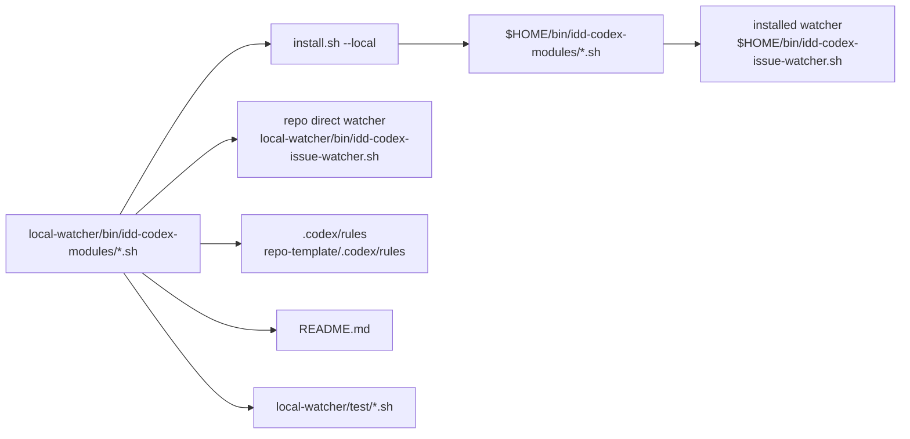
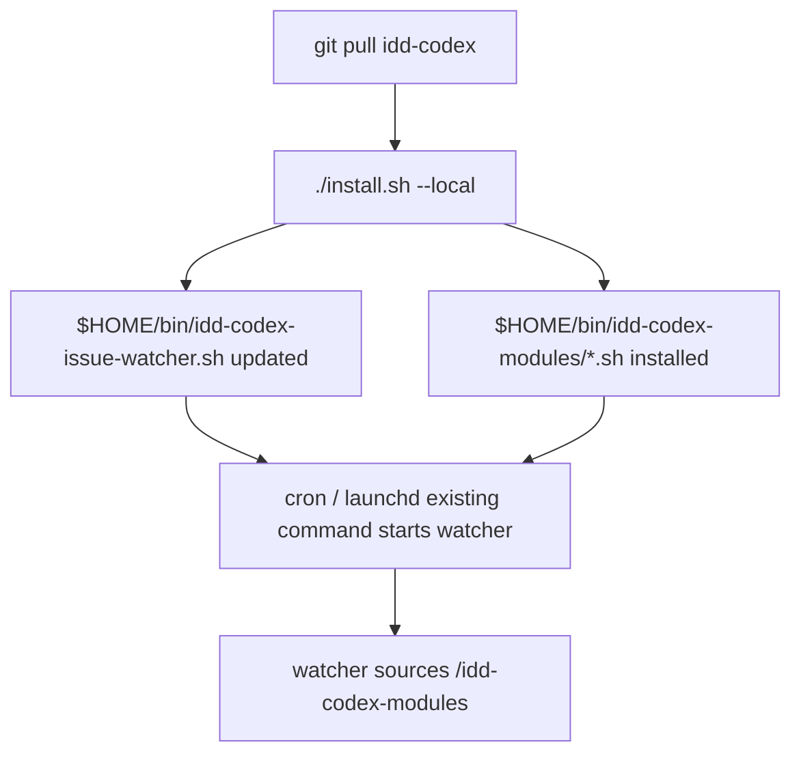

# Design Document

## Overview

idd-codex の local watcher モジュール配置先を `modules/` から `idd-codex-modules/` へ namespace 化し、同一ホストに idd-claude を併設したときの `$HOME/bin/modules/` 衝突を解消する。対象は idd-codex 側の local install、watcher のモジュール解決、repo 直実行用のソース配置、テスト、README、rules 参照の追従であり、watcher の機能挙動やラベル遷移は変更しない。

**Purpose**: この変更は idd-codex と idd-claude の local watcher モジュールを同一 `$HOME/bin` 配下で安全に併設できる価値を、idd-codex の運用者に提供する。  
**Users**: idd-codex を `install.sh --local` でローカル PC に配置し、cron / launchd から `$HOME/bin/idd-codex-issue-watcher.sh` を起動する運用者が利用する。  
**Impact**: 現在の idd-codex モジュール配置と解決先を `$HOME/bin/modules/` / `local-watcher/bin/modules/` から `$HOME/bin/idd-codex-modules/` / `local-watcher/bin/idd-codex-modules/` へ移し、旧 `$HOME/bin/modules/` を idd-codex の実行前提から外す。

### Goals

- `install.sh --local` が idd-codex モジュールを `$HOME/bin/idd-codex-modules/` へ配置し、`$HOME/bin/modules/` へ配置しない。
- watcher が `BASH_SOURCE` 基準で本体同階層の `idd-codex-modules/` を解決し、インストール後と repo 直実行で同一ロジックを維持する。
- README、テスト、root / repo-template rules の参照を新パスへ同期し、利用者とレビュワーが配置変更を検証できる。

### Non-Goals

- idd-claude 側の watcher、installer、モジュール配置、関数名、ラベル運用は変更しない。
- `$HOME/bin/modules/` に残る idd-claude ファイルや旧 idd-codex ファイルの削除、復旧、移行代行はしない。
- Triage / PM / Architect / Developer / Reviewer / PjM の workflow、ラベル遷移、exit code 意味、既存 env var 名、cron / launchd 起動文字列は変更しない。
- idd-codex モジュール本体の機能追加、削除、processor 分割の再設計はしない。
- `install.sh --repo` のテンプレート配置は主対象にしない。ただし README と検証では既存 install 手順との整合を崩さない。

## Architecture

### Existing Architecture Analysis

- `install.sh --local` は `local-watcher/bin/*.sh` / `*.tmpl` を `$HOME/bin` へ配置し、現在は `local-watcher/bin/modules/*.sh` を `$HOME/bin/modules` へ冪等コピーする。
- watcher は `IDD_MODULE_DIR="$(cd "$(dirname "${BASH_SOURCE[0]}")" ... && pwd)/modules"` で本体同階層の modules directory を解決し、`REQUIRED_MODULES` を順に `source` する。
- repo 直実行は `local-watcher/bin/idd-codex-issue-watcher.sh` と同階層の `modules/` に依存している。インストール後は `$HOME/bin/idd-codex-issue-watcher.sh` と同階層の `$HOME/bin/modules/` に依存している。
- root `.codex/rules/` と `repo-template/.codex/rules/` は byte 一致が必要な二重管理対象であり、`local-watcher/bin/modules` の例示を片側だけ更新してはいけない。
- 解消する technical debt は、idd-codex だけ prefix 済みファイル名を使っている一方でモジュールディレクトリだけ namespace されていない点である。

### Architecture Pattern & Boundary Map



**Architecture Integration**:
- 採用パターン: watcher 本体同階層の directory を `BASH_SOURCE` 基準で解決する既存パターンを維持し、directory 名だけを `idd-codex-modules` へ namespace 化する。
- ドメイン／機能境界: 配置責務は `install.sh --local`、実行時解決責務は watcher loader、検証責務は `local-watcher/test` と stage-a verify、利用者説明責務は README、設計規約例示責務は root / repo-template rules に分ける。
- 既存パターンの維持: `REQUIRED_MODULES` の順序、`source` 方式、missing module 時の `exit 1`、`copy_glob_to_homebin` による冪等配置、cron / launchd の起動文字列、既存 env var 名。
- 新規コンポーネントの根拠: 新しいロジックコンポーネントは追加しない。既存の module directory component の名前と配置先だけを namespace 化する。

### Technology Stack

| Layer | Choice / Version | Role in Feature | Notes |
|-------|------------------|-----------------|-------|
| CLI / Scripts | bash 4+ | installer、watcher loader、tests | 既存標準に合わせる |
| Data / Storage | filesystem under repo and `$HOME/bin` | module source / install destination | `$HOME/bin/modules` は idd-codex の配置先として使わない |
| Runtime | cron / launchd / shell | installed watcher 起動 | 起動文字列は不変 |
| Tooling | `shellcheck`, `diff`, bash smoke tests | regression verification | rules の byte sync を diff で確認 |

## File Structure Plan

### Directory Structure

```text
local-watcher/
├── bin/
│   ├── idd-codex-issue-watcher.sh
│   └── idd-codex-modules/              # git mv で modules/ から rename する
│       ├── auto-rebase.sh
│       ├── core_utils.sh
│       ├── guard-hook.sh
│       ├── merge-queue.sh
│       ├── pr-iteration.sh
│       ├── pr-reviewer.sh
│       ├── promote-pipeline.sh
│       ├── quota-aware.sh
│       ├── run-summary.sh
│       ├── scaffolding-health.sh
│       └── stage-a-verify.sh
└── test/
    ├── module_loader_missing_test.sh
    └── *_test.sh                       # ../bin/modules 参照を ../bin/idd-codex-modules へ追従

.codex/
└── rules/
    ├── design-review-gate.md
    └── tasks-generation.md

repo-template/
└── .codex/
    └── rules/
        ├── design-review-gate.md
        └── tasks-generation.md
```

### Modified Files

- `local-watcher/bin/modules/` -> `local-watcher/bin/idd-codex-modules/` — Developer は履歴維持のため `git mv local-watcher/bin/modules local-watcher/bin/idd-codex-modules` を使う。
- `local-watcher/bin/idd-codex-issue-watcher.sh` — `IDD_MODULE_DIR` を `$(dirname BASH_SOURCE)/idd-codex-modules` 相当に変更し、コメントと missing module エラーの復旧案内を `idd-codex-modules/` へ更新する。
- `install.sh` — `install.sh --local` の module source / destination を `local-watcher/bin/idd-codex-modules` -> `$HOME/bin/idd-codex-modules` に変更し、`$HOME/bin/modules` へ idd-codex モジュールを配置しない。
- `local-watcher/test/*.sh` — `../bin/modules/` 参照を `../bin/idd-codex-modules/` へ追従する。特に `module_loader_missing_test.sh` は一時 directory を `"$TMPROOT/idd-codex-modules"` にし、missing module エラーが新パスを指すことを確認する。
- `README.md` — 構成図、モジュール構成説明、手動コピー例、migration note、旧 `$HOME/bin/modules/` 言及を新配置に更新する。必要に応じて「旧 `$HOME/bin/modules/` は idd-codex が削除・復旧しない」ことも migration note に明記する。
- `.codex/rules/tasks-generation.md` と `repo-template/.codex/rules/tasks-generation.md` — verify 例の `local-watcher/bin/modules/*.sh` を `local-watcher/bin/idd-codex-modules/*.sh` へ byte 一致で同期する。
- `.codex/rules/design-review-gate.md` と `repo-template/.codex/rules/design-review-gate.md` — `stage_a_verify_extract_verify_block` の参照パスを `local-watcher/bin/idd-codex-modules/stage-a-verify.sh` へ byte 一致で同期する。
- `local-watcher/bin/idd-codex-modules/*.sh` — 各モジュールヘッダコメントの配置先 `$HOME/bin/modules/*.sh` / `local-watcher/bin/modules/` を `$HOME/bin/idd-codex-modules/*.sh` / `local-watcher/bin/idd-codex-modules/` へ更新する。

## Requirements Traceability

| Requirement | Summary | Components | Interfaces | Flows |
|-------------|---------|------------|------------|-------|
| 1, 1.1, 1.2, 1.3, 1.4 | local install の配置先分離 | Local Installer, Module Directory Layout | `install.sh --local`, `$HOME/bin/idd-codex-modules` | repo source -> install -> `$HOME/bin/idd-codex-modules` |
| 2, 2.1, 2.2, 2.3, 2.4 | watcher 起動時の解決先変更 | Watcher Module Loader, Module Directory Layout | `IDD_MODULE_DIR`, `REQUIRED_MODULES`, stderr | `BASH_SOURCE` dirname -> `idd-codex-modules` -> `source` |
| 1.5, 3, 3.1, 3.2, 3.3, 3.4, 3.5 | 再インストール移行と後方互換 | Local Installer, Watcher Module Loader, Documentation | existing watcher path, env var names, exit code 1 | existing cron / launchd -> same watcher -> new module dir |
| 4, 4.1, 4.2, 4.3, 4.4, 4.5 | docs と検証可能性 | Documentation, Loader Regression Tests, Rule Synchronization | README, bash tests, stage-a verify block | docs update -> test execution -> PR Test plan |
| Scope-out 2.1, 2.2, 2.3, 2.4, 2.5 | idd-claude 側、workflow、起動契約、旧 directory 復旧代行、module logic 変更を除外 | Non-Goals, Local Installer, Watcher Module Loader | no fallback, no cleanup, no behavior change | implementation avoids touching excluded owners and contracts |
| NFR 1, NFR 1.1, NFR 1.2 | 併設安全性 | Local Installer, Module Directory Layout | no writes to `$HOME/bin/modules` | idd-codex reinstall does not overwrite idd-claude modules |
| NFR 2, NFR 2.1, NFR 2.2 | 冪等性 | Local Installer | `ensure_dir`, `copy_glob_to_homebin` | repeated `install.sh --local` reuses `$HOME/bin/idd-codex-modules` |
| NFR 3, NFR 3.1 | 観測可能性 | Watcher Module Loader, Loader Regression Tests | missing module stderr | missing file -> pathful error -> exit 1 |

## Components and Interfaces

### Module Layout

#### Module Directory Layout

| Field | Detail |
|-------|--------|
| Intent | idd-codex 専用 module namespace を filesystem 上で提供する |
| Requirements | 1.1, 1.2, 1.3, 1.4, 2.3, 3.5, 4.1, 4.2 |

**Responsibilities & Constraints**
- `local-watcher/bin/modules/` を `local-watcher/bin/idd-codex-modules/` へ rename する。
- rename は `git mv` を使い、既存 module ファイルの履歴を保つ。
- module ファイル名と `REQUIRED_MODULES` の一覧・順序は変更しない。
- `$HOME/bin/modules/` を idd-codex の source / install destination として扱わない。

**Dependencies**
- Inbound: Local Installer — repo source directory として参照する (Critical)
- Inbound: Watcher Module Loader — repo 直実行時に参照する (Critical)
- Inbound: Tests / Docs / Rules — path example と検証対象として参照する (Important)

**Contracts**: State [x]

##### State Contract

| State | Expected Path | Owner |
|-------|---------------|-------|
| repo source | `local-watcher/bin/idd-codex-modules/*.sh` | idd-codex |
| installed local watcher | `$HOME/bin/idd-codex-modules/*.sh` | idd-codex |
| legacy / idd-claude area | `$HOME/bin/modules/*.sh` | idd-codex は変更前提にしない |

### Installer

#### Local Installer

| Field | Detail |
|-------|--------|
| Intent | `install.sh --local` で idd-codex watcher と専用 module directory を `$HOME/bin` へ配置する |
| Requirements | 1.1, 1.2, 1.3, 1.4, 3.1, 3.2, 3.4, NFR 1.1, NFR 1.2, NFR 2.1, NFR 2.2 |

**Responsibilities & Constraints**
- `"$LOCAL_WATCHER_DIR/bin/idd-codex-modules"` が存在する場合だけ `$HOME/bin/idd-codex-modules` を作り、`*.sh` を executable としてコピーする。
- `install.sh --local` では idd-codex module の destination として `$HOME/bin/modules` を作成・更新しない。
- 既存の `copy_glob_to_homebin` と `ensure_dir` を使い、冪等性とログ形式を既存実装に揃える。
- `install.sh --repo` の repo template 配置責務は変更しない。
- 旧 `$HOME/bin/modules` の削除や idd-claude module 復旧は行わない。

**Dependencies**
- Inbound: User / setup docs — `./install.sh --local` を実行する (Critical)
- Outbound: Module Directory Layout — source files を読む (Critical)
- Outbound: filesystem `$HOME/bin` — destination に書く (Critical)

**Contracts**: Batch [x] / State [x]

##### Batch Contract

```bash
./install.sh --local
```

- Preconditions: repo checkout に `local-watcher/bin/idd-codex-modules/*.sh` が存在する。
- Postconditions: `$HOME/bin/idd-codex-modules/*.sh` が配置され、watcher が同階層から source できる。
- Invariants: `$HOME/bin/modules/` は idd-codex module destination として使わない。既存 watcher 起動文字列は変えない。

### Watcher Runtime

#### Watcher Module Loader

| Field | Detail |
|-------|--------|
| Intent | watcher 起動時に本体同階層の idd-codex 専用 modules を読み込む |
| Requirements | 2.1, 2.2, 2.3, 2.4, 3.2, 3.3, 3.4, 3.5, NFR 3.1 |

**Responsibilities & Constraints**
- `IDD_MODULE_DIR` は `$(cd "$(dirname "${BASH_SOURCE[0]}")" ... && pwd)/idd-codex-modules` 相当で計算する。
- repo 直実行と `$HOME/bin` インストール後の両方で、同じ `BASH_SOURCE` 基準解決を使う。
- missing module 時は、欠落 path と `install.sh --local` の再実行案内に `idd-codex-modules/` を含め、`exit 1` の安全停止を維持する。
- `REQUIRED_MODULES` の配列、source 順、後続 workflow、ラベル遷移、exit code 意味は変更しない。

**Dependencies**
- Inbound: cron / launchd / direct shell — watcher 本体を起動する (Critical)
- Outbound: Module Directory Layout — `*.sh` を source する (Critical)
- Outbound: stderr — missing module を利用者へ通知する (Important)

**Contracts**: State [x] / Batch [x]

##### State Contract

```bash
IDD_MODULE_DIR="$(cd "$(dirname "${BASH_SOURCE[0]}")" >/dev/null 2>&1 && pwd)/idd-codex-modules"
```

- Preconditions: watcher 本体と `idd-codex-modules/` が同一 directory にある。
- Postconditions: `REQUIRED_MODULES` の全ファイルが source される。
- Invariants: `$HOME/bin/modules/` を fallback として参照しない。

### Verification and Documentation

#### Loader Regression Tests

| Field | Detail |
|-------|--------|
| Intent | module directory rename 後も missing module 検知と repo 直実行相当の解決を検証する |
| Requirements | 2.3, 2.4, 4.3, 4.4, 4.5, NFR 3.1 |

**Responsibilities & Constraints**
- `local-watcher/test/*.sh` の `../bin/modules` 参照を `../bin/idd-codex-modules` へ変更する。
- `module_loader_missing_test.sh` は一時コピー先も `idd-codex-modules` にし、欠落時 stderr が新 directory を含むことを確認する。
- install smoke は一時 `HOME` を使い、`install.sh --local` が `$HOME/bin/idd-codex-modules` を作り、`$HOME/bin/modules` に idd-codex module を配置しないことを確認する。

**Dependencies**
- Inbound: Developer / stage-a verify — test を実行する (Critical)
- Outbound: Local Installer / Watcher Module Loader — observable behavior を検査する (Critical)

**Contracts**: Batch [x]

#### Documentation

| Field | Detail |
|-------|--------|
| Intent | 利用者向けの構成図、手動コピー例、migration note を新配置へ揃える |
| Requirements | 1.5, 3.1, 3.2, 4.1, 4.2 |

**Responsibilities & Constraints**
- README の `modules/` 説明を `idd-codex-modules/` へ更新する。
- 手動コピー例は `mkdir -p "$HOME/bin/idd-codex-modules"` と `cp .../idd-codex-modules/*.sh "$HOME/bin/idd-codex-modules/"` にする。
- migration note は既存利用者が `cd ~/.idd-codex && git pull && ./install.sh --local` で移行できること、旧 `$HOME/bin/modules/` の削除・復旧は idd-codex が代行しないことを明記する。

**Dependencies**
- Inbound: Users / reviewers — README を参照する (Important)
- Outbound: Local Installer / Watcher Module Loader — actual behavior と一致させる (Critical)

**Contracts**: State [x]

#### Rule Synchronization

| Field | Detail |
|-------|--------|
| Intent | root と repo-template の rules 例示を新 module path に同期する |
| Requirements | 4.1, 4.2 |

**Responsibilities & Constraints**
- `.codex/rules/tasks-generation.md` と `repo-template/.codex/rules/tasks-generation.md` の verify 例を同一内容で更新する。
- `.codex/rules/design-review-gate.md` と `repo-template/.codex/rules/design-review-gate.md` の `stage-a-verify.sh` 参照を同一内容で更新する。
- 変更後に `diff -r .codex/rules repo-template/.codex/rules` が空であることを確認する。

**Dependencies**
- Inbound: Architect / Developer / Reviewer agents — rules を参照する (Critical)
- Outbound: Documentation / tests — path example の整合性を保つ (Important)

**Contracts**: State [x]

## Data Models

永続データモデルや schema は追加しない。filesystem 上の状態だけが対象であり、重要な state は以下に限定する。

| State | Before | After |
|-------|--------|-------|
| repo module source | `local-watcher/bin/modules/*.sh` | `local-watcher/bin/idd-codex-modules/*.sh` |
| installed module destination | `$HOME/bin/modules/*.sh` | `$HOME/bin/idd-codex-modules/*.sh` |
| watcher module lookup | `<watcher-dir>/modules/*.sh` | `<watcher-dir>/idd-codex-modules/*.sh` |

## Error Handling

### Error Strategy

missing module は従来どおり起動時に stderr へ具体 path を出し、`exit 1` で安全停止する。silent fail、旧 `$HOME/bin/modules` への fallback、部分的な source 継続は行わない。

### Error Categories and Responses

- **User / Setup Errors**: `idd-codex-modules/*.sh` が欠落している場合、欠落ファイル path と `install.sh --local` 再実行案内を出す。
- **System Errors**: `install.sh --local` のコピー失敗は既存の shell error propagation と `set -euo pipefail` に従う。
- **Business Logic Errors**: 対象外。workflow の状態遷移やラベル遷移は変更しない。

## Testing Strategy

- **Static Analysis**:
  - `shellcheck local-watcher/bin/idd-codex-issue-watcher.sh local-watcher/bin/idd-codex-modules/*.sh install.sh setup.sh .github/scripts/*.sh`
  - `diff -r .codex/rules repo-template/.codex/rules`
- **Unit / Smoke Tests**:
  - `bash local-watcher/test/module_loader_missing_test.sh` で missing module の `exit 1` と新 path の stderr を確認する。
  - 既存 `local-watcher/test/*.sh` の module path 参照が新 directory で通ることを、関連 test 実行または path grep で確認する。
- **Integration Tests**:
  - 一時 `HOME` で `./install.sh --local` を実行し、`$HOME/bin/idd-codex-modules/core_utils.sh` 等が配置されることを確認する。
  - 同じ一時 `HOME` で `$HOME/bin/modules/core_utils.sh` 等の idd-codex module が配置されないことを確認する。
  - repo 直実行相当として watcher 本体の一時コピーと `idd-codex-modules/` を使い、loader が `BASH_SOURCE` 基準で解決することを確認する。
- **E2E/UI Tests**: UI は存在しないため対象外。実環境 E2E は必要に応じて人間が dogfooding issue で確認する。
- **Performance/Load**: directory 名変更のみで性能要件はない。source 対象数と順序は不変。

## Migration Strategy

既存利用者は merge 後に idd-codex repository を更新し、`./install.sh --local` を再実行するだけで新配置へ移行する。cron / launchd の起動文字列は `$HOME/bin/idd-codex-issue-watcher.sh` のままでよい。



旧 `$HOME/bin/modules/` は idd-codex の新 runtime requirement から外れるが、idd-codex はこの directory を削除しない。idd-claude 側ファイルの復旧が必要な場合は idd-claude 側の手順で扱う。
