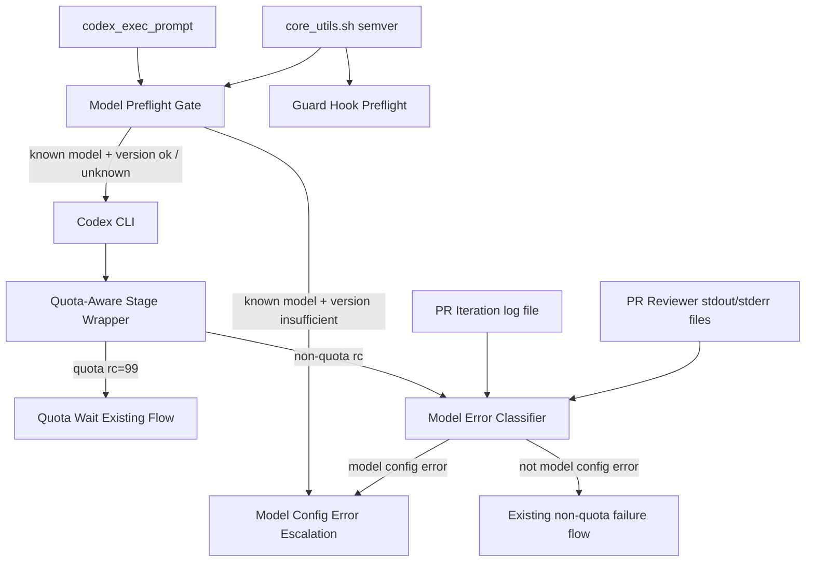

# Design Document

## Overview

本設計は、watcher が Codex CLI を起動する前に「指定モデルが要求する最低 CLI version」を確認し、既知の不整合では codex を起動せず fail-fast する境界を追加する。さらに、codex 実行後の stderr / stream から `model not found` / `unsupported model` 系エラーを検出し、通常の実装失敗や quota wait と区別して operator-visible に分類する。

**Purpose**: この機能はモデル設定ミスを通常の実装失敗から切り分ける価値を watcher 運用者に提供する。  
**Users**: idd-codex のローカル watcher 運用者が、モデル更新、Codex CLI 更新、failed-recovery 調査の workflow で利用する。  
**Impact**: 現在は codex rc 非 0 が多くの経路で `codex-failed` や retry として扱われる。変更後は既知モデルの CLI version 不足を stage 前に止め、実行後の model 不存在系失敗を「設定エラーの可能性」としてログ / コメント / recovery guidance に露出する。

### Goals

- `gpt-5.6-*` など最低 Codex CLI version を持つモデルを stage 起動前に検査する。
- 未知モデルは前方互換のため preflight で拒否せず、codex 実行後の model-not-found 分類に委ねる。
- model-not-found / unsupported-model 系エラーを quota wait と通常失敗から区別して観測可能にする。
- semver 比較を `core_utils.sh` へ抽出し、guard hook と model preflight で共有する。
- 新規ロジックは `local-watcher/bin/idd-codex-modules/model-preflight.sh` に配置し、本体 monolith への追加を最小化する。
- README に env override、default ON / escape hatch、復旧手順を記載する。

### Non-Goals

- Codex CLI の model catalog を network fetch して動的同期すること。
- `TRIAGE_MODEL` / `DEV_MODEL` など既存 default model ID の変更。
- 新しい GitHub label の追加、既存 label 名の変更、exit code 意味の破壊。
- quota wait の reset parsing、ラベル遷移、resume rails の再設計。
- Codex CLI を watcher が自動 update すること。

## Architecture

### Existing Architecture Analysis

- `codex_exec_prompt` は標準 stage、per-task Implementer / Reviewer、failed-recovery、auto-rebase、PR iteration など複数経路から呼ばれる共通 Codex CLI 起動 helper である。ここに preflight を入れると多くの `codex_exec_prompt` 利用者を横断できる。
- `qa_run_codex_stage` は標準 issue stage を quota-aware にラップし、quota 検出時は rc=99 を返して `qa_handle_quota_exceeded` へ委譲する。model error classification は quota 検出より低優先にし、quota wait を誤分類しない。
- PR iteration は `codex_exec_prompt` の出力を `tee` で `$pi_log_file` に保存し、usage-limit fatal や 529 を後処理している。model-not-found 分類は同じ log artifact を読む helper として接続できる。
- PR reviewer は `PR_REVIEWER_CODEX_CMD` template で外部 review command を実行し、stdout / stderr を secure tempfile に分けて保持する。`codex_exec_prompt` を経由しないため、実行後分類 helper を stdout / stderr file に対して呼ぶ必要がある。
- guard hook は `guard_compare_semver` を `guard-hook.sh` 内に持っており、model preflight との重複を避けるには `core_utils.sh` に共通 helper を置き、guard hook 側を移行する。

### Architecture Pattern & Boundary Map



**Architecture Integration**:

- 採用パターン: fail-fast preflight + post-run classifier。実行前に deterministic な version 不足を止め、実行後に catalog / account / retired model 由来の model-not-found を分類する。
- ドメイン／機能境界: version map / semver / codex version parsing / model error pattern / escalation text を分離する。label 遷移の最終責務は既存 stage failure handler に残す。
- 既存パターンの維持: bash module、`REQUIRED_MODULES` load、`idd_secure_mktemp`、processor prefix log、`qa_run_codex_stage` の quota 優先、既存 `codex-failed` / PR label 遷移。
- 新規コンポーネントの根拠: model-specific policy は quota-aware や guard-hook と責務が異なるため、`model-preflight.sh` として独立させる。

### Technology Stack

| Layer | Choice / Version | Role in Feature | Notes |
|-------|------------------|-----------------|-------|
| Frontend / CLI | bash 4+ / Codex CLI | `codex --version` preflight と codex output 分類 | 新 runtime dependency なし |
| Backend / Services | GitHub CLI `gh` | 既存 escalation comment / label 操作を流用 | 新 API 呼び出しは既存 comment/edit 範囲 |
| Data / Storage | env vars / local log files | model map override、stream / stderr artifact | secrets は扱わない |
| Messaging / Events | Issue / PR comments | 設定エラーの可能性を人間へ通知 | 新 label は追加しない |
| Infrastructure / Runtime | local watcher / cron / launchd | stage 起動前 gate と実行後 classification | 既存 cron contract 維持 |

## File Structure Plan

### Directory Structure

```text
local-watcher/
├── bin/
│   ├── idd-codex-issue-watcher.sh              # module load と codex_exec_prompt / failure flow への最小接続
│   └── idd-codex-modules/
│       ├── core_utils.sh                       # semver helper と codex version extract helper を共有化
│       ├── guard-hook.sh                       # guard_compare_semver を共有 helper 呼び出しへ置換
│       ├── model-preflight.sh                  # model version preflight / model error classifier / escalation helpers
│       ├── quota-aware.sh                      # quota 優先後に model classifier を呼べる hook point を追加
│       ├── pr-iteration.sh                     # iteration log file の model error 分類を接続
│       ├── pr-reviewer.sh                      # stdout / stderr file の model error 分類を接続
│       └── failed-recovery.sh                  # model config error は retry budget を消費しない終端理由へ接続
└── test/
    ├── model_preflight_test.sh                 # version map / semver / preflight / classifier fixture
    ├── guard_hook_test.sh                      # shared semver 移行後の guard preflight regression
    ├── qa_run_codex_stage_test.sh              # quota 優先と model error 分類の境界 regression
    ├── pi_usage_limit_fatal_test.sh            # PR iteration の model error 非混同 regression を追加
    └── pr_reviewer_quota_marker_test.sh        # PR reviewer の model error 非混同 regression を追加

README.md                                      # optional features / troubleshooting / env var table を更新
docs/specs/175--codex-cli-preflight-model-not-found/
├── requirements.md
├── design.md
└── tasks.md
```

### Modified Files

- `local-watcher/bin/idd-codex-modules/model-preflight.sh` — 新規 module。`mp_` prefix で preflight、model map parsing、codex version detection、model error detection、Issue / PR escalation body builder を提供する。
- `local-watcher/bin/idd-codex-modules/core_utils.sh` — `idd_compare_semver` と `idd_extract_semver` を追加し、非数値 suffix は数値 prefix までを比較する。
- `local-watcher/bin/idd-codex-modules/guard-hook.sh` — `guard_compare_semver` の実装を削除または thin wrapper 化し、`idd_compare_semver` を利用する。
- `local-watcher/bin/idd-codex-issue-watcher.sh` — `REQUIRED_MODULES` に `model-preflight.sh` を追加し、`codex_exec_prompt` の CLI 起動直前に preflight を呼ぶ。標準 failure comment 生成前に model config error を確認できる hook を追加する。
- `local-watcher/bin/idd-codex-modules/quota-aware.sh` — `qa_run_codex_stage` の quota 判定後、non-quota rc 透過前に stream file を model classifier に渡す。quota rc=99 は既存どおり優先する。
- `local-watcher/bin/idd-codex-modules/pr-iteration.sh` — codex 非 0 exit 時、usage-limit / 529 判定と競合しない位置で iteration log file の model config error を分類し、PR comment / `codex-failed` escalation に設定エラー文言を追加する。
- `local-watcher/bin/idd-codex-modules/pr-reviewer.sh` — non-quota exec failure 時、stdout / stderr file を classifier に渡し、PR reviewer error comment と exec-fail streak の扱いに設定エラー reason を残す。
- `local-watcher/bin/idd-codex-modules/failed-recovery.sh` — `fr_run_recovery_attempt` の codex rc 非 0 が model config error の場合、attempt budget を消費しない deterministic terminal reason として state / comment に残す。
- `README.md` — Optional features table、Codex CLI troubleshooting、model map override、`codex update` guidance を追加する。
- `local-watcher/test/model_preflight_test.sh` — 新規 shell fixture。map parsing、known insufficient version、unknown model pass-through、malformed override warning、model-not-found / unsupported-model pattern を検証する。

## Requirements Traceability

| Requirement | Summary | Components | Interfaces | Flows |
|-------------|---------|------------|------------|-------|
| 1, 1.1, 1.2, 1.3, 1.4, 1.5 | version preflight | Model Preflight Gate, Model Config Error Escalation | `codex --version`, `codex_exec_prompt` | stage start -> preflight -> pass/fail |
| 2, 2.1, 2.2, 2.3, 2.4, 2.5 | model-not-found 分類 | Model Error Classifier, Quota Boundary Adapter, PR Iteration Adapter, PR Reviewer Adapter | stream file, stderr file, comment body | non-quota rc -> classify -> existing failure flow |
| 3, 3.1, 3.2, 3.3, 3.4, 3.5 | model map / override | Model Version Requirement Map | `MODEL_PREFLIGHT_MIN_VERSIONS` | env parse -> model lookup |
| 4, 4.1, 4.2, 4.3, 4.4, 4.5 | shared semver | Core Version Utilities, Guard Hook Adapter | `idd_compare_semver`, `idd_extract_semver` | guard + model preflight |
| 5, 5.1, 5.2, 5.3, 5.4, 5.5 | module boundary / compatibility | Model Preflight Module, Watcher Bootstrap, README | `REQUIRED_MODULES`, env escape hatch | startup + stage execution |
| 6, 6.1, 6.2, 6.3, 6.4, 6.5, 6.6 | regression / docs | Model Preflight Regression Tests, Existing Flow Regression Tests, Operator Docs | shell tests, README | verification |
| NFR 1, NFR 1.1, NFR 1.2, NFR 1.3 | backward compatibility | All components | labels, defaults, quota flow | all flows |
| NFR 2, NFR 2.1, NFR 2.2 | observability | Model Config Error Escalation, logs | stable prefix, comments | fail-fast / post-run classification |

## Components and Interfaces

### Shared Utilities

#### Core Version Utilities

| Field | Detail |
|-------|--------|
| Intent | watcher 全体で使う semver 抽出 / 比較を提供する |
| Requirements | 4.1, 4.2, 4.3, 4.4, 4.5 |

**Responsibilities & Constraints**

- `MAJOR.MINOR.PATCH` の数値 prefix を比較する。patch 欠落は `0` と扱う。
- `0.144.0-beta` のような suffix は `0.144.0` として比較する。
- 完全に version として読めない入力は比較不能として return 2 など非 0 を返す。
- stdout は比較結果に使わず、呼び出し側の log discipline を守る。

**Dependencies**

- Inbound: Guard Hook Adapter — hook version preflight (Critical)
- Inbound: Model Preflight Gate — model minimum version preflight (Critical)
- External: bash arithmetic (Critical)

**Contracts**: Service [x]

##### Service Interface

```bash
idd_extract_semver <raw_string>
# stdout: X.Y.Z
# rc=0 extracted / rc=1 not found

idd_compare_semver <actual> <required>
# rc=0 actual >= required
# rc=1 actual < required
# rc=2 comparison invalid
```

### Model Preflight Module

#### Model Version Requirement Map

| Field | Detail |
|-------|--------|
| Intent | model pattern から最低 Codex CLI version を解決する |
| Requirements | 1.4, 3.1, 3.2, 3.3, 3.4, 3.5, 5.5 |

**Responsibilities & Constraints**

- 既定 map は `gpt-5.6-*>=0.144.0` を含む。OpenAI Help Center は GPT-5.6 の Codex CLI minimum を `0.144.0` と示し、OpenAI Codex repository の model catalog でも `gpt-5.6-sol` / `gpt-5.6-luna` に `minimal_client_version: "0.144.0"` がある。
- env override は `MODEL_PREFLIGHT_MIN_VERSIONS` に `pattern:min_version` を comma 区切りで渡す想定にする。例: `gpt-5.6-*:0.144.0,gpt-5.7-*:0.150.0`。
- pattern は shell glob として扱い、未信頼入力を `eval` / dynamic source に渡さない。
- malformed entry は WARN log に残して skip する。map 全体を fail closed しない。

**Dependencies**

- Inbound: Model Preflight Gate — model lookup (Critical)
- Outbound: Core Version Utilities — version validate (Critical)

**Contracts**: Service [x] / State [x]

##### Service Interface

```bash
mp_required_version_for_model <model_id>
# stdout: minimum version if known, empty if unknown
# rc=0 always; malformed override entries are warned and skipped
```

#### Model Preflight Gate

| Field | Detail |
|-------|--------|
| Intent | codex stage 起動前に既知 model の minimum CLI version を満たすか判定する |
| Requirements | 1.1, 1.2, 1.3, 1.4, 1.5, 3.4, 5.1, 5.2, NFR 2.1, NFR 2.2 |

**Responsibilities & Constraints**

- `MODEL_PREFLIGHT_ENABLED=false` の完全一致時のみ無効化し、それ以外は default ON とする。これは外部 service を追加せず、設定ミスを fail-fast する operator safety 機能のためである。
- unknown model は pass-through し、`model typo` を preflight では止めない。
- known model で `codex --version` が取れない / parse できない場合は fail-fast する。
- fail-fast 時は codex command を起動しない。標準 stage は Issue comment、PR iteration / reviewer は PR comment または既存 error comment に設定エラー文言を渡す。
- `codex update` は案内のみで実行しない。

**Dependencies**

- Inbound: `codex_exec_prompt` — standard codex launch (Critical)
- Outbound: Model Version Requirement Map — required version lookup (Critical)
- Outbound: Core Version Utilities — version compare (Critical)
- Outbound: Model Config Error Escalation — comment body / log detail (Important)

**Contracts**: Service [x] / Batch [x] / State [x]

##### Service Interface

```bash
mp_preflight_model <stage_label> <model_id>
# rc=0 pass / unknown / disabled
# rc=78 model config error fail-fast
# stdout: empty
# stderr/log: operator-visible diagnostics through mp_warn/mp_error
```

`codex_exec_prompt` は rc=78 をそのまま呼び出し側へ返す。呼び出し側は rc=78 を model config error として扱えるよう、必要に応じて `mp_last_error_file` または stage log marker を参照する。

#### Model Error Classifier

| Field | Detail |
|-------|--------|
| Intent | codex 実行後 artifact から model 不存在 / unsupported model を検出する |
| Requirements | 2.1, 2.2, 2.3, 2.4, 2.5, 5.3 |

**Responsibilities & Constraints**

- stdout stream-json、plain stderr、merged log のいずれも line-oriented scan できる。
- 検出 pattern は case-insensitive で `model not found`, `unsupported model`, `unknown model`, `does not exist`, `not available for your account` を初期候補とする。ただし quota / usage-limit 系 pattern より優先しない。
- 公開コメントには raw log 全文を貼らず、model ID、stage、reason、local artifact path / correlation token だけを出す。
- classifier 自体が失敗しても既存 non-quota failure flow を妨げない。

**Dependencies**

- Inbound: Quota Boundary Adapter — standard stage stream file (Critical)
- Inbound: PR Iteration Adapter — iteration log file (Important)
- Inbound: PR Reviewer Adapter — stdout / stderr file (Important)
- Outbound: Model Config Error Escalation — comment text / reason token (Critical)

**Contracts**: Service [x]

##### Service Interface

```bash
mp_detect_model_error <model_id> <artifact_path> [<artifact_path>...]
# stdout: reason token and sanitized excerpt
# rc=0 detected / rc=1 not detected / rc=2 unreadable input
```

#### Model Config Error Escalation

| Field | Detail |
|-------|--------|
| Intent | preflight / classifier の結果を既存 Issue / PR failure comment に安全に反映する |
| Requirements | 1.2, 1.3, 2.3, 2.4, NFR 2.1, NFR 2.2 |

**Responsibilities & Constraints**

- model ID、stage、reason、current / required version、operator action を統一文面へ整形する。
- public comment には raw stderr / stream 全文を含めず、local artifact path または correlation token だけを残す。
- 既存 `codex-failed` / PR failure comment の補助文として使い、新 label を追加しない。
- `codex update` は実行せず案内だけに留める。

**Dependencies**

- Inbound: Model Preflight Gate — version mismatch / version unreadable (Critical)
- Inbound: Model Error Classifier — model-not-found / unsupported-model (Critical)
- Outbound: existing failure handlers — Issue / PR comment に文面を渡す (Critical)

**Contracts**: Service [x]

##### Service Interface

```bash
mp_build_config_error_summary <kind> <stage_label> <model_id> <reason> [artifact]
# stdout: sanitized markdown fragment
# rc=0 always
```

### Runtime Adapters

#### Quota Boundary Adapter

| Field | Detail |
|-------|--------|
| Intent | `qa_run_codex_stage` で quota 優先を維持しつつ model error classification を接続する |
| Requirements | 2.3, 2.4, 2.5, NFR 1.2 |

**Responsibilities & Constraints**

- `qa_detect_rate_limit` / rollout rate limit による rc=99 が成立した場合は model classifier を実行しても label 遷移に使わない、または classifier を skip する。
- quota でない rc 非 0 のときのみ stream file を `mp_detect_model_error` に渡す。
- standard issue flow では設定エラー comment を `mark_issue_failed` または専用 wrapper に渡し、`codex-failed` は既存 label として維持する。

**Dependencies**

- Inbound: `qa_run_codex_stage` — codex execution wrapper (Critical)
- Outbound: Model Error Classifier — artifact classification (Critical)
- Outbound: existing failure handlers — label / comment (Critical)

**Contracts**: Batch [x] / State [x]

#### PR Iteration Adapter

| Field | Detail |
|-------|--------|
| Intent | PR iteration の non-quota codex failure を model config error として説明可能にする |
| Requirements | 2.3, 2.4, 2.5, NFR 2.1 |

**Responsibilities & Constraints**

- `pi_detect_usage_limit_fatal` が成立した場合は既存 quota wait / usage-limit 経路を優先する。
- model config error の場合は `codex-failed` escalation comment に「設定エラーの可能性」を含める。
- no-progress / max-rounds counter の意味は変更しない。

**Contracts**: Batch [x]

#### PR Reviewer Adapter

| Field | Detail |
|-------|--------|
| Intent | PR reviewer command の stdout / stderr から model config error を分類する |
| Requirements | 2.1, 2.2, 2.3, 2.4, 2.5 |

**Responsibilities & Constraints**

- `pr_detect_usage_limit_reset_epoch` が reset epoch を返す場合は quota wait を優先する。
- model config error の場合も raw stdout / stderr は local diagnostic artifact に留める。
- exec-fail streak に計上するかは既存設計との互換を優先する。推奨は deterministic config error として streak reason に `model-config-error` を残すが、label 名は増やさない。

**Contracts**: Batch [x]

#### Failed Recovery Adapter

| Field | Detail |
|-------|--------|
| Intent | model config error を retry budget 消費対象から切り離す |
| Requirements | 1.3, 2.4, 5.3, NFR 2.2 |

**Responsibilities & Constraints**

- failed-recovery の codex attempt が rc=78 または artifact classifier で model config error と判定された場合、attempt budget を増やさない。
- state JSON の terminal / last_status には `model-config-error` 相当の reason を残す。
- `codex-failed` は据え置き、comment に `codex update` / model ID 修正 guidance を含める。

**Contracts**: Batch [x] / State [x]

## Data Models

### Model Minimum Version Map

```text
MODEL_PREFLIGHT_MIN_VERSIONS="gpt-5.6-*:0.144.0,gpt-5.7-*:0.150.0"
```

| Field | Meaning | Validation |
|-------|---------|------------|
| pattern | shell glob pattern matched against model ID | non-empty, no whitespace-only |
| min_version | minimum Codex CLI version | `idd_extract_semver` success required |

Default map:

| Pattern | Minimum Codex CLI | Source |
|---------|-------------------|--------|
| `gpt-5.6-*` | `0.144.0` | OpenAI Help Center / openai/codex model catalog |

### Model Config Error Record

```text
kind=model-config-error
stage=<stage_label>
model=<model_id>
reason=<preflight-version|model-not-found|unsupported-model|codex-version-unreadable>
current_version=<version-or-unknown>
required_version=<version-or-empty>
artifact=<path-or-correlation-token>
```

This record is an internal shell variable / log line contract, not a persisted JSON schema. It keeps comments and logs consistent across Issue, PR iteration, PR reviewer, and failed-recovery flows.

## Error Handling

### Error Strategy

- Preflight version mismatch is deterministic: fail-fast before codex launch, return rc=78, and emit model / current version / required version / update guidance.
- Unknown model is forward-compatible: no preflight rejection. If codex later reports model-not-found, post-run classifier handles it.
- Quota is higher priority: quota wait remains rc=99 and `codex-needs-quota-wait`; model classifier must not steal that path.
- Classifier failure is fail-open: unreadable artifacts or pattern parser errors do not mask existing failure handling.
- Public comments are sanitized: no raw stderr dump; include reason token, model ID, stage, and recovery guidance.

### Error Categories and Responses

- **User / Operator Errors (configuration)**: model version mismatch, model not found, unsupported model. Response: `codex update` guidance, model env var check, `MODEL_PREFLIGHT_MIN_VERSIONS` guidance, `codex-failed` or existing PR terminal label with setting-error wording.
- **System Errors**: `codex --version` unavailable, version parse failure. Response: fail-fast for known models, operator log with command/path, no codex launch.
- **Business Logic Errors**: malformed override map. Response: WARN and skip malformed entry, continue with valid entries/default map.

## Testing Strategy

- **Unit Tests**:
  - `idd_compare_semver` handles equal, greater, lesser, suffix, missing patch, invalid input.
  - `mp_required_version_for_model` resolves `gpt-5.6-sol` / `gpt-5.6-terra` / `gpt-5.6-luna` and pass-through unknown model.
  - malformed `MODEL_PREFLIGHT_MIN_VERSIONS` entry emits WARN and is skipped.
  - `mp_detect_model_error` detects model-not-found / unsupported-model from plain stderr and stream-json-like lines.
- **Integration Tests**:
  - `mp_preflight_model` with stubbed `CODEX_BIN --version` returns rc=78 and does not invoke codex command for insufficient version.
  - `qa_run_codex_stage` keeps quota rc=99 priority when quota and model text coexist.
  - PR iteration non-quota failure log with unsupported model produces setting-error guidance.
  - PR reviewer stdout / stderr model error produces sanitized diagnostic and does not expose raw logs publicly.
- **E2E/UI Tests**:
  - Not applicable; this is local watcher bash workflow without UI.
- **Performance/Load**:
  - Preflight calls `codex --version` only for known model patterns; cache detected version per watcher process to avoid repeated calls within a cycle.
  - Classifier scans bounded local artifacts linearly and does not parse large logs with unbounded command substitution.

## Security Considerations

- Model IDs and log artifacts can include untrusted data from env or tool output. Pattern matching must use quoted variables and `case` / fixed grep patterns, not `eval`, dynamic `source`, or `bash -c` with untrusted fragments.
- Public comments must not include full stderr / stream output because model errors can be adjacent to prompt or repository details.
- Env override map is operator-controlled but still parsed defensively; malformed entries warn and skip rather than becoming shell code.

## Supporting References

- OpenAI Help Center indicates GPT-5.6 access in Codex requires Codex CLI `0.144.0`: <https://help.openai.com/zh-hans-cn/articles/20001354-gpt-56-in-chatgpt>
- OpenAI Codex model catalog includes `minimal_client_version: "0.144.0"` for GPT-5.6 models: <https://github.com/openai/codex/blob/main/codex-rs/models-manager/models.json>

## Design Review Notes

- Default ON is selected because the feature prevents deterministic misconfiguration from launching codex and adds only local `codex --version` plus log classification. `MODEL_PREFLIGHT_ENABLED=false` remains as an emergency escape hatch.
- No new label is introduced. Existing terminal labels stay stable; the distinction is exposed through structured logs, comments, and failed-recovery state reason.
- Unknown model pass-through is deliberate to avoid blocking future model IDs before the map is updated.
