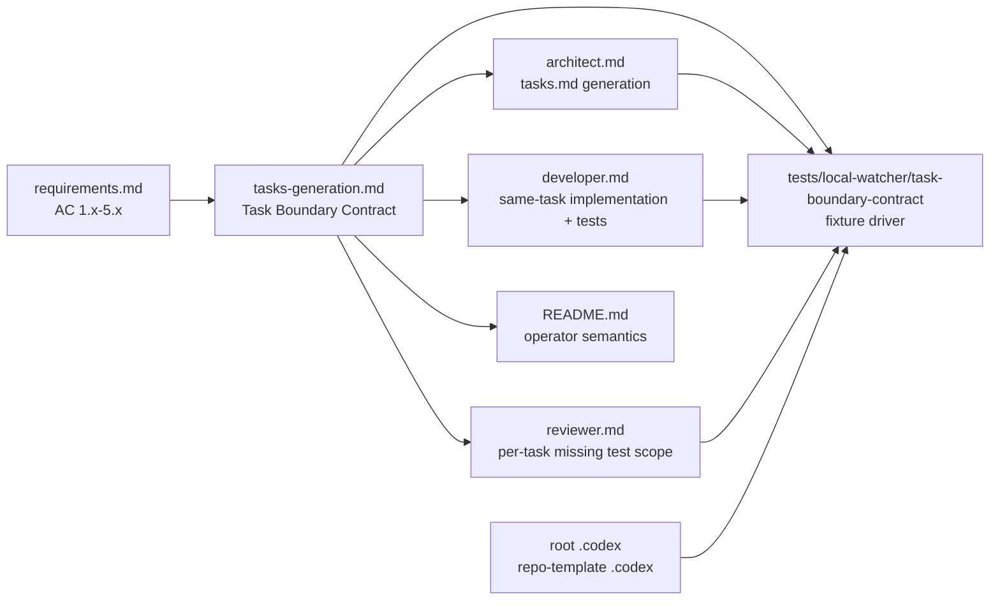

# Design Document

## Overview

per-task Reviewer は task 1 件の `_Requirements:_` を判定対象にするため、Architect が先行 task に regression coverage / failure path / safety fallback の AC を載せたまま対応テストを後続 task に分離すると、先行 task 完了時点で `missing test` reject が正しく発生する。本件は idd-codex 固有の port drift ではなく、Architect / Developer / Reviewer が共有する task-boundary contract の明文化不足を解消する変更である。

**Purpose**: この変更は `tasks.md` の `_Requirements:_` と test work の境界を同一契約として固定し、per-task loop を運用する maintainer と各 subagent に予測可能な review 単位を提供する。  
**Users**: idd-codex の Architect / Developer / Reviewer サブエージェント、および `PER_TASK_LOOP_ENABLED=true` で複数 task Issue を運用する maintainer が利用する。  
**Impact**: 現在の agent prompt / shared rule / README / shell fixture coverage に task-boundary contract を追加し、root `.codex/{agents,rules}` と `repo-template/.codex/{agents,rules}` を byte-identical に保つ。watcher dispatcher、Reviewer category、missing test の厳しさ、env var、label、exit code は変更しない。

### Goals

- `_Requirements:_` は「その task 完了時点で実装・テスト・レビュー可能な AC だけ」を表す正準契約として明文化する。
- regression coverage / failure path / safety fallback / 実行時挙動変更を含む AC は、原則として同 task 内の test work と結び付ける。
- test work を後続 task に defer する場合は、先行 task の `_Requirements:_` から未実施 test coverage AC を外し、`_Boundary:_` / `_Depends:_` で partial 範囲を明示する。
- root と repo-template の agent / rule を byte-identical に保ち、README と fixture driver で同じ契約を検証できるようにする。

### Non-Goals

- per-task Reviewer の 3 カテゴリ（AC 未カバー / missing test / boundary 逸脱）は変更しない。
- `missing test` 判定を緩和しない。test 不要扱いの例外も追加しない。
- per-task loop dispatcher、diff range 解決、Reviewer 起動回数、Stage B 全体 Reviewer の実行時挙動は変更しない。
- #6 / #13 の復旧作業や既存 spec の retrofit は行わない。
- `docs/architect-task-splitting.md` は新規追加せず、正準は shared rule と README に取り込む。

## Architecture

### Existing Architecture Analysis

- `.codex/rules/tasks-generation.md` は `tasks.md` の checkbox / `_Requirements:_` / `_Boundary:_` / `_Depends:_` / `- [ ]*` 規約の正準であり、Architect と Developer が参照する。
- `.codex/agents/architect.md` は `tasks.md` 生成テンプレートと自己レビュー観点を持つが、test coverage AC と同 task test work の結合を明示していない。
- `.codex/agents/developer.md` は task ごとに AC から必要テストを書く規約を持つが、deferred test task と先行 task `_Requirements:_` の関係が明示されていない。
- `.codex/agents/reviewer.md` は 3 カテゴリ判定を定義するが、per-task review 時に `missing test` 判定対象を当該 task の `_Requirements:_` に限定する契約が shared rule から辿れる形ではない。
- `local-watcher/bin/idd-codex-issue-watcher.sh` の per-task prompt builder は、実行時 prompt では対象 task の `_Requirements:_` のみを verify 対象にするよう注入している。今回の変更はこの実行時挙動を変更せず、prompt/rule/documentation/test 側の契約をそろえる。
- root `.codex/{agents,rules}` と `repo-template/.codex/{agents,rules}` は byte 一致が必要な二重管理対象である。片側だけの更新は self-hosting と consumer repo の挙動ドリフトを生む。

### Architecture Pattern & Boundary Map



**Architecture Integration**:
- 採用パターン: shared rule を正準にし、agent prompt と README は同じ contract を参照・要約する documentation-as-contract パターンを採用する。
- ドメイン／機能境界: task 生成責務は Architect Guidance、実装責務は Developer Guidance、判定責務は Reviewer Guidance、利用者説明は README、回帰検出は shell fixture driver に分離する。
- 既存パターンの維持: `tasks.md` checkbox 規約、`- [ ]*` deferrable 表記、per-task Reviewer の 3 カテゴリ、root / repo-template byte-identical 規約、stage-a-verify 構造化ブロック。
- 新規コンポーネントの根拠: prompt-only 変更は通常の shell test で観測しにくいため、task-boundary contract 専用の lightweight fixture driver を追加し、将来の prompt/rule 編集で同じ曖昧さが再発することを検出する。

### Technology Stack

| Layer | Choice / Version | Role in Feature | Notes |
|-------|------------------|-----------------|-------|
| Agent Prompts | Markdown | Architect / Developer / Reviewer の行動契約 | root と repo-template を byte-identical に保つ |
| Shared Rules | Markdown | `tasks.md` task-boundary contract の正準 | `tasks-generation.md` を中心に更新 |
| Documentation | Markdown | README の運用者向け説明 | 新規 docs 追加ではなく既存 README へ追記 |
| Tests | bash 4+ / grep / awk / diff | prompt/rule/docs fixture coverage | 新 runtime dependency は追加しない |
| Runtime | local watcher / Codex CLI | per-task loop 実行 | dispatcher の実行時挙動は変更しない |

## File Structure Plan

### Directory Structure

```text
.codex/
├── agents/
│   ├── architect.md        # task-boundary contract を tasks 生成指示へ接続
│   ├── developer.md        # task `_Requirements:_` の AC に必要な test work を同 task 作業として明示
│   └── reviewer.md         # per-task missing test scope を当該 task `_Requirements:_` に限定
└── rules/
    └── tasks-generation.md # 正準 Task Boundary Contract 節を追加

repo-template/
└── .codex/
    ├── agents/
    │   ├── architect.md
    │   ├── developer.md
    │   └── reviewer.md
    └── rules/
        └── tasks-generation.md

tests/
└── local-watcher/
    └── task-boundary-contract/
        ├── contract-driver.sh
        └── fixtures/
            ├── tasks-same-task-coverage.md
            ├── tasks-deferred-coverage.md
            └── tasks-invalid-deferred-ac.md
```

### Modified Files

- `.codex/rules/tasks-generation.md` / `repo-template/.codex/rules/tasks-generation.md` — `Task Boundary Contract` 節を追加する。`_Requirements:_` はその task 完了時点の実装・テスト・レビュー対象だけを表すこと、coverage / failure / safety AC は同 task test work と結び付けること、defer 時は先行 task の `_Requirements:_` から未実施 AC を外すことを明記する。
- `.codex/agents/architect.md` / `repo-template/.codex/agents/architect.md` — `tasks-generation.md` の contract を tasks 生成時の必須判断に接続する。`regression coverage` / `failure path` / `safety fallback` / runtime behavior change を含む task には同 task の test work を明記させ、deferred test task では `_Boundary:_` / `_Depends:_` の partial 範囲を要求する。
- `.codex/agents/developer.md` / `repo-template/.codex/agents/developer.md` — per-task loop では対象 task の `_Requirements:_` に含まれる AC の必要テストを同 task の作業として扱うこと、`- [ ]*` や後続 task の AC は対象 task の完了条件へ混ぜないことを明記する。
- `.codex/agents/reviewer.md` / `repo-template/.codex/agents/reviewer.md` — per-task review では `missing test` 判定対象を当該 task の `_Requirements:_` に限定し、範囲外 AC の未実施テストを reject 理由にしないことを明記する。`boundary 逸脱` は既存どおり task boundary 違反として扱う。
- `README.md` — `Reviewer Gate (#20 Phase 1)` と `Per-task TDD Implementation Loop (#21)` 周辺に task-boundary contract を追記する。README は byte-identical 対象外だが、agent / rule と同じ意味の運用説明にそろえる。
- `tests/local-watcher/task-boundary-contract/contract-driver.sh` — shell-level fixture coverage を追加する。prompt/rule/docs の静的 contract 文字列、root / repo-template diff、fixture 上の same-task coverage と deferred coverage の境界を検証する。
- `tests/local-watcher/task-boundary-contract/fixtures/*.md` — valid / invalid な `tasks.md` 断片を置き、driver が future drift を検出できるようにする。

## Requirements Traceability

| Requirement | Summary | Components | Interfaces | Flows |
|-------------|---------|------------|------------|-------|
| 1.1 | Architect の `_Requirements:_` scope 明確化 | Shared Task Rule, Architect Guidance, Fixture Driver | `tasks-generation.md`, `architect.md`, fixture pass/fail | rule -> architect prompt -> generated tasks |
| 1.2 | Developer が対象 AC の test work を同 task 作業として扱う | Developer Guidance, Fixture Driver | `developer.md`, static assertions | tasks.md -> Developer task loop |
| 1.3 | Reviewer が当該 task AC のみを missing test 判定対象にする | Reviewer Guidance, Fixture Driver | `reviewer.md`, static assertions | task diff -> per-task review |
| 1.4 | 3 agent が同一意味で contract に辿れる | Shared Task Rule, Agent Prompt Synchronization | root/repo-template markdown, `diff -r` | shared rule -> agent references |
| 2.1, 2.2, 2.3 | regression / failure / safety AC と同 task test work の結合 | Shared Task Rule, Architect Guidance, Fixture Driver | valid fixture `tasks-same-task-coverage.md` | coverage AC -> same-task test detail |
| 2.4 | runtime behavior change 時の regression / shell-level test | Shared Task Rule, Architect Guidance, README | markdown guidance | behavior task -> minimal regression test |
| 2.5 | 同 task に test を入れない場合の AC 除外 | Shared Task Rule, Architect Guidance, Fixture Driver | invalid fixture `tasks-invalid-deferred-ac.md` | deferred test -> prior task AC removal |
| 3.1, 3.4 | deferred test が先行 task の missing test にならない | Shared Task Rule, Reviewer Guidance, Fixture Driver | valid fixture `tasks-deferred-coverage.md` | prior task `_Requirements:_` excludes deferred AC |
| 3.2 | partial 範囲と coverage task dependency の明示 | Shared Task Rule, Architect Guidance | `_Boundary:_`, `_Depends:_` guidance | partial task -> coverage task |
| 3.3 | dedicated regression test task の `_Requirements:_` 限定 | Shared Task Rule, Architect Guidance, Fixture Driver | deferrable / dependent fixture | coverage task completion scope |
| 3.5 | `- [ ]*` 既存 deferrable 規約との整合 | Shared Task Rule, Developer Guidance, README | markdown guidance, fixture | deferrable task remains optional/deferred |
| 4.1, 4.2 | root / repo-template agent / rule byte-identical | Agent Prompt Synchronization, Shared Task Rule, Fixture Driver | `diff -r .codex/agents ...`, `diff -r .codex/rules ...` | implementation edit -> sync check |
| 4.3, 4.4 | verification に root/repo-template diff を含める | Fixture Driver, Verify Block | `tasks.md` stage-a-verify block | Stage A verify -> diff commands |
| 4.5 | README/docs の per-task semantics 同期 | README Contract Documentation, Fixture Driver | README grep assertions | rule update -> docs update |
| 5.1, 5.2 | shell-level fixture coverage practical cases | Fixture Driver | same-task / deferred fixtures | fixture driver -> pass/fail |
| 5.3 | root / repo-template byte-identical regression | Fixture Driver, Verify Block | `diff -r` in driver and verify | test suite -> drift detection |
| 5.4 | prompt-only assertion の実用性判断 | Fixture Driver, Implementation Notes Guidance | driver coverage or impl-notes reason | practical assertion -> automated check; impractical -> reason |

## Components and Interfaces

### Contract Authoring

#### Shared Task Rule

| Field | Detail |
|-------|--------|
| Intent | `tasks.md` の `_Requirements:_` と test work の境界を正準として定義する |
| Requirements | 1.1, 1.4, 2.1, 2.2, 2.3, 2.4, 2.5, 3.1, 3.2, 3.3, 3.4, 3.5, 4.2 |

**Responsibilities & Constraints**
- `tasks-generation.md` に `Task Boundary Contract` 節を追加する。
- `_Requirements:_` は task 完了時点の review scope であり、後続 task の未実施 coverage AC を含めない。
- coverage / failure / safety / runtime behavior change の AC を含める task には、同 task detail に対応 test work を明記する。
- defer する test coverage は dedicated task の `_Requirements:_` にのみ載せ、先行 partial task は `_Depends:_` で関係を示す。
- `- [ ]*` は既存の optional / deferrable 表記として維持し、未完了でも親完了に含め得る既存意味を壊さない。

**Dependencies**
- Inbound: Architect Guidance — tasks 生成時に参照する (Critical)
- Inbound: Developer Guidance — per-task 実装時に参照する (Important)
- Inbound: Reviewer Guidance — per-task 判定時に参照する (Important)
- Outbound: Fixture Driver — contract drift を静的に検出する (Important)

**Contracts**: State [x]

##### Markdown Contract

```markdown
## Task Boundary Contract

- `_Requirements:_` はその task 完了時点で実装・テスト・レビュー可能な AC のみを列挙する。
- `_Requirements:_` に regression coverage / failure path / safety fallback / runtime behavior change の AC を含める場合、同 task に対応 test work を明記する。
- test work を後続 task に defer する場合、先行 task の `_Requirements:_` に未実施 coverage AC を含めない。
```

### Agent Guidance

#### Architect Guidance

| Field | Detail |
|-------|--------|
| Intent | Architect が task-boundary contract に沿った `tasks.md` を生成する |
| Requirements | 1.1, 1.4, 2.1, 2.2, 2.3, 2.4, 2.5, 3.1, 3.2, 3.3, 3.5, 4.1 |

**Responsibilities & Constraints**
- `tasks.md` 生成テンプレートの近くに task-boundary contract を追加する。
- top-level task は独立 commit 可能な粒度にし、coverage AC を含む task は同 task の test work を detail として持つ。
- dedicated regression test task を作る場合、先行 task の `_Requirements:_` から deferred coverage AC を外し、coverage task に `_Depends:_` を付ける。
- `(P)` task は既存どおり `_Boundary:_` 必須とし、partial 範囲が曖昧な場合は `(P)` を付けない。

**Dependencies**
- Inbound: Shared Task Rule — 正準 contract (Critical)
- Outbound: Developer Guidance / Reviewer Guidance — generated tasks を入力として使う (Critical)

**Contracts**: State [x]

#### Developer Guidance

| Field | Detail |
|-------|--------|
| Intent | Developer が対象 task の `_Requirements:_` に含まれる AC の test work を同 task で扱う |
| Requirements | 1.2, 1.4, 3.4, 3.5 |

**Responsibilities & Constraints**
- per-task loop では対象 task 1 件のみを実装し、対象 task の `_Requirements:_` AC から必要 test を洗い出す。
- `- [ ]*` または後続 task に defer された coverage AC は、対象 task の完了条件へ混ぜない。
- 必要 test を同 task で追加できない場合は、tasks.md を書き換えず impl-notes.md の確認事項に矛盾として記録する。

**Dependencies**
- Inbound: Shared Task Rule, tasks.md — 実装 scope (Critical)
- Outbound: Reviewer Guidance — same-task test の判定対象を提供する (Critical)

**Contracts**: State [x]

#### Reviewer Guidance

| Field | Detail |
|-------|--------|
| Intent | per-task review の `missing test` 判定 scope を当該 task の `_Requirements:_` に限定する |
| Requirements | 1.3, 1.4, 3.4, 3.5 |

**Responsibilities & Constraints**
- per-task review では当該 task の `_Requirements:_` に列挙された AC のみを `AC 未カバー` / `missing test` 判定対象にする。
- 範囲外 AC や後続 deferred test task の未実施を理由に reject しない。
- `_Boundary:_` 違反は既存どおり task scope で reject する。
- Stage B の HEAD 全体 Reviewer は既存どおり Issue 全体を見られるため、per-task scope と混同しない。

**Dependencies**
- Inbound: Shared Task Rule, per-task prompt builder, tasks.md — 判定 scope (Critical)
- Outbound: review-notes.md — RESULT と Findings (Critical)

**Contracts**: State [x]

### Documentation

#### README Contract Documentation

| Field | Detail |
|-------|--------|
| Intent | 運用者に per-task review と task-boundary contract の関係を説明する |
| Requirements | 4.5 |

**Responsibilities & Constraints**
- `Reviewer Gate (#20 Phase 1)` の判定カテゴリに、per-task review 時の scope 限定を追記する。
- `Per-task TDD Implementation Loop (#21)` の新挙動に、`_Requirements:_` と same-task test work / deferred test task の関係を追記する。
- README は root / repo-template byte-identical 対象ではないため、root README のみ更新する。

**Dependencies**
- Inbound: Shared Task Rule — 正準 contract (Important)
- Outbound: Fixture Driver — README の key phrase を静的検出する (Nice-to-have)

**Contracts**: State [x]

### Regression Tests

#### Task Boundary Fixture Driver

| Field | Detail |
|-------|--------|
| Intent | prompt / rule / docs の task-boundary contract drift を shell-level fixture で検出する |
| Requirements | 4.1, 4.2, 4.3, 4.4, 5.1, 5.2, 5.3, 5.4 |

**Responsibilities & Constraints**
- `diff -r .codex/agents repo-template/.codex/agents` と `diff -r .codex/rules repo-template/.codex/rules` を実行する。
- shared rule / agent prompt / README に contract key phrase が存在することを grep で検証する。
- valid fixture では coverage AC と同 task test work が同一 task detail に存在することを pass とする。
- deferred fixture では先行 task が deferred coverage AC を含まず、coverage task が `_Depends:_` で先行 task に依存することを pass とする。
- invalid fixture では先行 task が coverage AC を含むのに test work を後続へ defer していることを fail として検出する。
- 依存は bash / grep / awk / diff の範囲に留め、新 runtime dependency は追加しない。

**Dependencies**
- Inbound: Shared Task Rule / Agent Guidance / README — 検証対象 (Critical)
- Outbound: stage-a-verify block — 実装後に再実行される (Critical)

**Contracts**: Batch [x]

##### Batch Contract

```bash
bash tests/local-watcher/task-boundary-contract/contract-driver.sh
```

- Preconditions: root と repo-template の `.codex/{agents,rules}` が存在する。
- Postconditions: contract drift / byte drift / fixture mismatch があれば non-zero exit。
- Invariants: 実 GitHub API、Codex CLI、network には接続しない。

## Data Models

### Markdown Contract Model

| Element | Meaning | Review Scope |
|---------|---------|--------------|
| `_Requirements:_` | task 完了時点で実装・テスト・レビュー可能な AC の列挙 | per-task `AC 未カバー` / `missing test` の対象 |
| `_Boundary:_` | task が触ってよい design component | per-task / final review の boundary 判定対象 |
| `_Depends:_` | deferred / partial task の順序関係 | Architect / Developer の実装順序制約 |
| `- [ ]*` | deferrable な optional / deferred task | 未完了でも親完了に含め得る既存表記 |

## Error Handling

### Error Strategy

- Prompt/rule の片側更新は `diff -r` により fail-fast する。
- Fixture driver は「期待 pass fixture が fail」「期待 fail fixture が pass」の両方を non-zero exit にする。
- Prompt-only assertion が shell-level で実用的に検証できない場合、Developer は `impl-notes.md` に理由と手動確認内容を記録する。ただし本設計では主要 assertion は grep / fixture で検証可能と見なす。
- README 更新漏れは driver の key phrase check で検出する。ただし文章表現の完全一致ではなく、契約上必要な anchor phrase の存在確認に留める。

### Error Categories and Responses

- **Contract Drift**: root / repo-template 差分、agent と shared rule の意味不一致。`diff -r` または grep assertion で non-zero。
- **Fixture Regression**: same-task coverage / deferred coverage の境界が fixture 期待と異なる。driver が fixture 名と期待 / 実測を stderr に出す。
- **Scope Confusion**: 先行 task に deferred coverage AC を載せる設計。invalid fixture で検出し、Architect guidance の修正対象にする。

## Testing Strategy

- **Unit-level / Static Checks**
  - `contract-driver.sh` が shared rule / agent prompt / README の key phrase を grep で検証する。
  - `contract-driver.sh` が valid / invalid fixture を awk で解析し、coverage AC と same-task test detail の結合を検証する。
  - `shellcheck tests/local-watcher/task-boundary-contract/contract-driver.sh` で新規 test driver の bash 品質を確認する。

- **Integration Tests**
  - `diff -r .codex/agents repo-template/.codex/agents` で agent prompt の byte-identical を検証する。
  - `diff -r .codex/rules repo-template/.codex/rules` で shared rule の byte-identical を検証する。
  - `bash tests/local-watcher/task-boundary-contract/contract-driver.sh` を stage-a-verify に含め、prompt/rule/docs/fixtures をまとめて検証する。

- **E2E/UI Tests**
  - UI は存在しないため対象外。
  - 実 Codex CLI を起動する E2E は本 Issue の scope 外。prompt-only 契約は shell fixture と README / prompt review で担保する。

- **Performance/Load**
  - fixture driver は小さな markdown fixture と grep / awk / diff のみを処理するため、性能目標は設けない。
  - 新規 runtime path は追加しないため watcher 実行時間への影響はない。

## Design Review Notes

- requirements.md の numeric AC 1.1-5.4 は Requirements Traceability にすべて対応付けた。
- File Structure Plan は実装対象ファイルと新規 fixture driver を具体 path で列挙した。
- root / repo-template の agents / rules は同一 PR で byte-identical に更新し、verify block と fixture driver の両方で差分なしを確認する設計にした。
- dedicated regression test task を後続に分離せず、coverage / failure / safety AC を実装する task には同 task 内で fixture driver 更新を含めるタスク分割にする。
