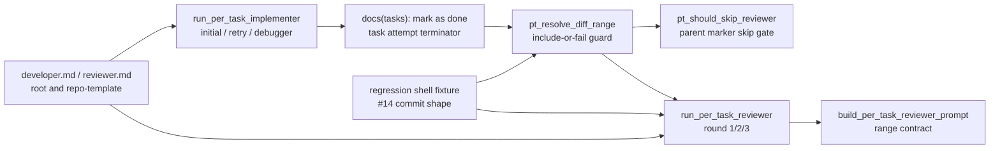

# Design Document

## Overview

per-task ループの Reviewer range 解決で、古い `docs(tasks): mark <id> as done` marker の後ろに積まれた retry 修正 commit が silent に除外される問題を解消する。対象は `pt_resolve_diff_range` を中心とした watcher runtime の range contract、Reviewer reject 後 / Debugger 後の Implementer 再実行経路、per-task agent prompt の marker contract、root / repo-template の配布整合、#14 形状の regression coverage である。

**Purpose**: この修正は retry 後の task-scope 修正 commit が per-task Reviewer の判定対象から漏れない価値を、idd-codex の運用者と Reviewer に提供する。
**Users**: `PER_TASK_LOOP_ENABLED=true` で task ごとの Implementer / Reviewer / Debugger を運用する maintainer が利用する。
**Impact**: 現在は marker commit を常に `range_end` として扱うため marker 後 commit が見えない。変更後は marker 後 commit を Reviewer range に含めるか、Reviewer 起動前に `codex-failed` 相当で明示停止する。

### Goals

- `pt_resolve_diff_range` が選択済み marker 後の commit を silent に除外しない。
- Reviewer reject 後と Debugger 経由の Implementer 再実行で、task の現在 attempt を表す marker 終端契約を prompt と runtime で共有する。
- per-task Reviewer prompt と reviewer agent prompt が start SHA / end SHA、範囲外 commit の扱い、ログ上の確認点を明示する。
- `.codex/agents/developer.md` / `.codex/agents/reviewer.md` と `repo-template/.codex/agents/developer.md` / `repo-template/.codex/agents/reviewer.md` を byte-identical に保つ。
- #14 と同じ「marker commit followed by corrective commit」形状を regression coverage で再現する。

### Non-Goals

- #21 の task 分割、missing test 境界、Reviewer 判定 depth の再設計はしない。
- Reviewer の reject カテゴリ（`AC 未カバー` / `missing test` / `boundary 逸脱`）は変更しない。
- per-task loop 全体の fresh session 仕様、ラベル名、env var 名、exit code 意味、cron / launchd 起動契約は変更しない。
- `idd-claude` 側の実装は変更しない。必要な feedback は関連 Issue への情報として残すに留める。
- 新しい外部サービス呼び出し、runtime dependency、破壊的な history rewrite は追加しない。

## Architecture

### Existing Architecture Analysis

- `run_per_task_loop` は task ごとに `run_per_task_implementer` -> `run_per_task_reviewer` を実行し、Reviewer reject 後は同じ task で Implementer を再実行して `run_per_task_reviewer "$task_id" 2` に進む。
- Debugger 経由では、round=2 reject 後に `run_debugger_stage` -> `run_per_task_implementer` -> `run_per_task_reviewer "$task_id" 3` に進む。BLOCKED 経路も Debugger 後に同じ task の Implementer を再実行して round=1 Reviewer に合流する。
- `pt_resolve_diff_range` は `$BASE_BRANCH..HEAD` の `docs(tasks): mark ... as done` commit から当該 task の marker を選び、その marker を `range_end` として返す。marker 後の commit は検査されないため、retry 修正 commit が range 外に残っても Reviewer は古い差分だけを見る。
- `pt_should_skip_reviewer` も `pt_resolve_diff_range` の range を使うため、range が marker で止まると marker 後 commit の存在を考慮できない。
- developer prompt は「進捗 commit は専用 commit」と「1 commit = 1 task ID」を説明しているが、retry で task が既に `- [x]` の場合に、修正 commit 後へ marker を再配置する契約が明確でない。
- reviewer prompt は `range_end_sha` を当該 task marker と説明しており、marker 後 commit を含める補正が入った場合の semantics を表現できない。

### Architecture Pattern & Boundary Map



**Architecture Integration**:
- 採用パターン: 既存 monolithic watcher 内の helper 関数を拡張し、`pt_resolve_diff_range` を per-task review range の単一入口として維持する。
- ドメイン／機能境界: range 解決は watcher runtime、marker 作成規律は Developer prompt、range 判定規律は Reviewer prompt、配布整合は root / repo-template sync、回帰検証は spec-local shell fixture に分離する。
- 既存パターンの維持: `PER_TASK_LOOP_ENABLED=true` 時だけ per-task helper が呼ばれる構造、`mark_issue_failed` による `codex-failed` 遷移、`pt_log` / `dbg_log` のログ形式、Reviewer 3 カテゴリ、`pt_resolve_diff_range` の stdout 基本形式。
- 新規コンポーネントの根拠: 新しい runtime dependency は追加しない。必要なら小さな helper（例: marker 後 commit 検査）を `pt_resolve_diff_range` 近傍に追加し、既存 caller からは range resolver 経由で利用する。

### Technology Stack

| Layer | Choice / Version | Role in Feature | Notes |
|-------|------------------|-----------------|-------|
| CLI / Scripts | bash 4+ | watcher helper と regression fixture | 既存標準に合わせる |
| VCS | git CLI | marker commit 列、post-marker commit、range diff の検査 | 新規依存なし |
| Agent Prompts | markdown | Developer / Reviewer の marker / range contract | root と repo-template を byte-identical 更新 |
| Docs | README / optional rules | runtime と prompt の契約説明 | 挙動説明が変わる箇所だけ追従 |
| Runtime | local watcher / cron / launchd | per-task loop 実行 | env var / label / exit code は維持 |

## File Structure Plan

### Directory Structure

```text
local-watcher/
├── bin/
│   └── idd-codex-issue-watcher.sh          # pt_resolve_diff_range / run_per_task_reviewer / retry paths
└── test/
    └── per_task_marker_review_range_test.sh # #14 commit shape の regression fixture

.codex/
└── agents/
    ├── developer.md                        # marker 終端契約を追記
    └── reviewer.md                         # range_start/end と範囲外 commit 契約を追記

repo-template/
└── .codex/
    └── agents/
        ├── developer.md                    # root と byte-identical
        └── reviewer.md                     # root と byte-identical

.codex/rules/
└── tasks-generation.md                     # 必要時のみ marker/range 契約を追記し repo-template と同期

repo-template/.codex/rules/
└── tasks-generation.md                     # 必要時のみ root と byte-identical

docs/specs/23--bug-per-task-commit-task-marker-review/
├── requirements.md
├── design.md
└── tasks.md
```

### Modified Files

- `local-watcher/bin/idd-codex-issue-watcher.sh` — `pt_resolve_diff_range` に marker 後 commit 検査を追加し、`run_per_task_reviewer` / `pt_should_skip_reviewer` の起動前 range が silent under-include にならないようにする。Reviewer reject 後、BLOCKED Debugger 後、round=2 reject Debugger 後の `run_per_task_implementer` 再実行経路では、range guard が Reviewer 起動前に必ず通ることを維持する。
- `.codex/agents/developer.md` と `repo-template/.codex/agents/developer.md` — retry 時の marker 終端契約を追加する。task が既に `- [x]` でも修正 commit を積んだ attempt の末尾に最新 `docs(tasks): mark <id> as done` marker を残すことを明示する。
- `.codex/agents/reviewer.md` と `repo-template/.codex/agents/reviewer.md` — per-task prompt の start/end SHA を正本として扱い、範囲外 commit は判断しないこと、marker 後 commit が含まれる場合でも渡された range 全体を判定対象にすることを明示する。
- `.codex/rules/tasks-generation.md` と `repo-template/.codex/rules/tasks-generation.md` — shared rule に marker / range contract を置く必要がある場合のみ更新し、必ず byte-identical に同期する。agent prompt だけで十分なら変更しない。
- `README.md` — per-task marker / review range semantics の説明が runtime と prompt からずれる場合のみ追従する。特に marker 後 commit を include-or-fail すること、ログで task ID / round / range を確認できることを説明する。
- `local-watcher/test/per_task_marker_review_range_test.sh` — temporary git repo で #14 形状を作り、`pt_resolve_diff_range` または wrapper された range guard が corrective commit を含めるか、Reviewer 起動前に明示失敗することを検証する。

## Requirements Traceability

| Requirement | Summary | Components | Interfaces | Flows |
|-------------|---------|------------|------------|-------|
| 1, 1.1, 1.2, 1.3, 1.4 | marker 終端契約の明確化 | PerTask Marker Contract, PerTask Retry Coordinator, PerTask Diff Range Resolver | `docs(tasks): mark <id> as done`, `run_per_task_implementer`, `pt_resolve_diff_range` | initial/retry/debugger Implementer -> marker -> Reviewer |
| 2, 2.1, 2.2, 2.3, 2.4 | 未レビュー commit 除外防止 | PerTask Diff Range Resolver, PerTask Reviewer Runner | `<start>\t<end>`, `mark_issue_failed`, `pt_log` | marker 後 commit 検出 -> include HEAD or fail before Reviewer |
| 3, 3.1, 3.2, 3.3, 3.4 | Reviewer range 明示 | PerTask Reviewer Prompt, Reviewer Agent Contract, Runtime Logging | `build_per_task_reviewer_prompt`, `reviewer.md`, `$LOG` | range 解決 -> prompt -> Reviewer self diff |
| 4, 4.1, 4.2, 4.3, 4.4, 4.5 | prompt / rule 配布整合 | Template Sync Boundary, Documentation | `diff -r .codex/agents repo-template/.codex/agents`, `diff -r .codex/rules repo-template/.codex/rules`, README | root update -> repo-template sync -> verify |
| 5, 5.1, 5.2, 5.3, 5.4 | regression coverage | Regression Harness, PerTask Retry Coordinator | shell fixture, temporary git repo | marker -> corrective commit -> include-or-fail assertion |
| NFR 1, NFR 1.1, NFR 1.2, NFR 1.3, NFR 1.4 | 後方互換 | All runtime components | env vars, labels, exit codes, dependencies | per-task off unchanged / per-task categories unchanged |
| NFR 2, NFR 2.1, NFR 2.2 | 観測可能性 | Runtime Logging, Failure Diagnostics | `pt_log`, `mark_issue_failed` body | marker 後 commit / stop reason -> operator visible |

## Components and Interfaces

### Watcher Runtime

#### PerTask Diff Range Resolver

| Field | Detail |
|-------|--------|
| Intent | task marker と HEAD の関係を検査し、Reviewer range の silent under-include を防ぐ |
| Requirements | 1.4, 2.1, 2.2, 2.3, 2.4, 3.3, 3.4, 5.1 |

**Responsibilities & Constraints**
- 既存の marker 選択（単記 marker 優先、連記 marker fallback、最新 marker 採用、直前 marker を `range_start`）を維持する。
- `current_mark..HEAD` に commit が存在する場合、Reviewer 起動前に検出する。
- marker 後 commit を安全に含められる場合は `range_end=HEAD` として返す。これにより corrective commit は `git diff range_start..range_end` に含まれる。
- `git rev-list` / `git merge-base --is-ancestor` / `git rev-parse HEAD` など range 検査が失敗する場合は、空 range や marker range に丸めず return 1 で失敗させる。
- stdout の主出力は既存 caller 互換の `<range_start_sha>\t<range_end_sha>` を維持する。追加情報は `pt_log` / stderr 相当の grep 可能ログに出す。
- 既存 env var、label、exit code の意味は変更しない。Reviewer 起動前失敗は既存 `rc=3` / `pt_mark_diff_range_resolve_failed` 系の人間復旧可能な失敗として扱う。

**Dependencies**
- Inbound: `run_per_task_reviewer`, `pt_should_skip_reviewer` — Reviewer 起動前の range を解決する (Critical)
- Outbound: git CLI — marker commit と HEAD の関係を読む (Critical)
- Outbound: `pt_log` / `mark_issue_failed` — include / fail の診断を残す (Important)

**Contracts**: Service [x] / State [x]

##### Service Interface

```bash
pt_resolve_diff_range "<task_id>"
# stdout: <range_start_sha>\t<range_end_sha>
# rc=0: range resolved; rc=1: marker missing or unsafe/unresolvable range
```

- Preconditions: `BASE_BRANCH` から `HEAD` までの git history が読める。
- Postconditions: marker 後 commit がある場合、`range_end_sha` は corrective commit を含む SHA（通常 `HEAD`）になるか、関数が失敗する。
- Invariants: marker 後 commit を検出した状態で古い marker SHA を `range_end_sha` として成功返却しない。

##### State Contract

| Condition | Resolver Result | Operator Signal |
|-----------|-----------------|-----------------|
| marker が HEAD または HEAD 後 commit なし | `range_end=marker` | existing `reviewer start ... range=` |
| marker 後 commit あり、HEAD が marker の descendant | `range_end=HEAD` | `post-marker-commits-included task=<id> marker=<sha> end=<sha> count=N` |
| marker 後 commit あり、git range を安全に解けない | return 1 | `diff-range-resolve-failed` / `codex-failed` |

#### PerTask Reviewer Runner

| Field | Detail |
|-------|--------|
| Intent | 解決済み range を Reviewer prompt に渡し、task ID / round / range をログに残す |
| Requirements | 2.1, 2.2, 2.3, 3.1, 3.2, 3.3, 3.4 |

**Responsibilities & Constraints**
- `run_per_task_reviewer` は `pt_resolve_diff_range` の失敗を Reviewer 起動前に `rc=3` として扱う。
- `pt_log "task=$task_id reviewer start round=$round ... range=..."` は補正後 range を出す。
- `build_per_task_reviewer_prompt` は `range_start_sha` と `range_end_sha` を明示し、`range_end_sha` が marker とは限らず marker 後 commit を含む HEAD の場合があることを説明する。
- Reviewer には「渡された range のみを判定し、range 外 commit は判断しない」ことを明示する。

**Dependencies**
- Inbound: `run_per_task_loop` — round=1 / 2 / 3 で呼ぶ (Critical)
- Outbound: PerTask Diff Range Resolver — range を取得する (Critical)
- Outbound: Reviewer Agent Contract — prompt の判定契約を実行する (Critical)

**Contracts**: Service [x] / Batch [x]

#### PerTask Retry Coordinator

| Field | Detail |
|-------|--------|
| Intent | Reviewer reject 後 / Debugger 後の同一 task 再実行が、古い marker の後ろに修正 commit を残したまま Reviewer へ進まないようにする |
| Requirements | 1.2, 1.3, 1.4, 2.4, 5.2, 5.3, NFR 1.2 |

**Responsibilities & Constraints**
- Reviewer reject 後の `run_per_task_implementer "$task_id"` -> `run_per_task_reviewer "$task_id" 2` 経路で、追加 guard を bypass しない。
- Debugger BLOCKED 後、および round=2 reject Debugger 後の `run_per_task_implementer "$task_id"` -> Reviewer 合流経路で、同じ range guard を通す。
- Implementer prompt は retry 時に「修正 commit の後ろへ最新 marker を残す」ことを求める。task が既に `- [x]` の場合は、修正 commit 後に空 marker commit を使う設計も許容する。ただし runtime は marker 再作成漏れがあっても marker 後 commit を include-or-fail する。
- `pt_check_task_completed` による進捗ゼロ検出は維持し、本件の range guard と責務を混ぜない。

**Dependencies**
- Inbound: `run_per_task_loop` — retry / debugger flow を制御する (Critical)
- Outbound: PerTask Marker Contract — Implementer の commit 規律を伝える (Important)
- Outbound: PerTask Diff Range Resolver — Reviewer 起動前の安全網 (Critical)

**Contracts**: State [x] / Batch [x]

### Prompt and Template Contracts

#### PerTask Marker Contract

| Field | Detail |
|-------|--------|
| Intent | Developer が task attempt の末尾に最新 marker を置く契約を明確化する |
| Requirements | 1.1, 1.2, 1.3, 4.1 |

**Responsibilities & Constraints**
- `.codex/agents/developer.md` と `repo-template/.codex/agents/developer.md` に同じ文面を追加する。
- 初回 attempt では実装 / validation / learning update 後に marker commit を置く。
- retry attempt で task checkbox が既に `- [x]` の場合でも、修正 commit 後に最新 `docs(tasks): mark <id> as done` marker を末尾に置く。実 diff がない場合の marker は空 commit を使うか、watcher の include-or-fail safety net により Reviewer が修正 commit を見る。
- destructive な `git reset` / `rebase` / marker 移動は要求しない。追加 commit で前進する。

**Dependencies**
- Inbound: Developer subagent — 実装と commit を行う (Critical)
- Outbound: PerTask Diff Range Resolver — marker 再作成漏れ時の安全網 (Critical)

**Contracts**: State [x]

#### Reviewer Agent Contract

| Field | Detail |
|-------|--------|
| Intent | Reviewer が渡された range を正本として読み、範囲外 commit を誤判定しない |
| Requirements | 3.1, 3.2, 4.1 |

**Responsibilities & Constraints**
- `.codex/agents/reviewer.md` と `repo-template/.codex/agents/reviewer.md` を byte-identical に更新する。
- per-task prompt の `range_start_sha` / `range_end_sha` を必ず使い、`git diff <start>..<end>` と `git log <start>..<end>` で判断する。
- `range_end_sha` は通常 marker だが、marker 後 commit が検出された場合は HEAD など補正後 SHA になり得る。
- range 外 commit は当該 per-task review では判断しない。全体観点は既存 Stage B Reviewer に残す。

**Dependencies**
- Inbound: PerTask Reviewer Runner — prompt で SHA を渡す (Critical)
- Outbound: `review-notes.md` — 判定結果を出力する (Critical)

**Contracts**: Batch [x]

#### Template Sync Boundary

| Field | Detail |
|-------|--------|
| Intent | self-hosting root と consumer 配布 template の prompt / rule 契約を一致させる |
| Requirements | 4.1, 4.2, 4.3, 4.4 |

**Responsibilities & Constraints**
- agent 更新後は `diff -r .codex/agents repo-template/.codex/agents` を空にする。
- shared rule を更新した場合は `diff -r .codex/rules repo-template/.codex/rules` を空にする。
- `tasks-generation.md` に marker / range 契約を置かない判断をした場合でも、verify では rules diff を実行して既存同期を壊していないことを確認する。

**Dependencies**
- Inbound: Developer implementation — root / repo-template を編集する (Critical)
- Outbound: stage-a verify / PR Test plan — diff で検証する (Critical)

**Contracts**: State [x]

### Verification

#### Regression Harness

| Field | Detail |
|-------|--------|
| Intent | #14 形状を shell-level で再現し、marker 後 corrective commit が silent に range 外にならないことを検証する |
| Requirements | 5.1, 5.2, 5.3, 5.4, NFR 1.4 |

**Responsibilities & Constraints**
- temporary git repo を作り、`main` 相当の base、task 実装 commit、`docs(tasks): mark 1.1 as done` marker、marker 後 corrective commit を順に積む。
- watcher の `pt_resolve_diff_range` 相当を読み込める形で実行する。monolithic script source が難しい場合は、抽出可能な helper 化または test-local harness で同じ public contract を検証し、prompt-only assertion は `impl-notes.md` に手動確認理由を残す。
- Reviewer 起動を stub できる場合は `run_per_task_reviewer` 手前の prompt / log に corrective commit SHA が入ることを検証する。stub が過大なら `pt_resolve_diff_range` が corrective commit を含む `range_end` を返すことを最低条件にする。
- Reviewer reject -> Implementer retry と Debugger -> Implementer retry の両形状は、同じ commit topology を複数 fixture case として作る。

**Dependencies**
- Inbound: stage-a verify — shell test を実行する (Critical)
- Outbound: PerTask Diff Range Resolver — public contract を検査する (Critical)

**Contracts**: Batch [x]

##### Batch Contract

```bash
bash local-watcher/test/per_task_marker_review_range_test.sh
```

- Preconditions: `git` と `bash` が利用できる。
- Postconditions: marker 後 corrective commit が range に含まれる、または Reviewer 起動前 failure が観測される。
- Invariants: 外部サービス、GitHub API、Codex CLI は呼ばない。

## Data Models

### Domain Model

- **Task ID**: `tasks.md` の numeric ID。marker subject の `<id>` と一致する。
- **Task marker commit**: subject が `docs(tasks): mark <id> as done` の commit。task attempt の終端を表す。
- **Resolved review range**: `range_start_sha..range_end_sha`。`range_end_sha` は通常 marker だが、marker 後 commit が存在する場合は corrective commit を含む SHA になり得る。
- **Post-marker commit set**: `git rev-list <marker>..HEAD` の結果。空でない場合は include-or-fail guard の対象。

### Logical Data Model

| Field | Source | Meaning |
|-------|--------|---------|
| `task_id` | `run_per_task_loop` pending task | 対象 task |
| `current_mark` | `git log --grep` | 最新 marker SHA |
| `range_start` | marker 列の直前要素または `BASE_BRANCH` | Reviewer diff の開始 |
| `range_end` | `current_mark` または `HEAD` | Reviewer diff の終端 |
| `post_marker_count` | `git rev-list current_mark..HEAD --count` | marker 後 commit の有無 |
| `round` | `run_per_task_reviewer` argument | 1 / 2 / 3 の retry 文脈 |

## Error Handling

### Error Strategy

- **Silent exclusion is forbidden**: marker 後 commit を検出した場合に古い marker を `range_end` として成功返却しない。
- **Include first, fail if unresolvable**: linear HEAD まで含められる場合は `range_end=HEAD` とする。git range の安全性を確認できない場合は Reviewer を起動せず `rc=3` に倒す。
- **Existing failure plumbing**: 新しい label や exit code は作らず、`run_per_task_reviewer` の diff range 解決失敗と同じ `pt_mark_diff_range_resolve_failed` / `codex-failed` 系に流す。コメント本文だけ原因と復旧手順を marker 後 commit 向けに拡張する。

### Error Categories and Responses

- **Marker missing / malformed**: 既存 `diff-range-resolve-failed` として停止し、単記 marker 作成・連記分割の復旧案内を維持する。
- **Post-marker commits included**: 失敗ではない。`pt_log` に task ID、round は caller 側ログ、marker SHA、range end、commit count を残す。
- **Post-marker commits unsafe / unresolvable**: Reviewer 起動前に `codex-failed`。Issue comment に task ID、marker SHA、HEAD SHA、`git log --oneline <marker>..HEAD` 確認手順、復旧方法を残す。
- **Reviewer prompt mismatch**: Reviewer が範囲外 commit を判断した場合は prompt 契約違反として reviewer.md 更新または issue follow-up の対象。runtime は渡した range だけを正本とする。

## Testing Strategy

- **Unit / Shell Helper Tests**:
  - `pt_resolve_diff_range` が marker 後 commit なしでは既存と同じ marker end を返す。
  - `pt_resolve_diff_range` が marker 後 corrective commit ありでは corrective commit を含む end（通常 HEAD）を返す。
  - marker 後 commit 検査で git range を解けない場合は成功扱いに丸めない。
- **Integration Tests**:
  - Reviewer reject -> Implementer retry 形状として、marker 後 corrective commit を作り range に含まれることを確認する。
  - Debugger guidance -> Implementer retry 形状として、同じ marker 後 corrective commit を作り range に含まれることを確認する。
  - `pt_should_skip_reviewer` が補正後 range を使い、corrective commit を含む場合に parent checkbox-only skip へ誤分類しない。
- **Regression Tests**:
  - `local-watcher/test/per_task_marker_review_range_test.sh` で #14 の commit topology を再現する。
  - test は GitHub API / Codex CLI を呼ばず、temporary git repo と bash / git だけで完結する。
  - prompt-only assertion が shell-level で難しい場合は、`impl-notes.md` に理由と手動確認を記録する。
- **Static / Sync Checks**:
  - `shellcheck local-watcher/bin/idd-codex-issue-watcher.sh install.sh setup.sh .github/scripts/*.sh`
  - `diff -r .codex/agents repo-template/.codex/agents`
  - `diff -r .codex/rules repo-template/.codex/rules`

## Rollout and Compatibility

- `PER_TASK_LOOP_ENABLED` が `true` でない場合、per-task helper は呼ばれず既存 single Developer + single Reviewer workflow は変わらない。
- `PER_TASK_LOOP_ENABLED=true` の場合も env var 名、label 名、branch naming、cron invocation、exit code 意味は変更しない。
- marker 後 commit が存在する異常形状では、従来の silent exclusion から「range に含める」または「Reviewer 起動前に明示停止」へ変わる。これは成功扱いで後続 task へ進むことを防ぐ bug fix であり、破壊的な外部契約変更ではない。
- README に per-task marker / review range semantics を記載する場合、runtime と prompt の契約に合わせる。
