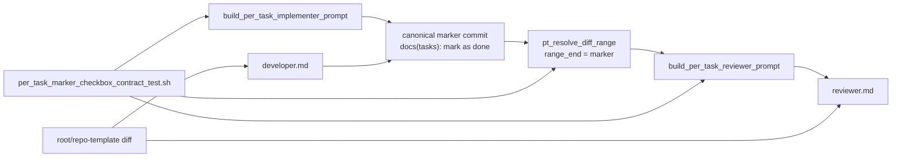

# Design Document

## Overview

per-task loop では、Implementer が対象 task の実装 commit を積んだ後、`tasks.md` の対象 checkbox を `[ ]` から `[x]` に更新し、`docs(tasks): mark <id> as done` の marker commit を追加する。この marker commit は `pt_resolve_diff_range` によって per-task Reviewer の `range_end_sha` になるため、review range には通常 `tasks.md` の checkbox 差分が含まれる。

本件は、正規 marker commit による対象 task checkbox 更新だけを allowed orchestration artifact として reviewer / watcher prompt に明示し、必須の進捗 marker が `boundary 逸脱` false positive を起こさないようにする bug fix である。一方で、task 本文、`_Requirements:_`、`_Boundary:_`、`_Depends:_`、順序、無関係 checkbox、marker commit 以外の spec artifact 更新は引き続き既存の 3 カテゴリ判定対象として扱う。

**Purpose**: この変更は per-task marker commit の分類契約を Implementer / Developer / Reviewer / watcher prompt 間で一致させ、per-task Reviewer false positive を防ぐ。  
**Users**: idd-codex の Developer / Reviewer サブエージェント、および `PER_TASK_LOOP_ENABLED=true` で per-task loop を運用する maintainer が利用する。  
**Impact**: agent prompt と watcher の per-task prompt builder に marker classification contract を追加し、root `.codex/agents` と `repo-template/.codex/agents` の byte-identical 状態を維持する。diff range 解決、Reviewer 3 カテゴリ、env var、label、exit code、marker commit の存在自体は変更しない。

### Goals

- 正規 `docs(tasks): mark <id> as done` commit の対象 checkbox 更新だけを allowed orchestration artifact として明文化する。
- per-task Implementer / Developer prompt と per-task Reviewer prompt が同じ marker commit subject と checkbox 更新契約を共有する。
- 正規 marker 以外の `tasks.md` / spec artifact 変更は `boundary 逸脱` 候補として維持する。
- regression-test-only commit に続く marker commit の range を shell fixture で再現し、prompt 契約と diff range を固定する。
- root `.codex/agents` と `repo-template/.codex/agents` の byte-identical 検証、および rules diff 検証を実装後 verify に含める。

### Non-Goals

- #13 の実装修正、#21 の task 分割 / missing test 問題、#23 の marker 後 range 漏れ問題は扱わない。
- Reviewer の 3 カテゴリ体系を変更しない。
- `docs(tasks): mark <id> as done` marker commit を廃止しない。
- per-task loop 全体設計、retry 設計、diff range 解決アルゴリズムを刷新しない。
- 正規 marker 以外の `tasks.md` 変更を許可対象へ広げない。
- 新しい runtime dependency、外部サービス、env var、label、exit code を追加しない。

## Architecture

### Existing Architecture Analysis

- `.codex/agents/developer.md` には `tasks.md` の `- [ ]` -> `- [x]` 更新と `docs(tasks): mark <task-id> as done` commit の既存契約がある。現在は marker が reviewer range に含まれる場合の分類契約までは明示していない。
- `.codex/agents/reviewer.md` は `boundary 逸脱` を `_Boundary:_` 外変更として扱うが、per-task marker checkbox 差分を orchestration artifact として除外する指示がない。
- `local-watcher/bin/idd-codex-issue-watcher.sh` の `build_per_task_implementer_prompt` は marker 作成契約を注入し、`build_per_task_reviewer_prompt` は `range_end_sha` が対象 task の marker commit であることを注入する。ただし、Reviewer に「正規 marker の対象 checkbox 更新だけは reject しない」と分類させる contract が不足している。
- `pt_resolve_diff_range` は既存互換のため単記 marker を優先し、連記 marker fallback も持つ。本件ではこの resolver 互換性を変更せず、allowed orchestration artifact の分類を正規単記 marker subject と対象 checkbox flip のみに限定する。
- root `.codex/agents` と `repo-template/.codex/agents` は byte 一致が必要な二重管理対象である。agent prompt を片側だけ更新すると self-hosting と consumer repo で per-task Reviewer 挙動がドリフトする。
- `local-watcher/test/` は watcher から対象関数だけを `awk` で抽出し、temporary fixture / fake dependency で shell-level regression を固定する既存パターンを持つ。

### Architecture Pattern & Boundary Map



**Architecture Integration**:
- 採用パターン: orchestration artifact を prompt contract として明示し、既存 reviewer category は維持する documentation-as-runtime-contract パターンを採用する。
- ドメイン／機能境界: marker 作成責務は Developer / Implementer guidance、marker 分類責務は Reviewer / per-task Reviewer prompt、range 解決責務は既存 watcher helper、回帰検出は shell fixture に分離する。
- 既存パターンの維持: single task marker subject、`tasks.md` checkbox 進捗、per-task fresh session、3 カテゴリ判定、root / repo-template byte-identical 規約、stage-a-verify 構造化ブロック。
- 新規コンポーネントの根拠: LLM の boundary 判定そのものは shell で実行できないため、temporary git repo で regression-test-only commit + marker commit の diff range を再現し、watcher prompt が allowed / disallowed marker classification を明示することを fixture driver で固定する。

### Technology Stack

| Layer | Choice / Version | Role in Feature | Notes |
|-------|------------------|-----------------|-------|
| Agent Prompts | Markdown | Developer / Reviewer の marker contract | root と repo-template を byte-identical に保つ |
| Watcher | bash 4+ | per-task prompt builder と diff range resolver | 既存 env var / exit code は変更しない |
| Tests | bash 4+ / git / grep / awk / diff | marker range と prompt contract の regression fixture | 新 dependency は追加しない |
| Runtime | Codex CLI / local watcher | per-task Implementer / Reviewer orchestration | prompt contract の明確化のみ |

## File Structure Plan

### Directory Structure

```text
.codex/
└── agents/
    ├── developer.md        # canonical marker commit contract を Developer guidance に追加
    └── reviewer.md         # marker checkbox classification を Reviewer guidance に追加

repo-template/
└── .codex/
    └── agents/
        ├── developer.md    # root と byte-identical
        └── reviewer.md     # root と byte-identical

local-watcher/
├── bin/
│   └── idd-codex-issue-watcher.sh
│       # build_per_task_implementer_prompt / build_per_task_reviewer_prompt に同じ marker contract を追加
└── test/
    └── per_task_marker_checkbox_contract_test.sh
        # regression-test-only commit + canonical marker commit の range と prompt contract を検証
```

### Modified Files

- `.codex/agents/developer.md` / `repo-template/.codex/agents/developer.md` — marker commit subject が `docs(tasks): mark <id> as done` の単一 task ID 契約であること、当該 marker commit で許される `tasks.md` 変更は対象 checkbox の `[ ]` -> `[x]` だけであることを byte-identical に追記する。
- `.codex/agents/reviewer.md` / `repo-template/.codex/agents/reviewer.md` — per-task review range に正規 marker commit が含まれ得ること、正規 marker の対象 checkbox flip だけは allowed orchestration artifact として `boundary 逸脱` reject の理由にしないこと、その他の `tasks.md` / spec artifact 変更は reject 候補として維持することを byte-identical に追記する。
- `local-watcher/bin/idd-codex-issue-watcher.sh` — `build_per_task_implementer_prompt` と `build_per_task_reviewer_prompt` に同一 marker contract を注入する。`build_per_task_reviewer_prompt` では `git log -1 --format=%s ${range_end}` が `docs(tasks): mark ${task_id} as done` に完全一致し、marker commit の差分が対象 checkbox flip のみである場合だけ allowed artifact と扱うよう明示する。
- `local-watcher/test/per_task_marker_checkbox_contract_test.sh` — watcher から `pt_resolve_diff_range` / prompt builder 関数を抽出し、temporary git repo で regression-test-only commit + `docs(tasks): mark 1.1 as done` commit を作る。resolved range が regression-test-only commit と marker commit を含むこと、marker commit の `tasks.md` 差分が対象 checkbox flip であること、prompt が allowed / disallowed marker classification を含むことを検証する。

### Unchanged Files

- `.codex/rules/**` / `repo-template/.codex/rules/**` — 本件の契約は per-task marker classification に限定し、shared rule の task generation 規約は変更しない。実装中に rule 更新が必要と判明した場合のみ root / repo-template 両系統を byte-identical に更新する。
- `README.md` — 新しい運用手順、env var、label、exit code、external service は追加しないため本設計では更新対象外とする。既存 README 記述と矛盾が見つかった場合は実装 PR の確認事項に記録する。

## Requirements Traceability

| Requirement | Summary | Components | Interfaces | Flows |
|-------------|---------|------------|------------|-------|
| 1.1 | 正規 marker commit の checkbox 更新を allowed artifact に分類 | Per-task Reviewer Prompt, Reviewer Agent Guidance, Marker Regression Test | `build_per_task_reviewer_prompt`, `reviewer.md`, fixture prompt assertions | range_end marker -> reviewer classification |
| 1.2 | 対象 checkbox 更新だけを理由に boundary reject しない | Per-task Reviewer Prompt, Reviewer Agent Guidance | prompt contract, review guidance | `tasks.md` checkbox flip -> no boundary reject reason |
| 1.3 | marker 以外の task-scope 変更は既存判定対象 | Reviewer Agent Guidance, Marker Regression Test | disallowed change list assertions | non-marker edits -> 3 categories |
| 1.4 | 非 canonical subject は allowed artifact にしない | Per-task Reviewer Prompt, Marker Regression Test | `git log -1 --format=%s`, exact subject assertion | noncanonical subject -> no auto-classification |
| 2.1 | task body edits の reject 可能性維持 | Reviewer Agent Guidance, Per-task Reviewer Prompt | prohibited edits list | task body edit -> boundary candidate |
| 2.2 | `_Requirements:_` edits の reject 可能性維持 | Reviewer Agent Guidance, Per-task Reviewer Prompt | prohibited edits list | requirements annotation edit -> boundary candidate |
| 2.3 | `_Boundary:_` edits の reject 可能性維持 | Reviewer Agent Guidance, Per-task Reviewer Prompt | prohibited edits list | boundary annotation edit -> boundary candidate |
| 2.4 | `_Depends:_` edits の reject 可能性維持 | Reviewer Agent Guidance, Per-task Reviewer Prompt | prohibited edits list | depends annotation edit -> boundary candidate |
| 2.5 | task ordering edits の reject 可能性維持 | Reviewer Agent Guidance, Per-task Reviewer Prompt | prohibited edits list | ordering edit -> boundary candidate |
| 2.6 | unrelated checkbox updates の reject 可能性維持 | Reviewer Agent Guidance, Per-task Reviewer Prompt | prohibited edits list | unrelated checkbox edit -> boundary candidate |
| 2.7 | canonical marker 以外の spec artifact updates の reject 可能性維持 | Reviewer Agent Guidance, Per-task Reviewer Prompt | prohibited edits list | other spec artifact edit -> boundary candidate |
| 3.1 | Implementer prompt が marker 契約を説明 | Per-task Implementer Prompt, Developer Agent Guidance | `build_per_task_implementer_prompt`, `developer.md` | task complete -> marker commit |
| 3.2 | Reviewer prompt が marker commit を range に含み得ることを明示 | Per-task Reviewer Prompt | `range_end_sha` section | resolved range -> reviewer prompt |
| 3.3 | Reviewer prompt が対象 checkbox だけ allowed と明示 | Per-task Reviewer Prompt | allowed artifact section | marker diff -> allowed artifact |
| 3.4 | Reviewer prompt が disallowed edits を明示 | Per-task Reviewer Prompt | prohibited edits list | other spec edits -> reject candidate |
| 3.5 | Implementer / Reviewer が同じ subject と checkbox 契約を共有 | Per-task Implementer Prompt, Per-task Reviewer Prompt, Developer Agent Guidance, Reviewer Agent Guidance | exact string assertions | prompt sync -> consistent contract |
| 4.1 | agent prompt root / repo-template byte-identical | Agent Prompt Synchronization | `diff -r .codex/agents repo-template/.codex/agents` | implementation edit -> sync verify |
| 4.2 | rule root / repo-template byte-identical if changed | Rule Sync Verification | `diff -r .codex/rules repo-template/.codex/rules` | no rule drift |
| 4.3 | agent diff verify を含める | Verify Block, Marker Regression Test | stage-a-verify command | Stage A verify -> agent diff |
| 4.4 | rule diff verify を含める | Verify Block | stage-a-verify command | Stage A verify -> rule diff |
| 5.1 | regression-test-only commit + marker range で false positive を防ぐ | Marker Regression Test, Per-task Reviewer Prompt | temp git repo, prompt assertions | regression commit -> marker commit -> review range |
| 5.2 | canonical checkbox が `[ ]` -> `[x]` になることを検証 | Marker Regression Test | `git diff <range> -- tasks.md` | marker commit diff |
| 5.3 | non-canonical `tasks.md` changes remain reject-eligible | Marker Regression Test, Reviewer Agent Guidance | prohibited edits assertions | invalid edits -> not allowed artifact |
| 5.4 | prompt-only assertion が実用困難な場合の記録 | Marker Regression Test, impl-notes guidance | shell coverage or impl-notes reason | automated where possible, manual reason otherwise |
| NFR 1.1-1.4 | 後方互換性と依存追加なし | All Components | no new env / labels / dependencies | existing workflows preserved |
| NFR 2.1-2.2 | operator が classification と reject reason を区別可能 | Reviewer Agent Guidance, Per-task Reviewer Prompt | review-notes guidance | allowed marker vs non-marker reject detail |

## Components and Interfaces

### Prompt Contract

#### Per-task Implementer Prompt

| Field | Detail |
|-------|--------|
| Intent | Implementer に canonical marker commit の作成契約を明示する |
| Requirements | 3.1, 3.5, NFR 1.1 |

**Responsibilities & Constraints**
- `docs(tasks): mark <id> as done` は単一 task ID の subject 完全一致を canonical とする。
- marker commit には `tasks.md` 以外を含めない。
- marker commit 内の `tasks.md` 変更は対象 task 行の `- [ ] <id>` -> `- [x] <id>` のみ許可する。
- task 本文、`_Requirements:_`、`_Boundary:_`、`_Depends:_`、順序、無関係 checkbox、deferrable 印は書き換え禁止として維持する。

**Dependencies**
- Inbound: `tasks.md` — 対象 task ID と checkbox 行 (Critical)
- Outbound: `pt_resolve_diff_range` — marker commit を range_end として解決 (Critical)
- Outbound: Per-task Reviewer Prompt — 同じ marker subject と checkbox contract を共有 (Critical)

**Contracts**: State [x]

##### Prompt Contract

```text
Canonical marker commit:
- subject: docs(tasks): mark <task-id> as done
- files: tasks.md only
- diff: target task checkbox [ ] -> [x] only
```

#### Per-task Reviewer Prompt

| Field | Detail |
|-------|--------|
| Intent | range に含まれる canonical marker checkbox update を allowed orchestration artifact と分類させる |
| Requirements | 1.1, 1.2, 1.3, 1.4, 3.2, 3.3, 3.4, 3.5, NFR 2.1, NFR 2.2 |

**Responsibilities & Constraints**
- `range_end_sha` が当該 task の marker commit であることを説明する。
- Reviewer に `git log -1 --format=%s <range_end_sha>` で subject を確認させる。
- subject が `docs(tasks): mark ${task_id} as done` に完全一致し、marker commit の `tasks.md` diff が対象 checkbox flip のみなら allowed orchestration artifact と扱う。
- allowed artifact は `boundary 逸脱` reject の理由にしないが、review-notes の Summary / Verified Requirements で operator が分類を識別できる程度に触れる。
- subject 不一致、連記 subject、marker commit 外の spec artifact 更新、本文 / annotation / 順序 / 無関係 checkbox 変更は allowed artifact にしない。

**Dependencies**
- Inbound: `pt_resolve_diff_range` — `<range_start>..<range_end>` (Critical)
- Inbound: Reviewer Agent Guidance — 3 カテゴリ判定と marker classification (Critical)
- Outbound: `review-notes.md` — allowed marker classification または reject reason (Important)

**Contracts**: State [x]

##### Classification Contract

```text
Allowed only if all are true:
1. range_end subject == docs(tasks): mark <task_id> as done
2. marker commit changes tasks.md only
3. marker commit changes only the target task checkbox from [ ] to [x]

Reject-eligible:
- task body edits
- _Requirements:_ edits
- _Boundary:_ edits
- _Depends:_ edits
- task ordering edits
- unrelated checkbox edits
- any other spec artifact update outside the canonical marker checkbox update
```

### Agent Guidance

#### Developer Agent Guidance

| Field | Detail |
|-------|--------|
| Intent | persistent agent definition 側でも marker 作成契約を watcher prompt と一致させる |
| Requirements | 3.1, 3.5, 4.1 |

**Responsibilities & Constraints**
- `.codex/agents/developer.md` と `repo-template/.codex/agents/developer.md` を byte-identical に更新する。
- 既存の impl-resume / tasks.md 進捗追跡規約の近くに、canonical marker commit は Reviewer が allowed orchestration artifact と分類するための唯一の marker であることを追記する。
- 既存の「進捗 commit は別 commit」「1 task = 1 marker commit」契約を弱めない。

**Dependencies**
- Inbound: AGENTS.md byte-identical 規約 (Critical)
- Outbound: Per-task Implementer Prompt — same wording / same subject (Critical)

**Contracts**: State [x]

#### Reviewer Agent Guidance

| Field | Detail |
|-------|--------|
| Intent | persistent agent definition 側で canonical marker checkbox update を boundary reject から除外する |
| Requirements | 1.1, 1.2, 1.3, 1.4, 2.1, 2.2, 2.3, 2.4, 2.5, 2.6, 2.7, 3.3, 3.4, 4.1, NFR 2.1, NFR 2.2 |

**Responsibilities & Constraints**
- `.codex/agents/reviewer.md` と `repo-template/.codex/agents/reviewer.md` を byte-identical に更新する。
- per-task review の range には `docs(tasks): mark <id> as done` marker commit が含まれ得ることを明記する。
- allowed artifact 範囲を対象 checkbox flip のみに限定する。
- 非 marker / 非 canonical / unrelated `tasks.md` changes の reject 可能性を明記する。
- `AC 未カバー` / `missing test` / `boundary 逸脱` 以外のカテゴリを作らない。

**Dependencies**
- Inbound: Per-task Reviewer Prompt — range と task ID (Critical)
- Outbound: `review-notes.md` — classification visibility (Important)

**Contracts**: State [x]

### Watcher Runtime

#### Diff Range Resolver

| Field | Detail |
|-------|--------|
| Intent | 既存どおり task ID の marker commit を per-task review range end として解決する |
| Requirements | 3.2, 5.1, NFR 1.1 |

**Responsibilities & Constraints**
- `pt_resolve_diff_range` の既存アルゴリズムは変更しない。
- regression fixture では canonical single-id marker が `range_end_sha` になることを確認する。
- 連記 fallback の既存互換性は本件で廃止しない。ただし fallback で解決された非 canonical subject を allowed orchestration artifact として自動分類しない。

**Dependencies**
- Inbound: git history (Critical)
- Outbound: Per-task Reviewer Prompt (Critical)

**Contracts**: State [x]

### Regression Coverage

#### Marker Classification Regression Test

| Field | Detail |
|-------|--------|
| Intent | regression-test-only commit + canonical marker commit の range と prompt contract を shell-level で固定する |
| Requirements | 1.1, 1.4, 3.2, 3.3, 3.4, 3.5, 5.1, 5.2, 5.3, 5.4 |

**Responsibilities & Constraints**
- `local-watcher/test/` の既存 pattern に合わせ、必要関数だけを watcher から `awk` 抽出して eval する。
- temporary git repo を作り、base commit、regression-test-only commit、`docs(tasks): mark 1.1 as done` marker commit を作成する。
- `pt_resolve_diff_range 1.1` が base -> marker の range を返し、その range に regression-test-only commit と marker commit が含まれることを検証する。
- marker commit の `tasks.md` diff が対象 checkbox `[ ]` -> `[x]` のみであることを検証する。
- `build_per_task_reviewer_prompt` が allowed artifact と disallowed `tasks.md` edits の両方を明示することを検証する。
- 実 LLM の approve / reject は shell test で実行しない。prompt-only assertion に留まる箇所は `impl-notes.md` に理由を記録する。

**Dependencies**
- Inbound: watcher prompt builders and resolver (Critical)
- Outbound: stage-a-verify block (Critical)

**Contracts**: Batch [x]

##### Test Interface

```bash
bash local-watcher/test/per_task_marker_checkbox_contract_test.sh
```

### Synchronization

#### Agent Prompt Synchronization

| Field | Detail |
|-------|--------|
| Intent | self-hosting 用 agent と consumer repo 配布用 agent の契約を byte-identical に保つ |
| Requirements | 4.1, 4.3 |

**Responsibilities & Constraints**
- `.codex/agents/developer.md` と `repo-template/.codex/agents/developer.md` を byte-identical にする。
- `.codex/agents/reviewer.md` と `repo-template/.codex/agents/reviewer.md` を byte-identical にする。
- 実装後 verify に `diff -r .codex/agents repo-template/.codex/agents` を含める。

**Dependencies**
- Inbound: AGENTS.md 二重管理規約 (Critical)
- Outbound: Verify Block (Critical)

**Contracts**: Batch [x]

#### Rule Sync Verification

| Field | Detail |
|-------|--------|
| Intent | rule ファイル未変更時も既存 drift を検出し、変更時は byte-identical を保証する |
| Requirements | 4.2, 4.4 |

**Responsibilities & Constraints**
- 本設計では rule ファイルの変更は予定しない。
- 実装中に rule 更新が必要になった場合は root / repo-template を byte-identical に更新する。
- 実装後 verify に `diff -r .codex/rules repo-template/.codex/rules` を含める。

**Dependencies**
- Inbound: AGENTS.md 二重管理規約 (Critical)
- Outbound: Verify Block (Critical)

**Contracts**: Batch [x]

## Data Models

### Marker Commit Contract

| Field | Value | Notes |
|-------|-------|-------|
| `task_id` | numeric hierarchy ID, e.g. `1.1` | `tasks.md` の対象 task ID |
| `subject` | `docs(tasks): mark <task_id> as done` | 完全一致のみ canonical |
| `changed_files` | `${SPEC_DIR_REL}/tasks.md` only | marker commit 自体の変更ファイル |
| `allowed_diff` | target checkbox `[ ]` -> `[x]` only | task 本文や annotation は含めない |

### Review Range State

| State | Meaning |
|-------|---------|
| `range_start_sha` | 直前 marker commit、または初回時は `BASE_BRANCH` の SHA |
| `range_end_sha` | 対象 task の marker commit SHA |
| `allowed_orchestration_artifact` | canonical subject + marker commit tasks.md target checkbox flip only |
| `reject_eligible_tasks_md_change` | allowed artifact 以外の `tasks.md` / spec artifact 変更 |

## Error Handling

### Error Strategy

- prompt contract は保守的に定義する。canonical 条件をすべて満たさない場合、Reviewer は allowed orchestration artifact として自動分類しない。
- non-canonical marker subject は `pt_resolve_diff_range` の既存互換性で range 解決され得るが、classification では allowed artifact にしない。
- shell fixture が prompt-only assertion 以上を検証できない場合は、実 LLM 判定を自動化できない理由を `impl-notes.md` に記録し、代替として prompt key phrase / git diff fixture / manual verification を残す。

### Error Categories and Responses

- **Boundary false positive**: canonical marker checkbox flip だけを理由に reject しないよう prompt / reviewer guidance で回避する。
- **Over-permissive classification**: task body / annotations / ordering / unrelated checkbox / other spec artifact updates は allowed artifact に含めない明示リストで回避する。
- **Sync drift**: root / repo-template agents と rules の `diff -r` を verify に含め、片側更新を検出する。
- **Runtime compatibility**: env var、label、exit code、diff range resolver 互換性を変更しない。

## Testing Strategy

- **Unit / Shell Tests**:
  - `local-watcher/test/per_task_marker_checkbox_contract_test.sh` で `pt_resolve_diff_range` が canonical marker commit を `range_end_sha` にすることを検証する。
  - 同 test で regression-test-only commit + marker commit の range が再現され、canonical marker checkbox diff が `[ ]` -> `[x]` であることを検証する。
  - 同 test で `build_per_task_implementer_prompt` と `build_per_task_reviewer_prompt` が同じ `docs(tasks): mark <id> as done` subject と checkbox-only contract を含むことを検証する。
  - 同 test で reviewer prompt が task body、`_Requirements:_`、`_Boundary:_`、`_Depends:_`、ordering、unrelated checkbox、other spec artifact updates を allowed artifact から除外することを検証する。
- **Integration Tests**:
  - `diff -r .codex/agents repo-template/.codex/agents` で Developer / Reviewer prompt の byte-identical を確認する。
  - `diff -r .codex/rules repo-template/.codex/rules` で rule drift がないことを確認する。
  - `shellcheck local-watcher/bin/*.sh install.sh setup.sh .github/scripts/*.sh` と新規 shell test の shellcheck を実行する。
- **E2E / Manual**:
  - 実 LLM Reviewer の approve / reject 判定は deterministic shell test では実行しない。必要な場合は実装 PR の `impl-notes.md` に、prompt-only assertion と手動確認内容を記録する。
  - 本 repo dogfooding の E2E は大きな runtime 変更ではないため必須にしない。
- **Performance / Load**:
  - prompt 追記と shell fixture 追加のみで、runtime loop の計算量や外部 API 呼び出し回数は増やさない。
