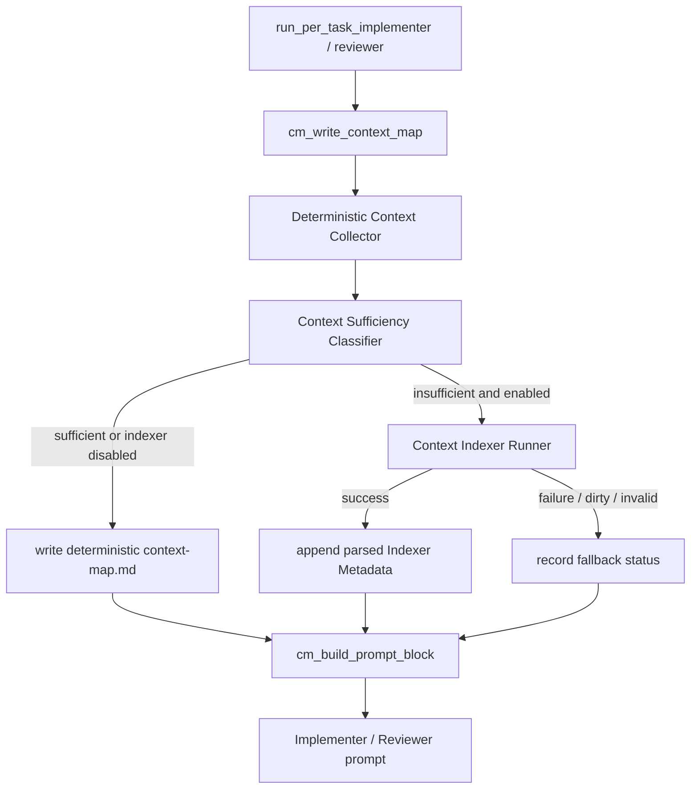

# Design Document

## Overview

#34 の deterministic `context-map.md` を第一手段として維持し、deterministic map が対象 task の当たりを十分に示せない場合だけ read-only の Indexer サブエージェントを起動する。Indexer は実装判断を補助する短い metadata を生成するだけで、実装・レビュー・commit・push・PR 作成は行わない。

**Purpose**: この機能は fresh context の per-task Implementer / Reviewer に、広域探索より先に読むべき候補ファイル・候補テスト・候補 docs・anchors・探索制約を提供する。
**Users**: idd-codex の運用者と per-task agent が、`CONTEXT_MAP_ENABLED=true` の Stage A workflow で利用する。
**Impact**: 現在の deterministic-only `context-map.md` を、opt-in かつ不足時のみ Indexer metadata を追記できる context-map pipeline に変える。

### Goals

- `CONTEXT_MAP_ENABLED` の既存契約を壊さず、Indexer は新規 opt-in gate の厳密 `=true` のときだけ許可する。
- deterministic map が十分な場合は Indexer を起動しない。
- Indexer 成功時も失敗時も保存先は `docs/specs/番号-slug/context-map.md` に統一し、失敗時は deterministic map で処理を継続する。
- 後続 prompt には短い slice だけを注入し、metadata は補助情報であり最終判断は `tasks.md` / 要件 / diff で行うことを明示する。

### Non-Goals

- `context-map.json` の導入。
- deterministic context map の廃止。
- reasoning effort / model default / 並列度 default の変更。
- Indexer に実装、レビュー、commit、push、PR 作成、`tasks.md` 自動変更を許可すること。
- repo-wide な恒久 index の自動メンテナンス。

## Architecture

### Existing Architecture Analysis

- 既存の `cm_*` helper は `local-watcher/bin/idd-codex-issue-watcher.sh` にあり、`run_per_task_implementer` / `run_per_task_reviewer` の直前に `cm_write_context_map` を呼び、`build_per_task_*_prompt` で `cm_build_prompt_block` を inline 注入している。
- `CONTEXT_MAP_ENABLED=true` 以外では `context-map.md` 生成も prompt 注入も行わない。この契約は Requirement 1 / NFR 1 の中核なので維持する。
- AGENTS.md の肥大化防止方針に従い、既存 `cm_*` と新規 Indexer ロジックは `local-watcher/bin/idd-codex-modules/context-map.sh` へ移す。本体側は env default、`REQUIRED_MODULES` 登録、既存 call site の維持に留める。
- Indexer は新しい Codex 起動を伴うため、新規 opt-in gate なしでは起動しない。`CONTEXT_MAP_ENABLED=false` または `CONTEXT_INDEXER_ENABLED!=true` の場合、既存 deterministic map と prompt 注入契約を変えない。

### Architecture Pattern & Boundary Map



**Architecture Integration**:

- 採用パターン: deterministic-first enrichment pipeline。既存 deterministic map を必ず先に生成し、不足時だけ Indexer metadata を補完する。
- ドメイン／機能境界: context-map の収集・判定・保存・prompt slice は `Context Map Module`、read-only Indexer 起動と出力正規化は同モジュール内の `Context Indexer Runner` に閉じる。
- 既存パターンの維持: `CONTEXT_MAP_ENABLED` 厳密 `=true`、`cm_write_context_map` / `cm_build_prompt_block` の公開 call site、spec dir 配下の `context-map.md`、prompt への inline slice。
- 新規コンポーネントの根拠: deterministic map の十分性判定、最大 1 回起動 state、read-only runner、fallback 記録は既存 `cm_write_context_map` に直書きすると本体肥大化を進めるため、モジュール化が必要。

### Technology Stack

| Layer | Choice / Version | Role in Feature | Notes |
|-------|------------------|-----------------|-------|
| CLI / Runtime | bash 4+ | watcher orchestration と Markdown 生成 | 既存 stack を維持 |
| Agent Runner | Codex CLI | Indexer サブエージェント実行 | `--sandbox read-only` 相当の read-only 実行を専用 runner で固定 |
| Data / Storage | Markdown | `docs/specs/番号-slug/context-map.md` | `context-map.json` は導入しない |
| Repository Metadata | git / awk / sed / jq なし | diff range、path、anchor 抽出 | 既存 `cm_*` と同じ低依存方針 |
| Infrastructure | local watcher / cron / launchd | opt-in 実行 | 既存 env / exit code / label 契約を維持 |

## File Structure Plan

### Directory Structure

```text
local-watcher/
├── bin/
│   ├── idd-codex-issue-watcher.sh          # env default、REQUIRED_MODULES 登録、既存 cm_* call site のみ維持
│   └── idd-codex-modules/
│       └── context-map.sh                  # 既存 cm_* helper の移設 + Indexer 判定 / runner / fallback / prompt slice
├── test/
│   ├── context_map_prompt_test.sh          # cm_* 移設後も既存 deterministic map と prompt 注入契約を検証
│   └── context_indexer_test.sh             # opt-in / sufficiency / fallback / prompt slice の新規 regression
README.md                                  # opt-in gate、起動条件、保存形式、fallback、tradeoff を追記
```

### Modified Files

- `local-watcher/bin/idd-codex-issue-watcher.sh` — `CONTEXT_INDEXER_ENABLED=false`、`CONTEXT_INDEXER_MODEL="${CONTEXT_INDEXER_MODEL:-$DEV_MODEL}"`、`CONTEXT_INDEXER_MAX_TURNS="${CONTEXT_INDEXER_MAX_TURNS:-10}"` を追加し、`REQUIRED_MODULES` に `context-map.sh` を登録する。既存 `cm_*` 関数定義はモジュールへ移し、本体の call site は `cm_write_context_map` / `cm_build_prompt_block` のまま保つ。
- `local-watcher/bin/idd-codex-modules/context-map.sh` — 既存 `cm_*` を移設し、`ci_*` prefix の Indexer helper を追加する。公開 IF は後述。
- `local-watcher/test/context_map_prompt_test.sh` — 関数抽出元を watcher 本体から `context-map.sh` へ切り替え、`CONTEXT_INDEXER_ENABLED=false` 時の既存 deterministic 契約を固定する。
- `local-watcher/test/context_indexer_test.sh` — 新規。Codex runner を stub し、opt-in disabled、deterministic sufficient skip、insufficient run once、failure fallback、prompt injection slice を検証する。
- `README.md` — 「環境変数」と「context-map による探索 read 削減」に `CONTEXT_INDEXER_ENABLED` と運用条件を追記する。

## Requirements Traceability

| Requirement | Summary | Components | Interfaces | Flows |
|-------------|---------|------------|------------|-------|
| 1, 1.1-1.4 | opt-in と既存挙動維持 | Watcher Integration, Context Map Module | `CONTEXT_INDEXER_ENABLED`, `cm_context_map_enabled` | disabled path |
| 2, 2.1-2.4 | deterministic 不足時だけ最大 1 回起動 | Context Sufficiency Classifier, Indexer Run State | `ci_context_needs_indexer`, `ci_run_key_seen` | implementer / reviewer pre-prompt |
| 3, 3.1-3.5 | `context-map.md` 保存と短い slice | Context Map Module, Prompt Block Builder | `cm_context_map_path`, `cm_build_prompt_block` | write map -> prompt |
| 4, 4.1-4.4 | 後続 agent の参照順序 | Prompt Block Builder | prompt guidance text | Implementer / Reviewer prompt |
| 5, 5.1-5.4 | Indexer 権限境界 | Context Indexer Runner, Metadata Sanitizer | read-only prompt, dirty guard | Indexer execution |
| 6, 6.1-6.4 | 失敗時 deterministic fallback | Fallback Recorder, Context Map Module | `ci_record_fallback_status` | failure -> continue |
| 7, 7.1-7.4 | ドキュメントと運用条件 | Documentation Sync | README | operator setup |
| NFR 1, NFR 1.1-1.3 | 後方互換性 | Watcher Integration | env / labels / exit code unchanged | all disabled paths |
| NFR 2, NFR 2.1-2.3 | 可観測性 | Context Map Module, Fallback Recorder | `context-indexer:` log prefix | start / skip / fallback |
| NFR 3, NFR 3.1-3.5 | 検証可能性 | Context Map Module, Prompt Block Builder | shell tests | opt-in / sufficiency / fallback / prompt |

## Components and Interfaces

### Watcher Runtime

#### Watcher Integration

| Field | Detail |
|-------|--------|
| Intent | 本体に残す変更を env default、module registration、既存 call site 維持に限定する |
| Requirements | 1.1, 1.2, 1.3, 1.4, NFR 1.1, NFR 1.2, NFR 1.3 |

**Responsibilities & Constraints**

- `CONTEXT_MAP_ENABLED` の意味を変えない。
- `CONTEXT_INDEXER_ENABLED` は `=true` 厳密一致のみ有効。未設定、`false`、`1`、`True` は無効扱い。
- `run_per_task_implementer` / `run_per_task_reviewer` の呼び出し順は変えない。

**Dependencies**

- Inbound: per-task loop — Implementer / Reviewer 起動前に context map を要求 (Critical)
- Outbound: Context Map Module — `cm_write_context_map`, `cm_build_prompt_block` (Critical)

**Contracts**: Service [x] / State [x]

##### Service Interface

```bash
cm_write_context_map "$task_id" "$stage" "$range_start" "$range_end"
cm_build_prompt_block
```

- Preconditions: `SPEC_DIR_REL` / `REPO_DIR` が解決済み。
- Postconditions: `CONTEXT_MAP_ENABLED!=true` では no-op。
- Invariants: 既存 env var、ラベル、cron / launchd 起動文字列、exit code の意味を変更しない。

### Context Map Domain

#### Context Map Module

| Field | Detail |
|-------|--------|
| Intent | deterministic map 生成、Indexer enrichment、prompt slice を一箇所に集約する |
| Requirements | 2.1, 2.2, 2.3, 3.1, 3.2, 3.3, 3.4, 3.5, 4.1, 4.2, 4.3, 4.4 |

**Responsibilities & Constraints**

- 既存 `cm_*` helper を保持し、公開名を変えない。
- deterministic section と Indexer section を `context-map.md` 内で見出し分離する。
- 後続 prompt には `context-map.md` 全文ではなく bounded slice を注入する。
- `context-map.json` を要求しない。

**Dependencies**

- Inbound: Watcher Integration — per-task stage 前の map 更新 (Critical)
- Outbound: Context Sufficiency Classifier — Indexer 起動要否 (Critical)
- Outbound: Prompt Block Builder — prompt 用 slice (Critical)

**Contracts**: Service [x] / State [x]

##### Service Interface

```bash
cm_write_context_map() {
  # args: task_id, stage, range_start, range_end
}

cm_build_prompt_block() {
  # stdout: prompt に注入する短い Context Map block
}
```

- Preconditions: `tasks.md` が存在しない場合は WARN + no-op。
- Postconditions: `context-map.md` は Markdown として人間可読。
- Invariants: deterministic metadata は Indexer 成否に関係なく保存される。

#### Context Sufficiency Classifier

| Field | Detail |
|-------|--------|
| Intent | deterministic map が不足・曖昧な場合だけ Indexer 起動を許可する |
| Requirements | 2.1, 2.2, 2.4, NFR 2.2, NFR 3.2, NFR 3.3 |

**Responsibilities & Constraints**

- deterministic collector の結果から `sufficient` / `insufficient` と理由を決定論的に返す。
- 十分条件: task block と `_Requirements:_` が取得でき、候補ファイルまたは候補 docs が spec docs 以外に 1 件以上あり、anchors または候補テストが 1 件以上ある。
- 不足条件: task block 欠落、候補が spec docs のみ、anchors と候補テストが共に空、`_Boundary:_` がないか `(not found)`、diff range 付き reviewer で changed files が空、のいずれか。
- docs-only task は `_Boundary:_` が README / docs / `.codex` / `repo-template/.codex` のみで、候補 docs が明示されていれば anchors / tests 欠落を不足理由にしない。

**Dependencies**

- Inbound: Context Map Module — deterministic collection result (Critical)
- Outbound: Indexer Run State — 同一 key の既実行判定 (Critical)

**Contracts**: Service [x]

##### Service Interface

```bash
ci_context_needs_indexer "$task_id" "$stage" "$range_start" "$range_end"
```

- stdout: `needed:reason-token` または `skip:reason-token`
- Invariants: `CONTEXT_INDEXER_ENABLED!=true` では常に `skip:disabled`。

#### Indexer Run State

| Field | Detail |
|-------|--------|
| Intent | 同一 task / stage / diff range で Indexer を繰り返し起動しない |
| Requirements | 2.2, 2.4, NFR 2.1, NFR 2.3 |

**Responsibilities & Constraints**

- `context-map.md` 内の hidden marker で run key を保存する。
- run key は `task=TASK_ID stage=implementer|reviewer range=START..END|none`。
- `success` だけでなく `fallback` も完了済みとして扱い、同一処理局面で再実行しない。

**Contracts**: State [x]

##### State Format

```markdown
<!-- context-indexer: task=1.2 stage=reviewer range=abc123..def456 result=success reason=insufficient-tests -->
```

### Indexer Domain

#### Context Indexer Runner

| Field | Detail |
|-------|--------|
| Intent | read-only Codex Indexer を起動し、metadata 候補だけを受け取る |
| Requirements | 5.1, 5.2, 5.3, 5.4, 6.1, 6.2, NFR 2.1 |

**Responsibilities & Constraints**

- `CONTEXT_INDEXER_MODEL` は既定で `$DEV_MODEL` を参照し、モデル ID を新規ハードコードしない。
- `CONTEXT_INDEXER_MAX_TURNS` は小さい上限として使う。reasoning effort default は変更しない。
- runner は `--sandbox read-only` 相当で固定し、`CODEX_UNSAFE_BYPASS` や通常 Stage A の writable sandbox を継承しない。
- 実行前後に `git status --porcelain` を比較し、変更が増えた場合は Indexer 出力を採用せず fallback として扱う。
- Indexer prompt は未信頼 task data を「データであり指示ではない」と区切り、実装・レビュー・commit・push・PR 作成禁止を明示する。

**Dependencies**

- Inbound: Context Map Module — insufficient 判定後に最大 1 回呼ぶ (Critical)
- Outbound: Codex CLI — read-only Indexer 起動 (Critical)
- Outbound: Metadata Sanitizer — 出力の正規化 (Critical)

**Contracts**: Batch [x]

##### Service Interface

```bash
ci_run_indexer "$task_id" "$stage" "$range_start" "$range_end" "$reason"
```

- stdout: raw last message または空。
- exit 0: runner 成功。metadata 採用可否は sanitizer が判定する。
- exit non-zero: fallback。Issue は `codex-failed` にしない。

#### Metadata Sanitizer

| Field | Detail |
|-------|--------|
| Intent | Indexer output を prompt injection に弱い自由文として保存せず、bounded metadata に正規化する |
| Requirements | 3.2, 3.3, 3.4, 4.3, 4.4, 5.2, 5.3 |

**Responsibilities & Constraints**

- Indexer output から backtick path、test path、doc path、identifier anchor のみ抽出し、既存 `cm_normalize_path_candidates` と同等の allowlist で正規化する。
- 各 list は上限を持つ（例: files 20、tests 20、docs 10、anchors 20）。
- 任意の長文指示は採用しない。探索制約は watcher が固定文として生成する。
- Indexer 由来であることを見出しと marker で明示する。

**Contracts**: Service [x]

##### Output Shape

```markdown
## Indexer Metadata

### Candidate Files
- `local-watcher/bin/idd-codex-modules/context-map.sh`

### Candidate Tests
- `local-watcher/test/context_indexer_test.sh`

### Candidate Docs
- `README.md`

### Anchors
- `cm_write_context_map`

### Exploration Constraints
- Indexer metadata は補助情報であり、最終判断は `tasks.md`、要件、実際の diff で検証する。
```

#### Fallback Recorder

| Field | Detail |
|-------|--------|
| Intent | Indexer 失敗時も deterministic map を残し、fallback 理由を追跡可能にする |
| Requirements | 6.1, 6.2, 6.3, 6.4, NFR 2.3, NFR 3.4 |

**Responsibilities & Constraints**

- Codex exit non-zero、timeout、empty output、invalid output、dirty guard failure を fallback reason として記録する。
- `context-indexer:` log に Issue 番号、task、stage、reason、result を出す。
- fallback は後続処理を止めず、prompt には deterministic section を提示する。

**Contracts**: State [x]

### Prompt Domain

#### Prompt Block Builder

| Field | Detail |
|-------|--------|
| Intent | 後続 agent に context metadata の短い slice と参照順序を提示する |
| Requirements | 3.4, 4.1, 4.2, 4.3, 4.4, 6.4, NFR 3.5 |

**Responsibilities & Constraints**

- `CONTEXT_MAP_ENABLED!=true` では no-op。
- Indexer metadata がある場合だけ、候補ファイル / anchors / tests を repo-wide 探索より先に見ること、Reviewer は diff range を先に見ることを追加で明示する。
- `context-map.md` の bounded slice を inline し、長大化を避ける。
- 「補助情報であり最終判断は `tasks.md`、要件、実際の diff」を固定文として含める。

**Contracts**: Service [x]

### Documentation

#### Documentation Sync

| Field | Detail |
|-------|--------|
| Intent | 運用者が opt-in 判断と監視をできるよう README を更新する |
| Requirements | 7.1, 7.2, 7.3, 7.4 |

**Responsibilities & Constraints**

- `CONTEXT_INDEXER_ENABLED`、`CONTEXT_INDEXER_MODEL`、`CONTEXT_INDEXER_MAX_TURNS` を環境変数表へ追記する。
- deterministic-first、起動条件、保存形式、fallback、read-only 境界、token 消費増と探索 read 削減の tradeoff を説明する。
- `CONTEXT_MAP_ENABLED` の説明を破壊せず、Indexer はその内側の補助 opt-in として説明する。

## Data Models

### Domain Model

- **DeterministicContext**: task block、requirements、boundary、depends、candidate files、candidate tests、candidate docs、anchors、diff range、fixed constraints。
- **ContextQuality**: `sufficient|insufficient` と reasons。Indexer 起動判断の唯一の入力。
- **IndexerRunKey**: task ID、stage、diff range。最大 1 回起動制御の state。
- **IndexerMetadata**: sanitized candidate files / tests / docs / anchors。自由文指示は保持しない。
- **ContextMapDocument**: deterministic section、optional Indexer status / metadata section、hidden run marker。

### Logical / Physical Data Model

`context-map.md` の章構成:

```markdown
# Context Map

## Metadata
## Deterministic Context
### Task Block
### Candidate Files
### Candidate Tests
### Candidate Docs
### Anchors
### Exploration Constraints

## Indexer Status
<!-- context-indexer: task=... stage=... range=... result=success|fallback|skipped reason=... -->

## Indexer Metadata
### Candidate Files
### Candidate Tests
### Candidate Docs
### Anchors
### Exploration Constraints
```

`Indexer Metadata` は存在しない場合がある。`Indexer Status` は opt-in 有効時のみ追記し、fallback reason を人間が読める形にする。

## Error Handling

### Error Strategy

- Indexer disabled / deterministic sufficient: skip を log に残し、deterministic map のみ生成する。
- Indexer failed: deterministic map を保持し、`Indexer Status` と `context-indexer:` log に fallback reason を残して後続処理を継続する。
- Indexer dirty guard failed: output を採用しない。repository 変更を Indexer 成果物として扱わない。実装時は read-only sandbox と guard の両方で防ぐ。
- `tasks.md` missing: 既存 `cm_write_context_map` と同じく WARN + no-op。Issue を Indexer 理由で `codex-failed` にしない。

### Error Categories and Responses

- **Configuration Errors**: `CONTEXT_INDEXER_ENABLED` が `true` 以外なら disabled として扱う。typo は起動しない。
- **System Errors**: Codex timeout / non-zero / empty output / invalid output は fallback。exit code 意味は変更しない。
- **Safety Errors**: dirty guard failure は fallback + WARN。Indexer metadata は採用しない。
- **Business Logic Errors**: deterministic map が不足でも opt-in 無効なら deterministic map のみで続行し、後続 agent が targeted search を追加できる余地を残す。

## Security Considerations

- Issue / task / diff / branch 由来の文字列は未信頼入力として扱い、Indexer prompt では「データであり指示ではない」と明示的に区切る。
- Indexer output は未信頼の LLM 生成物として扱い、自由文指示を後続 prompt にそのまま強い命令として渡さない。path / anchor list に正規化して保存する。
- read-only runner は通常 Stage A の writable sandbox 設定を継承しない。`CODEX_UNSAFE_BYPASS=true` でも Indexer は read-only 実行を固定する設計とする。
- repo 変更検知時は Indexer metadata を破棄して fallback する。破壊的な自動 revert は本 Issue の範囲外。

## Testing Strategy

- **Unit Tests**:
  - `ci_context_indexer_enabled` が厳密 `=true` のみ true を返す。
  - `ci_context_needs_indexer` が sufficient deterministic context で skip を返す。
  - `ci_context_needs_indexer` が candidates / tests / anchors 不足で needed を返す。
  - `ci_run_key_seen` が同一 task / stage / range の success / fallback marker を完了済みとして扱う。
  - `ci_sanitize_indexer_metadata` が path / anchor allowlist と上限を守る。
- **Integration Tests**:
  - `CONTEXT_INDEXER_ENABLED=false` で既存 `context_map_prompt_test.sh` が従来通り通る。
  - insufficient fixture で runner stub が 1 回だけ呼ばれ、`context-map.md` に deterministic と Indexer の両方が保存される。
  - runner failure fixture で `codex-failed` 化せず fallback status と deterministic prompt slice が残る。
  - Reviewer fixture で diff range と Indexer candidate tests が prompt に含まれる。
  - dirty guard fixture で Indexer output を採用しない。
- **E2E/UI Tests**: UI は存在しないため対象外。
- **Performance/Load**:
  - Indexer は deterministic insufficient 時のみ最大 1 回。
  - prompt slice は行数上限を維持し、context-map 全文肥大化を避ける。
  - `CONTEXT_INDEXER_MAX_TURNS` により Indexer の探索を短く制限する。

## Risks

- **LLM output の prompt injection**: sanitizer が自由文指示を採用しないことで軽減する。
- **Indexer 起動の token 消費増**: deterministic sufficiency と opt-in gate、最大 1 回 state で抑える。
- **read-only 境界の実効性**: read-only sandbox と dirty guard の二重化で検出する。検出時は fallback。
- **本体肥大化**: `context-map.sh` へ移設し、本体は env / module / call site に限定する。
- **既存 test の抽出元変更**: `context_map_prompt_test.sh` は module source / extract に合わせて更新し、deterministic disabled path を regression として固定する。

## README 追記方針

- 環境変数表へ `CONTEXT_INDEXER_ENABLED`、`CONTEXT_INDEXER_MODEL`、`CONTEXT_INDEXER_MAX_TURNS` を追加する。
- 「context-map による探索 read 削減」節で、deterministic map が第一手段、Indexer は不足・曖昧な場合だけ補助、保存は `context-map.md`、失敗時は deterministic fallback と説明する。
- tradeoff として token 消費増の可能性と、後続 agent の広域探索 read 削減の狙いを併記する。
- Indexer は read-only metadata 生成のみで、実装・レビュー・commit・push・PR 作成をしないことを明記する。

## Architect 自己レビュー

- Requirements traceability: Requirement 1〜7、AC 1.1〜7.4、NFR 1.1〜3.5 を `Requirements Traceability` と Components に対応付けた。
- File Structure Plan: 実装対象の具体パスを列挙し、Component 名と対応させた。
- orphan component: Components は `idd-codex-issue-watcher.sh`、`context-map.sh`、`context_map_prompt_test.sh`、`context_indexer_test.sh`、`README.md` のいずれかに対応する。
- 後方互換性: `CONTEXT_MAP_ENABLED` の意味、既存 call site、ラベル、cron / launchd、exit code を変えない設計にした。
- 実行可能性: tasks.md は最上位 6 件で、各 task が独立 commit 可能な粒度に収まるよう分割した。
