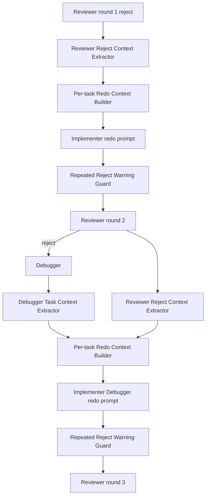

# Design Document

## Overview

per-task loop の redo 経路では、Reviewer reject や Debugger Fix Plan が Developer 再実行 prompt の主目的として渡らず、同じ `missing test` / AC 未カバーが round をまたいで残りやすい。本設計は、task 単位の Reviewer Findings / Required Action と Debugger の `## Task <id>` Fix Plan を抽出し、redo prompt に checklist として注入する。

**Purpose**: この機能は retry 時の是正対象を task 固有の checklist として Developer に渡し、Reviewer と運用者が closure を追跡できる状態を watcher 運用者に提供する。  
**Users**: watcher 運用者と Developer / Reviewer agent が、per-task reject 後の再実行 workflow で利用する。  
**Impact**: 現在の `run_per_task_implementer "$task_id"` だけに戻る経路を、任意の redo context を受け取る prompt 組み立てに変える。ただし既存 env var、label、cron 呼び出し、exit code、`PER_TASK_LOOP_ENABLED=false` 経路は変更しない。

### Goals

- Reviewer reject 後の再実行 prompt に、対象 task の Findings / Required Action / category / target を inline 注入する。
- Debugger 後の再実行 prompt に、Reviewer context と `debugger-notes.md` の `## Task <task_id>` セクションを併せて注入する。
- Developer agent 指示と watcher prompt の両方で Finding Closure Matrix の責務を明示する。
- 同一 category / target が連続し、前回 reject 以降に関連 test 差分が無い場合、warning-only の診断を Reviewer 起動前に残す。
- root `.codex/agents` と `repo-template/.codex/agents` の byte-identical 配布整合を verify する。

### Non-Goals

- Reviewer の reject カテゴリ、`review-notes.md` 出力契約、`RESULT:` パース規約の変更。
- Debugger にコード修正権限を与えること。
- per-task loop 全体の廃止、モデル ID / quota policy の変更、新しい外部 service / runtime dependency の追加。
- #23 の復旧作業そのものの再実行。
- requirements.md / tasks.md の実行時 rewrite や、既存 spec への retroactive migration。

## Architecture

### Existing Architecture Analysis

- `local-watcher/bin/idd-codex-issue-watcher.sh` は `PER_TASK_LOOP_ENABLED=true` のとき、`run_per_task_loop` から task ごとに Implementer → Reviewer を fresh Codex session で起動する。
- `build_per_task_implementer_prompt` は対象 task、context map、先行 learnings を heredoc で構築する単一入口であり、通常実行の prompt contract を保持する必要がある。
- `run_per_task_implementer` は現状 `build_per_task_implementer_prompt "$task_id"` だけを呼ぶため、retry 専用引数や context 注入経路が無い。
- `run_per_task_reviewer` は `parse_review_result` により `review-notes.md` の `RESULT`、categories、targets を抽出し、reject 時に `categories=$categories targets=$targets` をログへ残す。
- `run_per_task_loop` は round 1 reject 後、および round 2 reject + Debugger 後に、同じ `run_per_task_implementer "$task_id"` へ戻る。
- `.codex/agents/developer.md` と `repo-template/.codex/agents/developer.md` は byte-identical 維持が必須。今回の agent prompt 変更対象は Developer の per-task 節であり、Reviewer / Debugger の出力契約は変更しない。

### Architecture Pattern & Boundary Map



**Architecture Integration**:

- 採用パターン: helper extraction + optional prompt block injection。既存 `build_per_task_implementer_prompt` を通常 path の入口として維持し、redo context がある場合だけ追加 block を挿入する。
- ドメイン／機能境界: `review-notes.md` 抽出、`debugger-notes.md` 抽出、prompt block 生成、loop orchestration、warning guard を分離する。
- 既存パターンの維持: bash 4+、`set -euo pipefail`、stdout/stderr discipline、`pt_log` / `pt_warn`、`parse_review_result`、Reviewer 3 カテゴリ、Debugger の `## Task <id>` 出力契約。
- 新規コンポーネントの根拠: redo context は既存 learnings と異なり reject closure の checklist であり、抽出不能時の診断と連続 reject guard が必要なため、専用 helper として分離する。

### Technology Stack

| Layer | Choice / Version | Role in Feature | Notes |
|-------|------------------|-----------------|-------|
| CLI / Runtime | bash 4+ | watcher helper、prompt 生成、shell fixture | 新 runtime dependency は追加しない |
| Data / Storage | markdown files | `review-notes.md` / `debugger-notes.md` / `impl-notes.md` | 既存 spec artifact を利用 |
| Git | existing `git diff` / `git log` | 前回 reject 以降の test 差分検出 | 外部 service なし |
| Agent prompts | `.codex/agents/developer.md` | Finding Closure Matrix の agent-level contract | root / repo-template byte-identical |
| Tests | shell fixture | helper 抽出、prompt assertion、warning guard | `local-watcher/test/` 既存 pattern に合わせる |

## File Structure Plan

### Directory Structure

```text
local-watcher/
├── bin/
│   └── idd-codex-issue-watcher.sh        # per-task redo context helpers と loop injection
└── test/
    ├── per_task_redo_context_test.sh     # Reviewer / Debugger context 抽出と prompt 注入 fixture
    └── per_task_repeated_reject_guard_test.sh
                                            # 連続 reject warning guard fixture

.codex/
└── agents/
    └── developer.md                      # Finding Closure Matrix 責務を追記

repo-template/
└── .codex/
    └── agents/
        └── developer.md                  # root と byte-identical に同期
```

### Modified Files

- `local-watcher/bin/idd-codex-issue-watcher.sh` — redo context 抽出 helper、optional prompt block、`run_per_task_implementer` の任意引数、`run_per_task_loop` の round 1 / Debugger 後再実行への context 受け渡し、warning-only guard を追加する。
- `.codex/agents/developer.md` — per-task retry 時の Finding Closure Matrix 作成 / 更新責務を追加する。
- `repo-template/.codex/agents/developer.md` — root と同内容を byte-identical に反映する。
- `local-watcher/test/per_task_redo_context_test.sh` — watcher から必要 helper を抽出し、Reviewer Findings / Required Action と Debugger `## Task <id>` が redo prompt に入ることを検証する。
- `local-watcher/test/per_task_repeated_reject_guard_test.sh` — 同一 category / target かつ test 差分なしの warning 診断を検証する。

## Requirements Traceability

| Requirement | Summary | Components | Interfaces | Flows |
|-------------|---------|------------|------------|-------|
| 1 | Reviewer reject 後の redo context 注入 | Reviewer Reject Context Extractor, Per-task Redo Context Builder, Per-task Loop Orchestration | `review-notes.md`, `build_per_task_implementer_prompt` | round 1 reject → Implementer redo |
| 1.1 | Findings inline 注入 | Reviewer Reject Context Extractor | `pt_extract_review_reject_context` | round 1 reject |
| 1.2 | Required Action inline 注入 | Reviewer Reject Context Extractor | `pt_extract_review_reject_context` | round 1 reject |
| 1.3 | task ID / round / category / target 表示 | Per-task Redo Context Builder | redo context markdown block | Implementer prompt |
| 1.4 | 抽出不能時の診断 | Redo Context Diagnostics | `pt_log`, diagnostic block | fail-open warning |
| 2 | Debugger 後の redo context 注入 | Debugger Task Context Extractor, Per-task Redo Context Builder, Per-task Loop Orchestration | `debugger-notes.md` | round 2 reject → Debugger → Implementer redo |
| 2.1 | relevant Findings inline 注入 | Reviewer Reject Context Extractor | `pt_extract_review_reject_context` | Debugger 後 redo |
| 2.2 | Task section inline 注入 | Debugger Task Context Extractor | `pt_extract_debugger_task_section` | Debugger 後 redo |
| 2.3 | Reviewer / Debugger 由来識別 | Per-task Redo Context Builder | labeled markdown subsections | Implementer prompt |
| 2.4 | Debugger section 抽出不能時の診断 | Redo Context Diagnostics | `pt_log`, diagnostic block | fail-open warning |
| 3 | Finding Closure Matrix | Finding Closure Prompt Contract, Agent Prompt Synchronization | Developer agent text, watcher prompt text | Developer writes `impl-notes.md` |
| 3.1 | Matrix 作成 / 更新 | Finding Closure Prompt Contract | prompt contract | redo prompt |
| 3.2 | rejected target requirement 行 | Finding Closure Prompt Contract | matrix schema | `impl-notes.md` |
| 3.3 | fix commit 記録 | Finding Closure Prompt Contract | matrix schema | `impl-notes.md` |
| 3.4 | test/assertion 記録 | Finding Closure Prompt Contract | matrix schema | `impl-notes.md` |
| 3.5 | verification result 記録 | Finding Closure Prompt Contract | matrix schema | `impl-notes.md` |
| 3.6 | 修正 / test 不要理由 | Finding Closure Prompt Contract | matrix schema | `impl-notes.md` |
| 4 | 連続 reject の未対応検出 | Repeated Reject Warning Guard | reject fingerprint, git test diff | before Reviewer round 2 / 3 |
| 4.1 | missing test target + test 差分なし | Repeated Reject Warning Guard | `pt_build_repeated_reject_warning` | warning-only |
| 4.2 | AC target + test 差分なし | Repeated Reject Warning Guard | `pt_build_repeated_reject_warning` | warning-only |
| 4.3 | fail-fast 時の情報 | Repeated Reject Warning Guard | design chooses warning-only, no fail-fast | N/A |
| 4.4 | warning-only の可視化 | Repeated Reject Warning Guard | `pt_log`, prompt warning block | before Reviewer |
| 5 | 回帰検証と配布整合 | Regression Fixture Coverage, Agent Prompt Synchronization | shell tests, `diff -r` | Verify block |
| 5.1 | #23 shape Reviewer context | Regression Fixture Coverage | `per_task_redo_context_test.sh` | prompt assertion |
| 5.2 | Debugger context | Regression Fixture Coverage | `per_task_redo_context_test.sh` | prompt assertion |
| 5.3 | Finding Closure Matrix 検証 | Regression Fixture Coverage | prompt assertion + impl-notes fixture | shell fixture |
| 5.4 | agents byte-identical | Agent Prompt Synchronization | `diff -r .codex/agents repo-template/.codex/agents` | Verify |
| 5.5 | rules byte-identical | Rule Sync Verification | `diff -r .codex/rules repo-template/.codex/rules` | Verify |
| 5.6 | prompt-only assertion の理由記録 | Regression Fixture Coverage | `impl-notes.md` implementation note | Developer task |
| NFR 1.1 | env / label / cron / branch / exit code 互換 | Per-task Loop Orchestration | optional args only | all flows |
| NFR 1.2 | single workflow 互換 | Per-task Loop Orchestration | gate remains `PER_TASK_LOOP_ENABLED` | non per-task |
| NFR 1.3 | Reviewer categories 維持 | Reviewer Reject Context Extractor | existing parser / categories | all review |
| NFR 1.4 | dependency 追加なし | all components | bash / git only | all flows |
| NFR 2.1 | context injection evidence | Redo Context Diagnostics | `pt_log` | redo prompt |
| NFR 2.2 | repeated reject evidence | Repeated Reject Warning Guard | `pt_log` | warning-only |

## Components and Interfaces

### Watcher Per-task Redo Context

#### Reviewer Reject Context Extractor

| Field | Detail |
|-------|--------|
| Intent | `review-notes.md` の current task Findings / Required Action を redo prompt 用に抽出する |
| Requirements | 1.1, 1.2, 1.3, 1.4, 2.1, NFR 1.3 |

**Responsibilities & Constraints**

- `RESULT: reject` の current `review-notes.md` から `## Findings` セクションを抽出する。
- `### Finding` ブロックごとに `Target`、`Category`、`Detail`、`Required Action` を保持する。
- per-task review は current task の review file を上書きするため、通常は全 Findings を対象にする。防御的に task `_Requirements:_` と `boundary:*` target を使う filter helper を持ってよい。
- 抽出不能時は return code と diagnostic message を返し、通常 prompt と同一にならないよう diagnostic block を生成する。

**Dependencies**

- Inbound: Per-task Loop Orchestration — reject 直後に呼び出す (Critical)
- Outbound: Per-task Redo Context Builder — markdown block を渡す (Critical)
- External: `review-notes.md` — Reviewer output contract (Critical)

**Contracts**: Service [x] / State [x]

##### Service Interface

```bash
pt_extract_review_reject_context <task_id> <round> <review_notes_path>
```

- stdout: redo prompt に埋め込む markdown fragment。
- return `0`: 1 件以上の Finding / Required Action を抽出。
- return `1`: file missing / result not reject / findings missing / target-category parse failure。呼び出し側は diagnostic block を prompt に入れ、`pt_log` に `redo-context-unavailable` を残す。
- Invariants: `review-notes.md` は書き換えない。`parse_review_result` の result/categories/targets 契約は変更しない。

#### Debugger Task Context Extractor

| Field | Detail |
|-------|--------|
| Intent | `debugger-notes.md` から `## Task <task_id>` セクションだけを抽出する |
| Requirements | 2.2, 2.3, 2.4 |

**Responsibilities & Constraints**

- `## Task <task_id>` から次の `## Task ` または EOF までを抽出する。
- 抽出した block に `### 根本原因` / `### 修正手順` / `### 検証方法` / `### 関連参考資料` が揃うかを確認し、不足時は diagnostic を残す。
- Debugger output contract は変更しない。

**Dependencies**

- Inbound: Per-task Loop Orchestration — Debugger 正常終了後に呼び出す (Critical)
- Outbound: Per-task Redo Context Builder — Debugger 由来 block を渡す (Critical)
- External: `debugger-notes.md` — Debugger output contract (Critical)

**Contracts**: Service [x] / State [x]

##### Service Interface

```bash
pt_extract_debugger_task_section <task_id> <debugger_notes_path>
```

- stdout: `## Task <task_id>` markdown section。
- return `0`: section 抽出成功、必須 h3 が存在。
- return `1`: section missing / h3 missing / file missing。呼び出し側は diagnostic block を prompt に入れ、`pt_log` に `debugger-context-unavailable` を残す。

#### Per-task Redo Context Builder

| Field | Detail |
|-------|--------|
| Intent | Reviewer / Debugger 由来の抽出結果を Implementer prompt の任意 block として組み立てる |
| Requirements | 1.3, 2.3, 3.1, 3.2, 3.3, 3.4, 3.5, 3.6, NFR 2.1 |

**Responsibilities & Constraints**

- 通常実行では空文字を返し、既存 prompt を変えない。
- redo 実行では `## Retry Context` を追加し、task ID、redo kind、Reviewer round、category、target requirement、Required Action を明示する。
- Debugger 後は `### Reviewer Reject Context` と `### Debugger Fix Plan Context` を分け、由来を識別可能にする。
- Finding Closure Matrix の schema を prompt に含める。

**Dependencies**

- Inbound: `build_per_task_implementer_prompt` — optional argument で呼び出す (Critical)
- Outbound: Developer agent — `impl-notes.md` に matrix を残す (Critical)

**Contracts**: Service [x] / State [x]

##### Service Interface

```bash
pt_build_redo_context_block <task_id> <redo_kind> <review_round> <review_notes_path> [debugger_notes_path]
build_per_task_implementer_prompt <task_id> [redo_context_block]
run_per_task_implementer <task_id> [redo_context_block]
```

- `redo_kind`: `reviewer-reject` / `debugger-fix-plan` / `blocked-debugger` の限定値。
- `build_per_task_implementer_prompt` の第 2 引数が空なら既存挙動と同一。
- `run_per_task_implementer` は第 2 引数を任意にして後方互換を保つ。

### Watcher Loop and Diagnostics

#### Per-task Loop Orchestration

| Field | Detail |
|-------|--------|
| Intent | redo context を round 1 reject 後と round 2 reject + Debugger 後の再実行に渡す |
| Requirements | 1.1, 1.2, 2.1, 2.2, NFR 1.1, NFR 1.2 |

**Responsibilities & Constraints**

- round 1 reject 後、`pt_build_redo_context_block "$task_id" reviewer-reject 1 ...` を作成して Implementer redo に渡す。
- round 2 reject + Debugger 後、Reviewer context と Debugger context の両方を含む block を Implementer redo に渡す。
- 既存 `DEBUGGER_ENABLED` gate、Debugger 既起動 sentinel、quota path、`mark_issue_failed` の exit code 意味を変えない。

**Dependencies**

- Inbound: `run_per_task_loop` (Critical)
- Outbound: `run_per_task_implementer`, `run_per_task_reviewer`, `run_debugger_stage` (Critical)

**Contracts**: Batch [x] / State [x]

#### Repeated Reject Warning Guard

| Field | Detail |
|-------|--------|
| Intent | 同一 category / target と test 差分なしを Reviewer 起動前に operator-visible warning として残す |
| Requirements | 4.1, 4.2, 4.4, NFR 2.2 |

**Responsibilities & Constraints**

- fail-fast ではなく warning-only を採用する。理由は AC が either であり、既存 per-task loop の成功 / 失敗 exit code とラベル遷移を壊さないため。
- reject fingerprint は `category + target`。`missing test` と `AC 未カバー` を対象にする。
- test diff は前回 reject 直後の `HEAD` から次 Reviewer 起動直前の `HEAD` までの `git diff --name-only` を、`local-watcher/test/*`、`tests/*`、`*_test.sh`、`*test*.sh` 等の test path heuristic で判定する。
- warning には task ID、category、target requirement、`changed_tests=(none)` または検出した test path を含める。
- round 2 Reviewer 起動前は「前回 reject target に対して test 差分が無い risk」として警告できる。round 3 Reviewer 起動前は round 1 / round 2 の fingerprint overlap を確認し、連続 reject warning として記録する。

**Dependencies**

- Inbound: Per-task Loop Orchestration — Reviewer 起動直前に呼び出す (Critical)
- Outbound: `pt_log`, redo context block — operator / Developer に可視化 (Critical)
- External: git diff — test path detection (Important)

**Contracts**: Service [x] / State [x]

##### Service Interface

```bash
pt_collect_reject_fingerprints <review_notes_path>
pt_collect_changed_test_paths <from_sha> <to_sha>
pt_build_repeated_reject_warning <task_id> <from_round> <to_round> <fingerprints> <changed_tests>
```

- stdout: warning markdown fragment または空。
- return `0`: warning 判定完了。warning が無い場合も `0`。
- return `1`: git SHA 解決不能など。呼び出し側は `pt_log ... repeated-reject-guard-unavailable` を残し、Reviewer 起動は止めない。

### Agent Prompt Distribution

#### Finding Closure Prompt Contract

| Field | Detail |
|-------|--------|
| Intent | Developer に `impl-notes.md` の Finding Closure Matrix 更新を義務付ける |
| Requirements | 3.1, 3.2, 3.3, 3.4, 3.5, 3.6 |

**Responsibilities & Constraints**

- watcher per-task Implementer prompt と `.codex/agents/developer.md` の両方に同じ責務を明示する。
- matrix の列は `Target requirement`、`Category`、`Required Action`、`Fix commit`、`Test/assertion`、`Verification result`、`Notes / no-change reason` とする。
- rejected target requirement ごとに 1 行を作る。不要判断の場合も理由と確認結果を行に残す。

#### Agent Prompt Synchronization

| Field | Detail |
|-------|--------|
| Intent | root と repo-template の Developer agent 指示を byte-identical に保つ |
| Requirements | 5.4, NFR 1.1 |

**Responsibilities & Constraints**

- `.codex/agents/developer.md` と `repo-template/.codex/agents/developer.md` を同一内容に更新する。
- `.codex/agents/reviewer.md` / `.codex/agents/debugger.md` の出力契約は変更しない。
- rules は変更しない想定だが、verify では `diff -r .codex/rules repo-template/.codex/rules` も実行する。

### Regression Fixture Coverage

#### Redo Context Regression Test

| Field | Detail |
|-------|--------|
| Intent | #23 shape の redo prompt context 注入を shell fixture で検証する |
| Requirements | 5.1, 5.2, 5.3, 5.6 |

**Responsibilities & Constraints**

- 実 LLM は起動せず、既存 `per_task_marker_review_range_test.sh` と同様に watcher から helper を抽出して stub する。
- `review-notes.md` fixture に Req 5.2 / 5.3 の `missing test` Findings と Required Action を置き、prompt に category / target / Required Action が含まれることを検証する。
- `debugger-notes.md` fixture に `## Task 1.1` と h3 4 セクションを置き、prompt に Debugger 由来として含まれることを検証する。
- Finding Closure Matrix schema が prompt に含まれることを検証する。

#### Repeated Reject Guard Test

| Field | Detail |
|-------|--------|
| Intent | 同一 target + test 差分なしの warning-only 診断を検証する |
| Requirements | 4.1, 4.2, 4.4, NFR 2.2 |

**Responsibilities & Constraints**

- temporary git repo で前回 reject 後に実装ファイルだけを変更したケースを作る。
- `missing test` と `AC 未カバー` の同一 target fingerprint で warning block が task/category/target/changed_tests none を含むことを検証する。
- test file を変更したケースでは warning が出ないことを検証する。

## Data Models

### Reject Finding Record

```text
task_id=<numeric task id>
round=<1|2|3>
target=<requirement id | boundary:<component>>
category=<AC 未カバー | missing test | boundary 逸脱>
detail=<reviewer detail text>
required_action=<reviewer required action text>
source=review-notes.md
```

### Debugger Task Section

```text
task_id=<numeric task id>
source=debugger-notes.md
section_markdown=<## Task <id> ...>
has_root_cause=<true|false>
has_fix_steps=<true|false>
has_verification=<true|false>
has_references=<true|false>
```

### Finding Closure Matrix Schema

```markdown
| Target requirement | Category | Required Action | Fix commit | Test/assertion | Verification result | Notes / no-change reason |
|--------------------|----------|-----------------|------------|----------------|---------------------|--------------------------|
```

## Error Handling

### Error Strategy

- redo context 抽出不能は fail-open warning とし、通常 prompt と同一にはせず diagnostic block を注入する。これにより 1.4 / 2.4 の「silent に進めない」を満たしつつ、既存 exit code / label 遷移を変えない。
- Debugger の既存 validation failure は既存 `run_debugger_stage` の `mark_issue_failed` に委ねる。今回の helper は「validated file から task section を prompt 用に抽出する」責務だけを持つ。
- repeated reject は warning-only。`codex-failed` 付与や Reviewer skip は実装しない。

### Error Categories and Responses

- **Context extraction unavailable**: `review-notes.md` / `debugger-notes.md` missing、Finding parse failure、Task section missing。`pt_log` に task / round / reason を残し、prompt に diagnostic block を入れる。
- **Repeated reject risk**: 同一 category / target と test diff none。`pt_log` と prompt warning block に task / category / target / changed_tests を残す。
- **System command failure**: `git rev-parse` / `git diff` 失敗。guard unavailable として warning を残し、Reviewer 起動は止めない。

## Testing Strategy

- **Unit / Shell Helper Tests**
  - `pt_extract_review_reject_context` が Findings / Required Action / category / target を抽出する。
  - `pt_extract_review_reject_context` が抽出不能時に diagnostic を返す。
  - `pt_extract_debugger_task_section` が `## Task <id>` のみを抽出し、別 task section を混ぜない。
  - `pt_build_redo_context_block` が Reviewer 由来と Debugger 由来を識別可能な見出しで出力する。
- **Integration / Prompt Tests**
  - `build_per_task_implementer_prompt <task_id> <redo_context>` が通常 prompt を壊さず retry block を追加する。
  - round 1 reject 後の prompt に task ID、round、category、target、Required Action、Finding Closure Matrix が含まれる。
  - Debugger 後の prompt に Reviewer Findings と Debugger Fix Plan が別見出しで含まれる。
- **Regression Tests**
  - #23 shape の Req 5.2 / 5.3 `missing test` が redo prompt に含まれる。
  - 同一 category / target で test 差分なしの場合に warning-only 診断が出る。
  - test file 差分がある場合に repeated reject warning が出ない。
- **Distribution / Static Verification**
  - `shellcheck local-watcher/bin/*.sh install.sh setup.sh .github/scripts/*.sh`
  - `shellcheck local-watcher/test/per_task_redo_context_test.sh local-watcher/test/per_task_repeated_reject_guard_test.sh`
  - `diff -r .codex/agents repo-template/.codex/agents`
  - `diff -r .codex/rules repo-template/.codex/rules`

## Design Decisions and Alternatives

- **Decision: warning-only guard** — AC 4.1 / 4.2 は fail-fast または warning を許容している。今回の primary goal は retry prompt の改善であり、exit code / label contract の変更リスクを避けるため warning-only を採用する。
- **Decision: optional prompt block** — `build_per_task_implementer_prompt` を dedicated redo helper で置き換えず、第 2 引数の optional block を受ける形にする。通常実行の prompt 形状と learnings 注入を維持しやすい。
- **Alternative rejected: review-notes.md の構造変更** — Reviewer output contract を変えると既存 parser と Review agent 指示の blast radius が大きい。既存 `Target` / `Category` / `Required Action` を抽出する。

## Self Review Notes

- Requirements traceability は Requirement 1〜5、AC 1.1〜5.6、NFR 1.1〜2.2 を design.md に明示した。
- File Structure Plan は具体 path を列挙し、Components 名は将来 `(P)` task を切る場合にも `_Boundary:_` で参照できる名称にした。今回の tasks.md では `(P)` task を置かないため `_Boundary:_` は不要。
- tasks.md は最上位 6 件で Budget overflow check を満たす想定。
- repeated reject は fail-fast ではなく warning-only の明示設計であり、AC 4.3 は fail-fast 非採用のため N/A として扱う。
