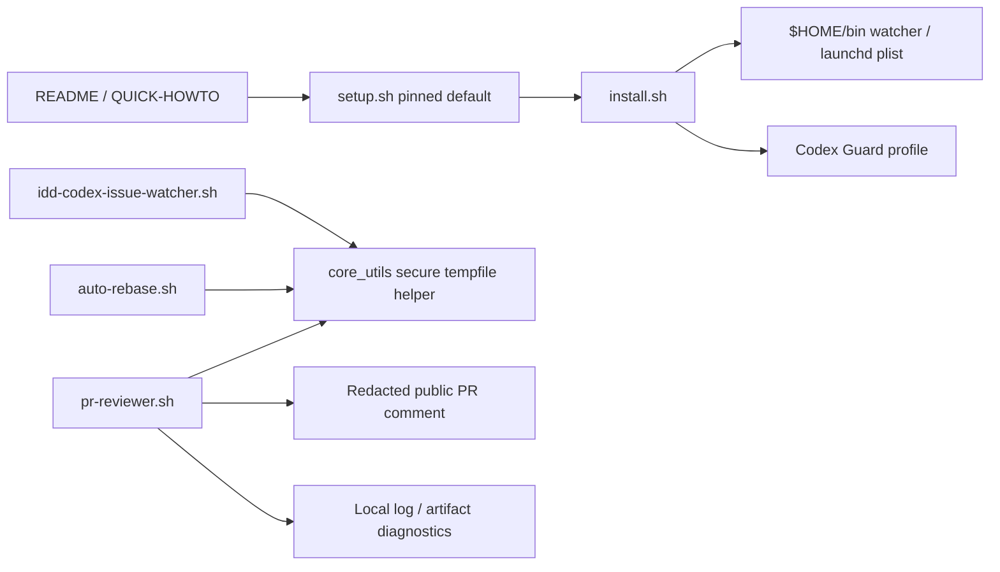

# Design Document

## Overview

Issue #52 は、既存の idd-codex 導入経路と local watcher 周辺に残る中リスクの security hardening を、後方互換性を保ちながらまとめて適用する。対象は bootstrap の pinned reference 化、`install.sh --local` 再実行時の利用者設定保護、Codex Guard Hook profile の安全な生成、PR Reviewer の公開エラーコメント redaction、watcher / processor の secure tempfile 化、PR Reviewer placeholder 値の shell 解釈抑止である。

**Purpose**: この変更は、公開 OSS として配布される idd-codex の導入・再インストール・自動レビュー実行時の攻撃面を縮小し、運用者が安全に継続利用できる状態を提供する。
**Users**: idd-codex を `curl | bash`、`setup.sh`、`install.sh --local`、cron / launchd watcher、PR Reviewer Processor で運用する maintainer / local operator が対象である。
**Impact**: 現在の mutable `main` 前提、local runtime file の無条件 overwrite、`sed` 置換、公開 stderr 抜粋、予測可能な `/tmp` path、placeholder 値の不十分な検証を、明示的な固定参照・safe overwrite・literal replacement・redacted public comment・owner-only secure tempfile・fail-closed validation に置き換える。

6-1（feature template の `codex-auto-dev` 自動付与除去）は PR #53 対応済みのため、本設計では扱わない。Issue / PR label 名、既存 env var 名、cron / launchd の watcher 起動 path は変更しない。

## Goals / Non-Goals

### Goals

- README / QUICK-HOWTO / `setup.sh` の推奨 bootstrap を、人間が決定した pinned release tag または commit reference に同期する。
- `install.sh --local` / `--all` で既存の `$HOME/bin/idd-codex-issue-watcher.sh` と macOS launchd plist を silent overwrite せず、operator-visible な backup / skip / force path を提供する。
- Codex Guard Hook profile generation で hook path を byte-preserving に展開し、`#`, `\`, `&`, space などで壊れないようにする。
- PR Reviewer の non-quota execution failure comment から raw stdout / stderr を除外し、local log / artifact で診断できるようにする。
- triage JSON、quota reset handoff、auto-rebase result / stderr、PR Reviewer prompt / stdout / stderr / result などの tempfile を非予測・owner-only・fail-closed にする。
- `{BASE}`, `{HEAD}`, `{PR}` placeholder に入る PR-derived value を data として検証し、危険値は warning + skip にする。
- README / QUICK-HOWTO に changed operator-visible behavior と migration / override note を同期する。

### Non-Goals

- 6-1 の再実装、Issue template / label taxonomy の変更。
- `codex`, `agy`, GitHub CLI など外部 AI review tool 本体の導入・認証・sandbox 仕様変更。
- 既存 operator が明示指定した `IDD_CODEX_REPO_URL` / `IDD_CODEX_BRANCH` override の禁止。
- OS 全体の `/tmp` 権限、cron / launchd 登録方式、watcher 実行ユーザーの変更。
- 既に公開済みの PR comments や既存 local logs からの情報削除。
- `LOCK_FILE` default の互換性破壊。lock file は機密 payload ではないため、本 scope では prompt / JSON / stderr / reset state 系 tempfile の hardening を優先する。

## Architecture

### Existing Architecture Analysis

- 本リポジトリは bash + markdown + GitHub issue template YAML の tool / template repo であり、runtime は `setup.sh`, `install.sh`, `local-watcher/bin/idd-codex-issue-watcher.sh`, `local-watcher/bin/idd-codex-modules/*.sh` に分かれる。
- `install.sh --repo` 系には `.bak` once-only を含む safe overwrite helper がある一方、`--local` の watcher / launchd plist は `copy_template_file` 経由で差分あり既存ファイルを `OVERWRITE` するため、Requirement 2 の対象になる。
- Guard Hook profile は `sed "s#__IDD_CODEX_GUARD_HOOK_PATH__#...#g"` で生成されており、delimiter `#` や escape 処理不足により path corruption の余地がある。
- PR Reviewer Processor は `PR_REVIEWER_ENABLED=true` の厳密 opt-in で起動し、候補 PR の head pattern / fork exclusion を既に持つ。ただし non-quota `exec-failed` comment に stderr 先頭 1KB を含める。
- Tempfile は `mktemp` を使う箇所と、`/tmp/qa-reset-${REPO_SLUG}-...` / `/tmp/triage-...json` / `/tmp/ar-result-$$` のような predictable path fallback が混在する。
- `idd-codex-issue-watcher.sh` は巨大化しているため、新規低レベル共通処理は `core_utils.sh` に置き、本体側は call site の置換に留める。

### Architecture Pattern & Boundary Map

採用パターンは「既存 bash module 境界への最小 hardening helper 追加」である。外部依存や新規サービスは増やさず、既存 env / label / command path を保つ。



**Architecture Integration**:

- 採用パターン: shared helper + targeted call-site replacement。tempfile と literal replacement は共通 helper 化し、個別 processor は責務内で使う。
- ドメイン境界: bootstrap / installer / watcher core / processor / docs を分離し、PR Reviewer の public comment policy と secure tempfile policyを混ぜない。
- 既存パターンの維持: `set -euo pipefail`, env override, `command -v`, `gh` / `jq` / `git` / `mktemp`, logger prefix, opt-in gate, `.bak` recovery pattern。
- 新規コンポーネントの根拠: secure tempfile と literal replacement は複数ファイルで同じ安全条件を要求するため `core_utils.sh` / `install.sh` helper としてまとめる。

## Technology Stack

| Layer | Choice / Version | Role in Feature | Notes |
|---|---|---|---|
| CLI / Scripts | bash 4+ | setup, install, watcher, processors | 既存 stack を維持 |
| Git / GitHub | `git`, `gh`, `jq` | clone / PR / comment / label operations | 新規外部 API は追加しない |
| Tempfile | POSIX `mktemp`, `umask 077`, owner-only directory | non-predictable tempfile creation | fallback to predictable `/tmp` は禁止 |
| Docs | Markdown | README / QUICK-HOWTO operator guidance | pinned ref と checksum 未決事項を反映 |
| Tests | shell script tests, `shellcheck` | regression coverage | 既存 `local-watcher/test/*_test.sh` pattern を踏襲 |

## File Structure Plan

### Directory Structure

```text
.
├── setup.sh
├── install.sh
├── README.md
├── QUICK-HOWTO.md
├── local-watcher/
│   ├── bin/
│   │   ├── idd-codex-issue-watcher.sh
│   │   └── idd-codex-modules/
│   │       ├── core_utils.sh
│   │       ├── auto-rebase.sh
│   │       ├── pr-reviewer.sh
│   │       ├── pr-iteration.sh
│   │       └── quota-aware.sh
│   └── test/
│       ├── security_medium_bootstrap_docs_test.sh
│       ├── security_medium_install_test.sh
│       ├── security_medium_tempfiles_test.sh
│       └── security_medium_pr_reviewer_test.sh
└── docs/specs/52--security-medium/
    ├── requirements.md
    ├── design.md
    └── tasks.md
```

### Modified Files

- `setup.sh` — `IDD_CODEX_BRANCH` default を human-approved pinned reference に変更し、help / comments / no-args guidance を同じ URL に同期する。override env var 名は維持する。
- `install.sh` — local runtime file 向け safe copy helper、dry-run action reporting、Guard Hook profile literal rendering helper を追加する。`install.sh --repo` の template distribution semantics は変更しない。
- `README.md` — quick install, env var table, checksum verification path, local runtime overwrite policy, PR Reviewer failure behavior, tempfile policy を更新する。
- `QUICK-HOWTO.md` — quick install URL と audit / checksum guidance を README と同期する。
- `local-watcher/bin/idd-codex-issue-watcher.sh` — predictable triage / quota reset / stderr temp path を secure tempfile helper に置換する。既存 env var / label / exit code は維持する。
- `local-watcher/bin/idd-codex-modules/core_utils.sh` — shared secure tempfile helper を追加する。既存 logger / worktree helper は維持する。
- `local-watcher/bin/idd-codex-modules/auto-rebase.sh` — result file / dismissal stderr file の predictable fallback を secure tempfile helper に置換する。
- `local-watcher/bin/idd-codex-modules/pr-reviewer.sh` — PR-derived placeholder validation、redacted public error comment、local diagnostics logging / artifacts、secure tempfile adoption を行う。
- `local-watcher/bin/idd-codex-modules/pr-iteration.sh` — usage-limit / soft-fail handoff temp files が prompt / JSON / diagnostics を含むため secure tempfile helper に置換する。
- `local-watcher/bin/idd-codex-modules/quota-aware.sh` — quota reset state atomic update tempfile を owner-only creation に合わせる。
- `local-watcher/test/security_medium_bootstrap_docs_test.sh` — pinned default / docs synchronization / override note の regression。
- `local-watcher/test/security_medium_install_test.sh` — local runtime backup / skip / force / dry-run / guard profile path rendering の regression。
- `local-watcher/test/security_medium_tempfiles_test.sh` — secure tempfile helper と watcher / processor call-site fallback removal の regression。
- `local-watcher/test/security_medium_pr_reviewer_test.sh` — placeholder rejection、fork/head pattern non-regression、public comment redaction、local diagnostic correlation の regression。

## Requirements Traceability

| Requirement | Summary | Components | Interfaces | Flows |
|---|---|---|---|---|
| 1 | bootstrap pinned path | Bootstrap Reference Policy | `IDD_CODEX_BRANCH`, docs URLs | setup clone/update |
| 1.1 | recommended `curl | bash` uses pinned ref | Bootstrap Reference Policy, Documentation Sync | README / QUICK-HOWTO / setup comments | docs rendering |
| 1.2 | default setup uses pinned ref | Bootstrap Reference Policy | `IDD_CODEX_BRANCH` default | clone / fetch |
| 1.3 | overrides honored | Bootstrap Reference Policy | `IDD_CODEX_BRANCH`, `IDD_CODEX_REPO_URL` | clone / fetch |
| 1.4 | mutable branch override documented | Documentation Sync | README / QUICK-HOWTO | operator guidance |
| 1.5 | checksum verification path where artifacts exist | Documentation Sync | release artifact notes | manual verification |
| 2 | reinstall protects local runtime | Local Runtime Safe Copy | `install.sh --local`, `--all`, `--force`, `--dry-run` | local install |
| 2.1 | watcher existing diff not silently discarded | Local Runtime Safe Copy | `$HOME/bin/idd-codex-issue-watcher.sh` | backup / skip / overwrite |
| 2.2 | launchd plist existing diff not silently discarded | Local Runtime Safe Copy | LaunchAgents plist | backup / skip / overwrite |
| 2.3 | recovery path visible | Local Runtime Safe Copy, Documentation Sync | `.bak` / unique backup path | install log |
| 2.4 | existing recovery not overwritten without opt-in | Local Runtime Safe Copy | `--force` | safe overwrite |
| 2.5 | dry-run reports action | Local Runtime Safe Copy | `--dry-run` log_action | dry run |
| 3 | guard path expansion robust | Guard Profile Renderer | profile template | local install |
| 3.1 | exact hook path preserved | Guard Profile Renderer | `IDD_CODEX_HOOKS_INSTALL_DIR` | render profile |
| 3.2 | valid path chars do not corrupt profile | Guard Profile Renderer | literal replacement | render profile |
| 3.3 | malformed generation fails visibly | Guard Profile Renderer | install error | fail closed |
| 3.4 | dry-run reports without writing | Guard Profile Renderer | `--dry-run` | dry run |
| 4 | PR Reviewer public error redaction | PR Reviewer Error Reporter | PR comment, local log | review execution |
| 4.1 | generic non-quota public comment | PR Reviewer Error Reporter | `pr_post_error_comment` | exec failure |
| 4.2 | local diagnostics retained | PR Reviewer Error Reporter | `$LOG`, diagnostic artifacts | exec failure |
| 4.3 | raw stderr secrets not copied public | PR Reviewer Error Reporter | redaction policy | exec failure |
| 4.4 | stable correlation context public | PR Reviewer Error Reporter | PR number, sha, tool, run token | exec failure |
| 4.5 | opt-out no-op preserved | PR Reviewer Orchestrator | `PR_REVIEWER_ENABLED` | processor gate |
| 5 | predictable temp names removed | Secure Tempfile Helper | `idd_secure_mktemp` | watcher / processors |
| 5.1 | non-predictable names | Secure Tempfile Helper | `mktemp` template | all temp creation |
| 5.2 | owner-only readable | Secure Tempfile Helper | `umask 077`, `chmod 700` dir | temp creation |
| 5.3 | fail closed on creation failure | Secure Tempfile Helper | non-zero return | current operation fails |
| 5.4 | no reliance on pre-existing world-writable path | Secure Tempfile Helper | `${IDD_CODEX_TMP_DIR:-$LOG_DIR/tmp}` | runtime |
| 5.5 | cleanup unless retained diagnostic | Secure Tempfile Helper, PR Reviewer Error Reporter | traps / artifact policy | completion / failure |
| 6 | untrusted PR refs treated as data | PR Reviewer Placeholder Guard | `pr_validate_placeholder_value` | review command |
| 6.1 | substitution prevents shell syntax | PR Reviewer Placeholder Guard | `{BASE}`, `{HEAD}`, `{PR}` | command resolution |
| 6.2 | dangerous values skipped with warning | PR Reviewer Placeholder Guard | warning log | candidate processing |
| 6.3 | head pattern exclusion preserved | PR Reviewer Candidate Filter | `PR_REVIEWER_HEAD_PATTERN` | candidate fetch |
| 6.4 | fork exclusion preserved | PR Reviewer Candidate Filter | owner comparison | candidate fetch |
| 6.5 | rejected values not exposed publicly | PR Reviewer Placeholder Guard, Error Reporter | warning + no public raw value | skip |
| NFR 1 | backward compatibility | All components | existing env / labels / paths | rollout |
| NFR 1.1 | env var names preserved | All components | existing env vars | runtime |
| NFR 1.2 | label semantics preserved | PR Reviewer / watcher | existing labels | transitions |
| NFR 1.3 | cron / launchd command paths preserved | Local Runtime Safe Copy | `$HOME/bin/idd-codex-issue-watcher.sh` | install |
| NFR 1.4 | installer idempotency preserved | Local Runtime Safe Copy | `--repo`, `--local`, `--all` | reinstall |
| NFR 2 | docs and observability | Documentation Sync, all hardening checks | README / logs | operator workflows |
| NFR 2.1 | changed visible behavior documented | Documentation Sync | README / QUICK-HOWTO | docs |
| NFR 2.2 | rejected input / fail closed logs reason | Secure Tempfile Helper, PR Reviewer Placeholder Guard, Guard Profile Renderer | logger prefixes | runtime |
| NFR 2.3 | regression coverage normal / unwanted / boundary | Regression Tests | shell tests | verify |

## Components and Interfaces

### Bootstrap / Documentation

#### Bootstrap Reference Policy

| Field | Detail |
|---|---|
| Intent | `setup.sh` default and docs URLを同じ pinned reference に固定する |
| Requirements | 1, 1.1, 1.2, 1.3, 1.4, 1.5, NFR 1.1, NFR 2.1 |

**Responsibilities & Constraints**

- `IDD_CODEX_BRANCH` の default は人間決定済み pinned reference にする。値は Open Questions の人間決定後に確定する。
- `IDD_CODEX_REPO_URL` / `IDD_CODEX_BRANCH` / `IDD_CODEX_DIR` の env var 名は変えない。
- operator が mutable branch を明示した場合は許容し、docs で「pinned default の明示 override」と説明する。
- checksum artifacts が同一 release で提供される場合のみ、手動 verification path を具体化する。未提供の場合は「提供方針未決」として Developer が生成を発明しない。

**Dependencies**

- Inbound: Documentation Sync — pinned ref text を共有 (Critical)
- Outbound: `git clone`, `git fetch`, `git checkout`, `git reset --hard` — 既存 bootstrap flow (Critical)

**Contracts**: Service [x] / API [ ] / Event [ ] / Batch [x] / State [ ]

##### Service Interface

```bash
resolve_idd_codex_ref() -> "$IDD_CODEX_BRANCH"
```

- Preconditions: human-approved pinned reference が設計 PR / Issue comment で確定している。
- Postconditions: env override が無い場合だけ pinned reference を使う。
- Invariants: env var names and clone destination semantics are unchanged.

#### Documentation Sync

| Field | Detail |
|---|---|
| Intent | README / QUICK-HOWTO に operator-visible behavior changes を同期する |
| Requirements | 1.1, 1.4, 1.5, 2.3, NFR 2.1 |

**Responsibilities & Constraints**

- quick install URL、env var table、checksum verification、local runtime overwrite policy、PR Reviewer error behavior、tempfile policy を更新する。
- README と QUICK-HOWTO で推奨 command が drift しないよう同一 pinned ref を使う。

### Installer

#### Local Runtime Safe Copy

| Field | Detail |
|---|---|
| Intent | local runtime target の差分あり既存ファイルを silent overwrite しない |
| Requirements | 2, 2.1, 2.2, 2.3, 2.4, 2.5, NFR 1.3, NFR 1.4 |

**Responsibilities & Constraints**

- 対象は少なくとも `$HOME/bin/idd-codex-issue-watcher.sh` と `$HOME/Library/LaunchAgents/com.local.idd-codex-issue-watcher.plist`。
- 既存なしは `NEW`、同一は `SKIP`、差分ありは recovery file 作成後に overwrite、recovery 作成不可なら skip / fail visible とする。
- 既存 recovery file を上書きしない。`--force` は target overwrite の明示 opt-in として扱うが、recovery file は unique name か既存温存にする。
- dry-run は `NEW` / `SKIP` / `BACKUP` / `OVERWRITE` / `WOULD-SKIP` 相当を operator-visible に出す。

**Dependencies**

- Inbound: `install.sh --local` / `--all` (Critical)
- Outbound: filesystem copy / chmod (Critical)

**Contracts**: Service [x] / API [ ] / Event [ ] / Batch [x] / State [x]

##### Service Interface

```bash
copy_local_runtime_file <src> <dest> [--executable]
```

- Preconditions: `src` exists.
- Postconditions: changed existing `dest` is either preserved in recovery file before overwrite, or target is skipped with visible reason.
- Invariants: `install.sh --repo` behavior is unchanged.

#### Guard Profile Renderer

| Field | Detail |
|---|---|
| Intent | Guard Hook profile template に hook path を literal replacement で安全に埋め込む |
| Requirements | 3, 3.1, 3.2, 3.3, 3.4, NFR 2.2 |

**Responsibilities & Constraints**

- `sed` delimiter replacement は使わず、`awk` の `index` / `substr` literal replacement または同等の shell-safe helper を使う。
- rendered profile に selected hook path が exact に含まれること、placeholder が残らないことを検証する。
- generation failure は malformed profile を書かず、install message / stderr で理由 category を出す。
- dry-run では action classification だけを出し、dest file を作らない。

### Watcher / Processor Runtime

#### Watcher Core Tempfile Call Sites

| Field | Detail |
|---|---|
| Intent | watcher 本体の triage / quota / stderr 系 tempfile call-site を secure helper に接続する |
| Requirements | 5.1, 5.2, 5.3, 5.4, 5.5, NFR 2.2 |

**Responsibilities & Constraints**

- `idd-codex-issue-watcher.sh` に残る `/tmp/triage-*`, `/tmp/qa-reset-*`, `mktemp -t ... || echo ""` などのうち、prompt / JSON / stderr / reset state を含むものを `idd_secure_mktemp` 経由へ置き換える。
- cleanup は既存 flow の成功 / quota / error 分岐に合わせ、読み取り前に削除しない。
- lock file default は本 scope で変更しない。

**Dependencies**

- Inbound: Stage A / Reviewer / Triage / Debugger call sites (Critical)
- Outbound: Secure Tempfile Helper (Critical)

**Contracts**: Service [ ] / API [ ] / Event [ ] / Batch [x] / State [x]

#### Secure Tempfile Helper

| Field | Detail |
|---|---|
| Intent | prompt / JSON / stderr / reset state 用 tempfile を non-predictable owner-only に統一する |
| Requirements | 5, 5.1, 5.2, 5.3, 5.4, 5.5, NFR 2.2 |

**Responsibilities & Constraints**

- `core_utils.sh` に `idd_secure_mktemp` と必要なら `idd_secure_tmpdir` を追加する。
- default base directory は `${IDD_CODEX_TMP_DIR:-$LOG_DIR/tmp}` とし、`mkdir -p` 後に `chmod 700` を試みる。
- `umask 077` を局所適用して `mktemp` を呼び、失敗時は predictable path fallback をしない。
- caller が cleanup trap を設置する。diagnostic artifact として intentionally retained する場合は local log に path と reason を残す。

**Dependencies**

- Inbound: watcher core, auto-rebase, pr-reviewer, pr-iteration, quota-aware (Critical)
- Outbound: `mktemp`, `mkdir`, `chmod` (Critical)

**Contracts**: Service [x] / API [ ] / Event [ ] / Batch [ ] / State [x]

##### Service Interface

```bash
idd_secure_mktemp <prefix>
```

- Preconditions: `LOG_DIR` or `IDD_CODEX_TMP_DIR` is set and writable.
- Postconditions: stdout is a newly-created file path with non-predictable suffix and owner-only permissions.
- Invariants: no fallback to `/tmp/<prefix>-$$`, timestamp-only, issue-number-only, or repo-slug-only path.

#### PR Reviewer Placeholder Guard

| Field | Detail |
|---|---|
| Intent | PR-derived values を shell syntax として解釈されない data に制限する |
| Requirements | 6, 6.1, 6.2, 6.3, 6.4, 6.5, NFR 1.2, NFR 2.2 |

**Responsibilities & Constraints**

- `{BASE}`, `{HEAD}`, `{PR}` に入る値を個別に検証する。
- newline、redirection (`<`, `>`)、glob (`*`, `?`, `[`)、command substitution (`$(`, backtick)、separator (`;`, `|`, `&`)、leading `-` を拒否する。
- PR number は numeric のみを許可する。
- `PR_REVIEWER_HEAD_PATTERN` と fork exclusion は既存候補抽出のまま保持する。
- rejected value は public comment に出さず、local operator warning でも値全文ではなく reason category / PR number / field name を優先する。

**Contracts**: Service [x] / API [ ] / Event [ ] / Batch [ ] / State [ ]

##### Service Interface

```bash
pr_validate_placeholder_value <field> <value>
pr_substitute_placeholders <cmd_template> <base_ref> <head_ref> <pr_number> <prompt_file>
```

- Preconditions: `cmd_template` is trusted operator configuration.
- Postconditions: unsafe PR-derived value causes skip before command execution.
- Invariants: PR Reviewer disabled state remains no-op.

#### PR Reviewer Error Reporter

| Field | Detail |
|---|---|
| Intent | Public PR error comment と local diagnostics の情報境界を分離する |
| Requirements | 4, 4.1, 4.2, 4.3, 4.4, 4.5, 6.5 |

**Responsibilities & Constraints**

- non-quota exec failure の public comment は generic message + stable correlation context のみにする。
- raw stdout / stderr excerpt は public comment に含めない。
- local `$LOG` または secure diagnostic artifact に exit code、tool、PR number、head sha、diagnostic file path / summary を残す。
- quota reset detection path は既存の `pr_handle_quota_wait` を維持する。
- `PR_REVIEWER_ENABLED != true` では comments / labels を追加しない。

**Contracts**: Service [x] / API [x] / Event [ ] / Batch [ ] / State [x]

##### API Contract

| Method | Endpoint | Request | Response | Errors |
|---|---|---|---|---|
| `gh pr comment` | PR comments | generic error body + hidden marker | comment created / duplicate skipped | GitHub failure is WARN + continue where existing behavior allows |

## Data Models

### Domain Model

- **Pinned Bootstrap Reference**: human-approved release tag or commit SHA. It is a configuration constant / doc string, not a persisted runtime state.
- **Local Runtime Recovery File**: backup path associated with a runtime target. It preserves pre-overwrite content and must not be silently overwritten.
- **Secure Tempfile**: ephemeral file under owner-controlled temp dir. It may contain prompt, JSON, stderr, result token, or reset epoch.
- **PR Reviewer Error Correlation**: public comment includes stable low-sensitivity fields such as PR number, head SHA / marker SHA, tool, exit category, and log correlation token. Full diagnostics remain local.

### Logical / Physical Data Model

| Data | Location | Retention | Sensitivity |
|---|---|---|---|
| bootstrap pinned ref | `setup.sh`, README, QUICK-HOWTO | committed | low |
| runtime recovery files | adjacent to target, e.g. `$HOME/bin/idd-codex-issue-watcher.sh.bak*` | until operator removes | medium |
| secure temp files | `${IDD_CODEX_TMP_DIR:-$LOG_DIR/tmp}` | removed by trap unless diagnostic artifact | medium |
| PR Reviewer local diagnostics | `$LOG` and optional secure artifact | existing log retention | medium / high |
| public PR error comment | GitHub PR comment | permanent unless operator deletes | low only |

No database schema or remote state migration is introduced.

## Error Handling

### Error Strategy

- Bootstrap pinned ref is blocked on human decision. If the reference is not decided, Developer must not choose one and should surface it in PR confirmation items.
- Installer safe copy is fail-visible: backup creation failure prevents overwrite and logs an error / skip reason.
- Guard profile rendering is fail-closed for malformed output: do not write partial profile.
- Secure tempfile creation failure fails the current operation with an operator-visible reason category. It must not fall back to predictable `/tmp` paths.
- PR Reviewer unsafe placeholder values skip only the affected PR and log a warning. They do not create public comments containing raw rejected values.
- PR Reviewer non-quota execution failures create generic public comments while retaining local diagnostics.

### Error Categories and Responses

- **User / Operator Input Errors**: mutable `IDD_CODEX_BRANCH` override, unsafe PR-derived placeholder, existing recovery file conflict. Response is warning / skip with reason category and docs guidance.
- **System Errors**: `mktemp`, `mkdir`, `chmod`, `cp`, Guard profile rendering, GitHub comment failure. Response is fail-closed for local file safety, or existing WARN + continue where comment failure was already best-effort.
- **Business Logic Errors**: PR Reviewer disabled, fork PR, head pattern mismatch, quota reset detection. Existing no-op / skip / quota wait semantics stay intact.

## Testing Strategy

- **Unit / Shell Helper Tests**
  - `idd_secure_mktemp` normal case creates file under secure dir with non-empty random suffix and owner-only permission.
  - `idd_secure_mktemp` failure case does not return `/tmp/<predictable>` fallback.
  - Guard profile renderer preserves paths containing `#`, `\`, `&`, spaces.
  - PR Reviewer placeholder validator accepts normal refs and rejects newline / shell separator / glob / leading option cases.

- **Installer Tests**
  - `install.sh --local` creates runtime targets when absent.
  - changed watcher / launchd plist gets backup + visible action, and existing recovery file is not overwritten.
  - `--dry-run --local` reports create / skip / backup / overwrite without writing.

- **PR Reviewer Tests**
  - non-quota exec failure public comment excludes stderr text containing local path / token-like string.
  - local diagnostics contain enough correlation to find the failure.
  - `PR_REVIEWER_ENABLED!=true` remains no-op.
  - fork exclusion and `PR_REVIEWER_HEAD_PATTERN` exclusion continue to work.

- **Integration / Smoke Tests**
  - `setup.sh` docs/default synchronization test for pinned reference after human decision.
  - watcher secure temp call-sites for triage and quota reset use helper and clean up files.
  - auto-rebase / pr-reviewer / pr-iteration temp files use helper and have no predictable fallback.

- **Performance / Load**
  - No new network call is introduced.
  - Tempfile helper adds only local filesystem operations; no measurable watcher cycle overhead is expected.
  - PR Reviewer redaction reduces public comment size.

## Security Considerations

- Issue / PR title, body, labels, branch names, PR refs, and review tool stdout / stderr are untrusted. They must not be passed to `sed`, `eval`, `bash -c`, or public comments without validation / redaction.
- `{BASE}`, `{HEAD}`, `{PR}` values are PR-derived data. Validation must happen before command string substitution.
- `PR_REVIEWER_*_CMD` remains trusted operator configuration. This design does not attempt to parse arbitrary trusted command templates into argv arrays, but it prevents PR-derived placeholders from injecting shell syntax into those templates.
- Public PR comments are considered permanent and externally visible. Raw stderr / stdout must stay local.
- Tempfiles containing prompts, JSON, stderr, result tokens, or reset state use owner-only directory and file permissions. Predictable `/tmp` fallback is prohibited.
- Guard profile rendering must be literal replacement, not regex / delimiter replacement.
- New external service calls are not introduced. PR Reviewer remains behind `PR_REVIEWER_ENABLED=true`.

## 確認事項・リスク

- **Open Question: pinned reference** — 既定の pinned release tag または commit SHA は未決である。Developer は値を選ばず、人間決定後に `setup.sh`, README, QUICK-HOWTO を同じ値で更新する。
- **Open Question: checksum artifacts** — checksum artifacts を同一 PR で提供するか、release 運用手順として別途扱うか未決である。未決のまま artifact 生成や checksum 値を実装者判断で追加しない。
- **Risk: `install.sh --local` の overwrite policy change** — silent overwrite を止めるため operator-visible behavior が変わる。README に明記し、`--force` / backup path を示す。
- **Risk: secure tempfile dir permissions** — 既存 `LOG_DIR` が共有 writable な場合、helper は `chmod 700` を試みる。失敗時の扱いは fail-closed とし、operator に `IDD_CODEX_TMP_DIR` override を案内する。
- **Risk: PR Reviewer command compatibility** — これまで通っていた unusual branch name が skip される可能性がある。これは Requirement 6 の安全側挙動であり、`PR_REVIEWER_HEAD_PATTERN` と fork exclusion の既存挙動は維持する。
