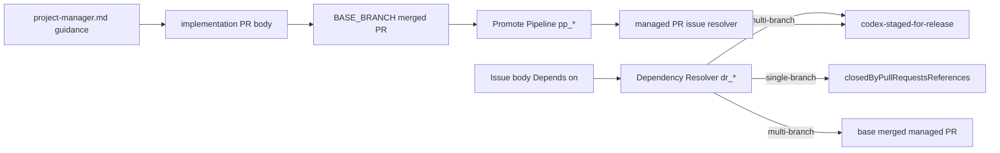

# Issue #6 設計: Gitflow no-closing-keyword 依存解決

## Overview

本件は、`BASE_BRANCH=develop` / `PROMOTION_TARGET_BRANCH=main` のような multi-branch 運用で、`develop` へ統合済みの作業を後続 Issue の開発依存として扱えるようにする修正である。現状は Dependency Resolver と Promote Pipeline が GitHub の closing keyword 由来リンクに強く依存しており、release 前に Issue を open のまま残す Gitflow 運用では、実装済み依存が未解決として扱われる。

設計上は「develop merge 済み」と「production release による Issue close」を分離する。single-branch 運用では既存の closing-keyword 前提を維持し、multi-branch 運用でのみ `codex-staged-for-release` と managed PR の base branch merge を development-resolved として扱う。

GitHub 公式 docs では PR description 内の特殊キーワードは default branch を対象にする PR で解釈されるため、`develop` merge 時に auto-close keyword を固定使用しない方針は妥当である。実装 PR は `BASE_BRANCH != PROMOTION_TARGET_BRANCH` のとき `Refs #N` を基本にし、release close は repository の default branch / release merge policy に委ねる。

## Goals / Non-Goals

### Goals

- multi-branch 運用で `codex-staged-for-release` 付き open Issue を Dependency Resolver の development-resolved として扱う。
- multi-branch 運用で `BASE_BRANCH` に merged 済みの managed PR から対象 Issue を解決し、closing keyword が無くても `codex-staged-for-release` を自動付与する。
- unmanaged PR の plain reference だけで任意 Issue に `codex-staged-for-release` を付与しない。
- design PR は既存どおり `Refs #N` 固定、implementation PR は multi-branch で auto-close keyword 固定を避ける。
- README とログで、develop merge 済み / release 待ち / dependency resolved の状態を追跡できるようにする。

### Non-Goals

- GitHub default branch の変更、release note 生成、feedman-ios 固有 README の更新は行わない。
- watcher が新規に Issue close API を呼ぶ処理は追加しない。
- 既存 env var 名、ラベル名、cron 起動契約、exit code 意味は変更しない。
- `PROMOTE_PIPELINE_ENABLED=true` 以外で Promote Pipeline の自動付与処理を起動しない。

## Architecture Pattern & Boundary Map

既存 bash 関数群を維持し、判定境界だけを追加する。Dependency Resolver は Issue 側の依存解決を担当し、Promote Pipeline は merged PR から release 待ち Issue のラベル集合を作る。Project Manager guidance は PR body policy のみを更新し、実行時の GitHub API 副作用は持たない。



## Technology Stack

| レイヤ | 技術 | 方針 |
|---|---|---|
| watcher core | bash 4+ / `gh` / `jq` / `timeout` | 既存関数に helper を追加し、env var 追加は行わない |
| GitHub API | `gh pr list`, `gh issue view`, GraphQL | 既存 timeout 変数を使い、取得失敗は WARN + 安全側 |
| ドキュメント | Markdown | root と `repo-template` の agent 定義を byte 一致で更新 |
| 検証 | shell-level regression tests / shellcheck | 外部 API は mock し、single / multi 両方を検証 |

## File Structure Plan

```text
local-watcher/bin/idd-codex-issue-watcher.sh
  Dependency Resolver Gate:
  - dr_gh_graphql_closed_by または後継 helper に Issue labels を追加取得
  - dr_resolve_one に multi-branch 用の staged-for-release / base-merged 判定を追加
  - dr_check_dependencies のログ集計に resolved reason を反映
  - dr_format_unresolved_comment の Issue 表記を連結誤読しない文面へ調整

local-watcher/bin/modules/promote-pipeline.sh
  Promote Pipeline:
  - pp_collect_merged_issues の merged PR 取得 fields を body/title/headRefName/baseRefName 等へ拡張
  - managed PR issue resolver helper を追加し、branch / title / body plain reference / closing refs から Issue 番号を抽出
  - pp_resolve_merge_sha を no-closing-keyword managed PR でも merge commit 解決できるよう拡張
  - fork PR / unmanaged PR / 既ラベル付き Issue の抑止を維持

.codex/agents/project-manager.md
repo-template/.codex/agents/project-manager.md
  implementation PR body guidance:
  - multi-branch では final / design-less の場合も auto-close keyword 固定を避け、Refs を採用する方針を明記
  - design-review mode の Refs 固定は現状維持
  - 両ファイルを byte 一致で更新

README.md
  Gitflow / Promote Pipeline / Dependency Resolver:
  - codex-staged-for-release 自動付与が closing keyword 非依存になったことを説明
  - multi-branch の develop merge と release close の分離を明記
  - 既存 opt-in gate と single-branch 互換を明記

local-watcher/test/issue6_gitflow_no_closing_keyword_test.sh
  shell-level regression:
  - dr_resolve_one / dr_check_dependencies / pp_collect_merged_issues / pp_resolve_merge_sha / PjM static policy を mock で検証
```

## Requirements Traceability

| Requirement | 設計要素 |
|---|---|
| 1 | `dr_resolve_one` が multi-branch で `codex-staged-for-release` label と `BASE_BRANCH` merged managed PR を development-resolved として扱い、single-branch では既存 closing-keyword 経路を維持する |
| 2 | `pp_collect_merged_issues` と managed PR resolver が closing refs、branch naming、PR title、managed PR body plain reference から Issue 番号を抽出し、fork / unmanaged / 既ラベル付き Issue を抑止する |
| 3 | PjM implementation guidance が multi-branch では `Refs #N` を採用し、Promote Pipeline は label 付与のみ行って Issue close API を呼ばない |
| 4 | `dr_log` / `pp_log` / `dr_warn` / `pp_warn` で reason と失敗を可視化し、未解決依存コメントの Issue 番号表記を誤読しない形へ変更する |
| 5 | single-branch closing PR、closing refs 抽出、env var / label / cron / exit code、`PROMOTE_PIPELINE_ENABLED` gate を維持する |
| 6 | shell-level regression と static check で single / multi branch、unmanaged PR、PjM guidance を検証する |

## Components and Interfaces

### Dependency Resolver Gate

対象ファイル: `local-watcher/bin/idd-codex-issue-watcher.sh`

`dr_resolve_one` の内部判定を次の順序にする。

| 条件 | stdout record | caller の扱い |
|---|---|---|
| API / parse 失敗 | `api error|<reason>` | unresolved、安全側 |
| `BASE_BRANCH != PROMOTION_TARGET_BRANCH` かつ staged label あり | `resolved|staged-for-release` | resolved |
| `BASE_BRANCH != PROMOTION_TARGET_BRANCH` かつ base merged managed PR あり | `resolved|base-merged|#<pr>` | resolved |
| closed Issue かつ merged closing PR あり | `resolved|closing-pr` | resolved |
| open Issue で上記なし | `open|open` | unresolved |
| closed Issue で merged PR なし | `closed unmerged|closed-unmerged` | unresolved |

既存テスト mock との互換のため、`dr_check_dependencies` は `|` を含まない旧 stdout（`resolved` / `open` / `closed unmerged` / `api error`）も受け付ける。構造化ログでは `resolved=#N(reason)`、または `resolved_reasons=#N:staged-for-release,#M:base-merged` のように reason を残す。

### Managed PR Issue Resolver

対象ファイル: `local-watcher/bin/modules/promote-pipeline.sh`

Promote Pipeline 側に managed PR から Issue 番号を抽出する helper を置く。Dependency Resolver から同 helper を直接呼ぶ必要がある場合でも、helper は stdout のみを返し副作用を持たない。

入力 PR JSON の必要 field:

| field | 用途 |
|---|---|
| `number` | ログと merge SHA 解決 |
| `headRepositoryOwner.login` / `isCrossRepository` | fork PR 除外 |
| `headRefName` | `codex/issue-<N>-impl-` / `codex/issue-<N>-impl-resume-` による managed 判定と Issue 抽出 |
| `baseRefName` | `BASE_BRANCH` merged PR の再確認 |
| `title` | `#N` または `issue-N` 表記から Issue 抽出 |
| `body` | managed PR の plain reference `#N` 抽出 |
| `closingIssuesReferences` | 既存 closing-keyword 経路の維持 |
| `mergeCommit.oid` | `pp_resolve_merge_sha` の no-closing-keyword 経路 |

managed 判定は次の優先順位とする。

1. fork PR でない、かつ `headRefName` が `codex/issue-<N>-impl-` または `codex/issue-<N>-impl-resume-` に一致する。
2. 1 に一致しないが、title が idd-codex 実装 PR 形式（例: `feat(#N): ...` または `issue-N` を含む）で、head が `codex/` 配下の同一 repo branch である。
3. 1 または 2 で managed と判定できた PR に限り、body plain reference `#N` を追加候補として読む。
4. managed と判定できない PR は `closingIssuesReferences` 以外を auto-label 根拠にしない。

複数 Issue 番号が抽出された場合は unique + numeric sort し、各 Issue ごとに label 付与を試行する。branch/title から Issue 番号を得られる場合はそれを主候補とし、body plain reference は managed PR 内の補助候補として扱う。これにより unmanaged PR の「参考リンク」だけで label が付く事故を避ける。

### Promote Pipeline Merge SHA Resolver

対象ファイル: `local-watcher/bin/modules/promote-pipeline.sh`

`pp_resolve_merge_sha` は現在 `gh issue view --json closedByPullRequestsReferences` に依存している。no-closing-keyword managed PR ではこの field が空になるため、次の順序で merge commit を解決する。

1. 既存の `closedByPullRequestsReferences` から merged PR の `mergeCommit.oid` を解決する。
2. 解決できない場合、`BASE_BRANCH` merged PR のうち managed resolver が対象 Issue 番号を含む PR を探し、`mergeCommit.oid` を返す。
3. 解決できない場合は既存どおり `missing` 扱いにし、WARN または ST missing 経路へ流す。

### Project Manager Guidance

対象ファイル: `.codex/agents/project-manager.md`, `repo-template/.codex/agents/project-manager.md`

implementation mode の `Refs` / auto-close keyword 使い分けを multi-branch で分岐する。

| branch model | tasks.md 状態 | 対応 Issue 表記 |
|---|---|---|
| `BASE_BRANCH == PROMOTION_TARGET_BRANCH` | 既存判定どおり | 既存の partial=`Refs` / final=auto-close keyword |
| `BASE_BRANCH != PROMOTION_TARGET_BRANCH` | 任意 | `Refs #N` |

design-review mode は既存どおり `Refs #N` 固定で変更しない。root と `repo-template` の agent 定義は同一 PR で byte 一致させる。

### README Updates

対象ファイル: `README.md`

README は以下を更新する。

- `codex-staged-for-release` は multi-branch で develop merge 済み / release 待ちを表す。
- Promote Pipeline は closing keyword だけでなく managed PR の branch/title/body reference から auto-label できる。
- multi-branch の implementation PR body は release close を妨げないため `Refs #N` を使う。
- single-branch と `PROMOTE_PIPELINE_ENABLED != true` は既存挙動維持。

## Data Models

### Dependency Resolution Record

`dr_resolve_one` から `dr_check_dependencies` へ渡す内部 record。

```text
<verdict>|<reason>|<optional-pr>
```

| field | 値 |
|---|---|
| `verdict` | `resolved`, `open`, `closed unmerged`, `api error` |
| `reason` | `closing-pr`, `staged-for-release`, `base-merged`, `open`, `closed-unmerged`, `graphql-failed`, `jq-parse-error` 等 |
| `optional-pr` | `#123` など。base merged PR 判定時のみ必要 |

### Managed PR Issue Candidate

Promote Pipeline helper が内部で扱う候補。

```text
issue_number=<N> pr_number=<P> source=<closing-ref|head|title|body-plain> managed=<true|false>
```

`managed=false` かつ `source=body-plain` の候補は label 付与対象にしない。

## Error Handling

- GitHub API 取得失敗、timeout、GraphQL errors、`jq` parse 失敗は WARN を出し、安全側に倒す。
- Dependency Resolver の安全側は unresolved 扱いで、対象 Issue を `codex-blocked` にする既存動作を維持する。
- Promote Pipeline の安全側は当該 PR / Issue の auto-label または ST 判定を skip し、他 Issue 処理は継続する。
- fork PR は WARN ではなく通常 skip として扱い、既存除外ポリシーを維持する。
- 未解決依存コメントは `Issue #N` のように対象 Issue と仕様 Issue 番号が連結して見えない表記にする。

## Testing Strategy

- shell-level unit regression: `dr_resolve_one` の GraphQL / PR list mock で single-branch closing PR、multi-branch staged label、multi-branch base merged managed PR、multi-branch unresolved を検証する。
- shell-level Promote Pipeline regression: `pp_collect_merged_issues` の `gh pr list` / `gh issue edit` mock で closing refs、head/title/body plain reference、unmanaged plain reference、fork PR、既ラベル skip を検証する。
- merge SHA regression: `pp_resolve_merge_sha` が closing refs 経路と no-closing-keyword managed PR 経路の両方で SHA を返すことを検証する。
- static docs regression: root と `repo-template` の `project-manager.md` が byte 一致し、multi-branch implementation PR guidance が `Refs #N` 方針を持つことを検証する。
- README regression: Gitflow / staged-for-release / release close / opt-in gate の説明が更新されていることを目視または grep で確認する。

## Migration Strategy

破壊的 migration は行わない。既存 single-branch repository は `BASE_BRANCH == PROMOTION_TARGET_BRANCH` のままなので closing-keyword 経路が維持される。multi-branch repository は既存の `BASE_BRANCH` / `PROMOTION_TARGET_BRANCH` / `PROMOTE_PIPELINE_ENABLED` / `LABEL_STAGED_FOR_RELEASE` をそのまま使う。

README には、multi-branch の implementation PR body が `Refs #N` を使うこと、Issue close は release branch 到達時の repository policy に委ねることを migration note として追記する。

## Supporting References

- GitHub Docs: Linking a pull request to an issue — <https://docs.github.com/articles/closing-issues-via-commit-messages>
- GitHub GraphQL Issues reference: `closedByPullRequestsReferences` と `baseRefName` / `headRefName` filter 引数 — <https://docs.github.com/en/graphql/reference/issues>
- GitHub CLI `gh pr view` manual: `--json` fields に `body`, `title`, `headRefName`, `baseRefName`, `headRepositoryOwner`, `mergeCommit`, `closingIssuesReferences` 等が含まれる — <https://cli.github.com/manual/gh_pr_view>

## Architect Self Review

- Requirements traceability: 1.1 から 6.5 まで全 numeric ID を `Requirements Traceability` に対応付けた。
- Architecture readiness: Dependency Resolver、Promote Pipeline、PjM guidance、README、test の境界を File Structure Plan と Components に分離した。
- Feasibility: 新規外部依存と env var 追加なし。既存 `gh` / `jq` / `timeout` の範囲で実装可能。
- Risk review: unmanaged PR の plain reference 誤付与、single-branch regression、fork PR 除外、API failure safe-side を明示した。
